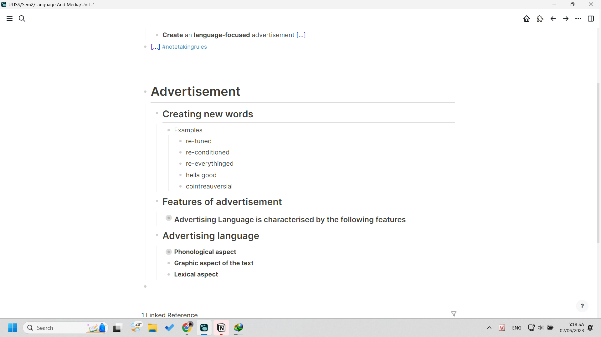
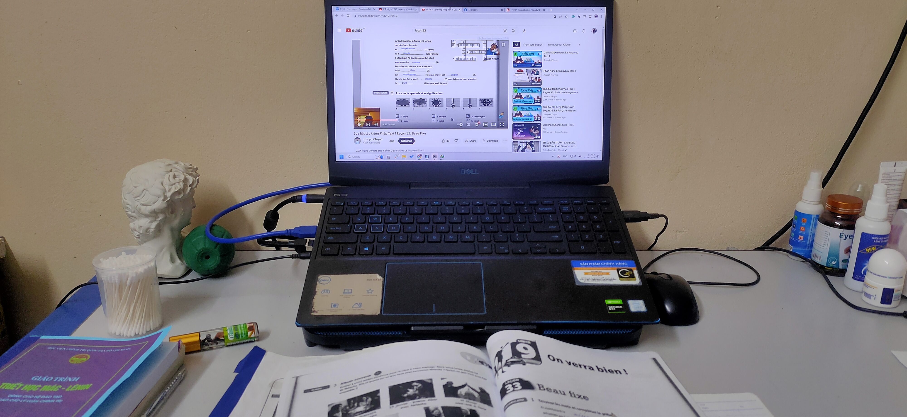

- 05:17 đang chạy ôn tiếng Pháp và Language and Media
	- 
- 4 giờ dậy cầm máy lên đọc truyện tí tỉnh ngủ, thấy Dung chia sẻ video phòng 107 của câu lạc bộ nó, nghe hay thật, nhìn cảm xúc thật. Do nhạc phần nhiều và xếp cảnh đúng nhạc (lại nhớ đến video của mình, có lẽ có thể thử xem lại) nhưng mà hóa ra nhạc do video gốc đã khá ổn rồi, còn lại thì edit một tí nó hơi kiểu tiktok tí cũng được. somehow nhạc tiktok được người ta chỉnh khá nhiều, mà bịt âm thì kĩ thuật đó là giảm thanh đi, tôi vẫn chưa biết cách làm cơ bản, tra mạng được, nhưng nhiều cách làm và có thể làm đến đâu như nào (chẳng hạn đưa một người chuyên nghiệp họ tự mò, tham khảo phát triển thì còn đỉnh hơn, cảm giác bản exclusive ý :)) )
-
- 
-