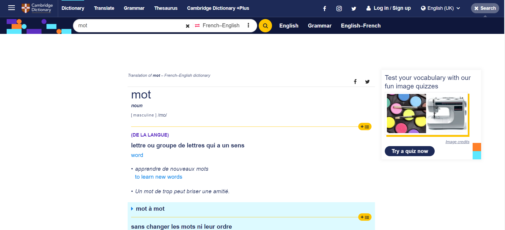
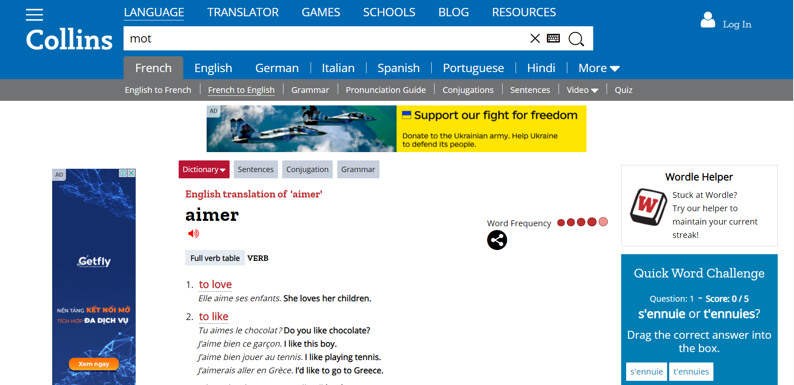

- Meta
	- related:: 
	  [[ULIS _ Tiếng Pháp B1]] from ... to
	  [[Français_madame Thu]] from ... to
- Learning
	- [[Le Nouveau Taxi 1]]
	- [[Français/madame Thu]]
		- [[Français/madame Thu/Leçon 1]]
		- [[Français/madame Thu/Leçon 3]]
		- [[Français/madame Thu/Leçon 4]]
		- [[Français/madame Thu/Leçon 6]]
		- [[Français/madame Thu/Leçon 12]]
		- [[Français/madame Thu/Leçon 15]]
		- [[Français/madame Thu/Leçon 16]]
		- [[Français/madame Thu/Leçon 18]]
		- [[Français/madame Thu/Leçon 19-5]]
	- [[ULISS/Sem1/Français B1]]
		- [[ULISS/Sem1/Français B1/Leçon 1]]
		- [[ULISS/Sem1/Français B1/Leçon 2]]
		- [[ULISS/Sem1/Français B1/Leçon 3]]
		- [[ULISS/Sem1/Français B1/Leçon 4]]
		- [[ULISS/Sem1/Français B1/Leçon 5]]
		- [[ULISS/Sem1/Français B1/Leçon 6]]
		- [[ULISS/Sem1/Français B1/Leçon 7]]
		- [[ULISS/Sem1/Français B1/Leçon 8]]
		- [[ULISS/Sem1/Français B1/Leçon 9]]
		  :LOGBOOK:
		  CLOCK: [2023-05-17 Wed 23:00:54]
		  :END:
		- [[ULISS/Sem1/Français B1/Leçon 10]]
		- [[ULISS/Sem1/Français B1/Leçon 11]]
		- [[ULISS/Sem1/Français B1/Leçon 12]]
		- [[ULISS/Sem1/Français B1/Leçon 13]]
		- [[ULISS/Sem1/Français B1/Leçon 14]]
		- [[ULISS/Sem1/Français B1/Leçon 15]]
		- [[ULISS/Sem1/Français B1/Leçon 16]]
		- [[ULISS/Sem1/Français B1/Leçon 17]]
		- [[ULISS/Sem1/Français B1/Leçon 18]]
		- [[ULISS/Sem1/Français B1/Leçon 19]]
		- [[ULISS/Sem1/Français B1/Leçon 20]]
	- [[ULISS/Sem2/Français B1]]
		- [[ULISS/Sem2/Français B1/Leçon 1]]
		- [[ULISS/Sem2/Français B1/Leçon 2]]
		- [[ULISS/Sem2/Français B1/Leçon 3]]
		- [[ULISS/Sem2/Français B1/Leçon 4]]
		- [[ULISS/Sem2/Français B1/Leçon 5]]
		- [[ULISS/Sem2/Français B1/Leçon 6]]
- [[Vocabulaire Français]]
- [[Grammaire Frainçaise]]
- Dictionnaire
  collapsed:: true
	- Dùng collins tốt hơn vì hình thức nó tiện hơn (và ở sau còn có translation)
	- 
	- 
	-
- Meta
  collapsed:: true
	- related:: 
	  [[Ulis_Tiếng Pháp B1]] from ... to
	  [[Français_madame Thu]] from ... to
-
-