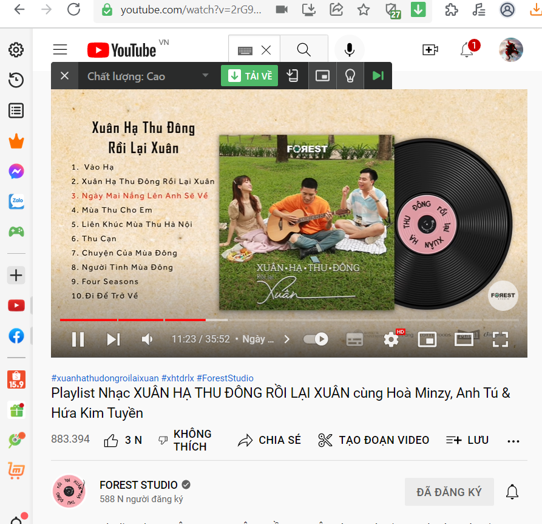
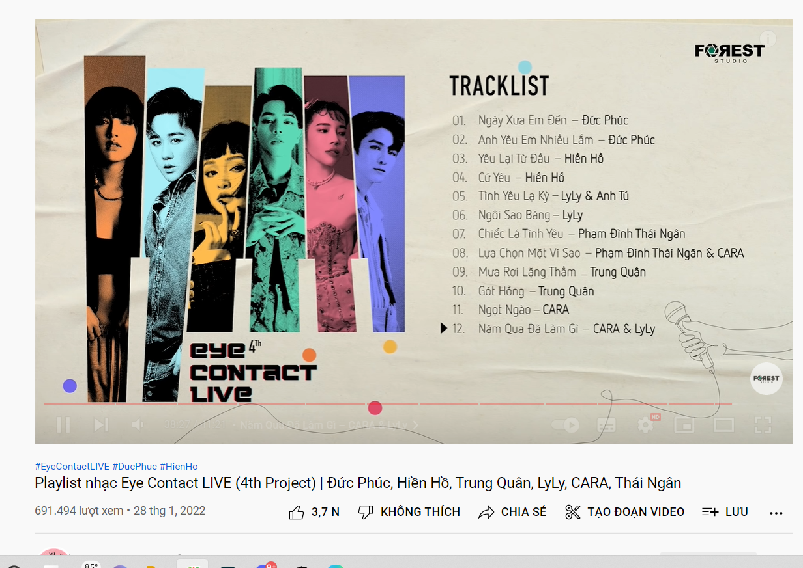

- 05:31 Đúng là sinh viên sẽ ăn mì nhiều đây
	- không phải vì nghèo mà bận học không có thời gian
	-
- Làm thâu đêm nốt cái note record [[HCH Faci Structure]] tới giờ mới úp bát mì mà xơi cho có sức làm tiếp.
- Định đánh Tốc chiến nhưng thôi làm nốt đi, muộn lắm rồi, muốn xả hơi thì tải cái app 200 câu hỏi là được
- Mệt rồi, tôi nghĩ giờ này nhiều đăú dậy rồi, Minh Thảo mà biết tôi thức thế chắc sẽ mắng tôi đi ngủ. Hi vọng thế. Nó mà đọc cái này và bảo tôi vì lúc đó muộn rồi sao mắng tôi được nữa: Ừ tất nhiên tao sẽ nói thế rồi. Một cách dịu dàng như thế chắc cũng đưa tôi vào giấc ngủ ngàn thu vì mãn nguyện luôn ý.
- Ngủ đi, mặc kệ đống bài tập. Không làm có chết ai. ừ. Giá mà ai đó làm hộ. Nhưng thế không hay, giá mà ai đó học hộ như hình thức do for you - phục vụ thì hay hơn. Mà học để làm thì chỉ có làm hộ thôi chứ làm sao mà sản sinh ra một thứ  lại ở người người khác được. Trừ khi là mổ nhưng tri thức là nơ ron và nó trừu tượng, không hình hài. Thế thì chỉ còn cách học rồi tác động bị động như nói ra rả suốt ngày hoặc là bón hộ đống kiến thức đã chế biến như em bé ha
- 07:22 đi ngủ thôi, không buồn ngủ cũng phải ngủ. Ngủ dậy làm nốt cái kiểm tra Discord và Notion rồi đọc mấy cái của chị Fuong. Mà khoan đang băn khoăn để đọc và tích hợp tốt hơn thì mình phải có sẵn mindset tức là map sẵn những vấn đề cốt lõi nền tảng mình thấy và xây tạm cái based cảm xúc các thứ của mình đã chứ. Hay đọc chill chill thôi cũng nảy ra ý mà, rồi lại kết hợp ý hả, thực ra rồi nó cũng fit thôi. Hừm thôi tùy lúc dậy. Ngủ ở phòng tôi không ngủ được vớ cái nắng vàng buổi sáng đâu. sang phòng mẹ nó thanh cảnh dịu nhẹ màu rèm xanh hơn
-
- Dậy thì đọc cái cần phải làm trước và còn một số note của mày mày đã chưa đưa vào
-
- 14:37 dậy làm note ghi chú
	- Logseq thua nặng ở đoạn không có tìm ở page
		- [Reddit](https://www.reddit.com/r/logseq/comments/tc7d66/is_there_a_ctrl_f_for_finding_text_on_a_page/)
		- dù có search within page nhưng không đưa đến đó mà đưa đến thẳng đó luôn nên khá là không dễ theo dõi
		- dù việc cập nhật comment của tôi thì không bị ảnh hưởng
		- mình có nên tìm cách cấu trúc lại bài viết để mỗi phần không quá dài hoặc không quá lộn xộn khó tìm ý không
			- yeah dù add thời gian video vào hay tìm bằng chữ, lời thì kết quả vẫn thế. việc tìm qua video dễ hơn nhiều việc tìm từ trí nhớ
			- dù back lại để nhìn toàn bộ cũng chỉ tốn thêm có vài phút
		- Google Docs thì thua ở đoạn nó không show hết page nếu muốn tìm tiểu tiết
			- cũng chẳng kết hợp hai cái vào với nhau được
			- Logseq vẫn chấp nhân được ở đoạn mở tab bên cạnh và tổng hợp ý làm blog
- 17:32 Xem hết rồi, đồng tình một số ý và có nếp nghĩ riêng, nghĩ mình sẽ hợp phần nào với suy nghĩ cũ nhưng đọc lại thấy nó thừa nhiều hơn là kiểu trùng là tốt...
- Chuyên mục những bài hát mùa đông mà không lạnh
	- 
	- Và nhạc năng động
	- 
-