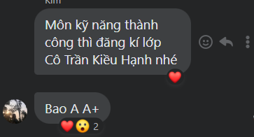

- 04:29 dậy làm tiếp với MỞ ở [[MỞ - Community Manager]] phần build hệ thống
- Còn quên một cái là những apps đi kèm với MIro rất đỉnh.
- tự dưng hiểu lại cảm hứng ích kỉ tham lam ở khoản sao chép "ăn cắp" thu thập thông tin
	- dù chẳng hiểu tại sao nên nhưng nhớ đến hành động mình sẽ làm gì nếu là mình ngày xưa chứ không phải ngày xưa mình làm gì
		- chụp lại tất cả các note và suy nghĩ cách làm việc, ý tưởng của mọi người và vứt hết vào một folder #DOING
- khi viết chữ **văn hóa MỞ**, chợt nhận ra khi đánh giá và tìm cách đạp lên người khác, mình cần quan tâm cả yếu tố văn hóa nữa chứ không chỉ tư duy hay tài năng, tài sản họ có được, hay đúng hơn là tất cả yếu tố riêng rẽ một cách riêng rẽ chứ không phải nhìn nó ở khoản toàn diện. Vì toàn diện thực sự thì mọi cái riêng rẽ sẽ toàn diện
- #goal suýt quên mình phải học thi MOS expert nữa, mà IC3 là gì
- tham khảo mấy kì thi, góp ý đánh giá và đặt chủ đề trên các nhóm trường khác nhau để vừa nói lên về sinh viên, cách học ở trường đó và lên kế hoạch những gì mình cần làm.
	- như mua vở, như SYLL, mang gì nhập học, tính trước bao giờ đi nghĩa vụ,...
		- 
		- về giáo viên và trường
			- 
			- 
			- cái này có thể hỏi thầy Trung hoặc thầy cũng không biết
			- 
			-
		- lập luôn list những điều đại học sẽ làm cũng được
			- có thể chia thành từng năm mỗi khi đổi mới
			- tất nhiên vẫn có trang cập nhạt mới nhất, đầy đủ nhất
			- còn mấy trang cũ cho vào làm lịch sử.
		- mà mấy trang của các trường thảm hại vl, dù mình biết ơn đã có người hỏi để mình chỉ phải search ra các post và có chị support luôn ở đó nhưng kì thực có thể hoàn toàn không cần. Làm wiki của trường mẹ đi
			- đồng thời cũng rèn người ta tư duy không cần hỏi lại cái cũ, trước khi hỏi thì search, cách trả lời cũng phải thật xác đáng và đúng hơn là nếu bên văn phòng làm tốt thì chẳng ai cần hỏi gì nữa cả, các quyết định xong hết luôn thì tuyệt
	- Thực ra mình lên kế hoạch sẵn và thống kê các mảng các trường cũng được. Nó sẽ hơi dở dang và không theo thứ tự lắm nhưng nên có kịp thời
		- nó chỉ là mô hình để mình nắm rõ và sống 1 cách bình thường thôi (từ giáo viên đến cơ sở vật chất, đến cơ sở onl như thư viện, app được dùng nick edu... đến khuôn viên, map,... đi scout hết đi)
		- à đấy hỏi Phương Thảo xem nó bao giờ nhập học
		- sau tùy nhu cầu sẽ chọn hướng và tùy tham vọng sẽ chú ý và moi móc, tạo vấn đề khác để tìm hiểu
			- cũng cần bám một mentor nữa, không nhất thiết là người hướng dẫn, có thể kết thân với ai hợp như chị Huyền giúp tôi nhiều về thông tin phốt các thứ ở Chu nè hay trân trọng và hiểu mình
- Sự kém cỏi của hệ thống
  collapsed:: true
	- 
	- 1 là quy định và lên sẵn nếp sống, lối làm việc
	- 2 là để tự do thì nên cập nhật ở một chỗ tất cả tính năng và ghi rõ bao giờ sẽ có hoặc có kèm hướng dẫn, đỡ phải tra. Cái trang đầu vô dụng vờ lờ
		- 
	- 
	- éo có, éo biết bọn nó tra đỗ chưa kiểu gì, chắc xem điểm chuẩn công khai trên page facebook
		- 
	- và ghi như cặc
		- ghi rõ khoảng thời gian đi nó tốt hơn hẳn, đấy sẽ không phải mạng hệ thống mà là logic và hình thức hệ thống?
		- 
- 
-
- Some Shower Thoughts
	- dạo này chuyển sang dùng cái này hay ghê ha. Ừ vì nó tiện ý mày dù lộn xộn thì vẫn rất lộn xộn
	- Cái cũ thì dùng Note hoặc note từ giấy thì dùng dạng page Note
- Tò mò với Phương Thảo ghê
  collapsed:: true
	- và ghen tị, thế thì phải cạnh tranh rồi
		- nhưng nhớ cạnh tranh tốt với mày, còn tệ với người ta hay không không tính, là không hủy hoại bản thân dù nó chẳng vui nhưng nó là tín hiệu cầu cứu. Hơi nhảm nhỉ, may mà mày vẫn đẹp trai phần nào dù có diệt mình. Yên tâm tao sẽ giúp mày
	- nhưng cũng thương nó, học mà không có thời gian chơi là học kém rồi? Hoặc làm gì mà vẫn giỏi không cần học phải hành hay phải cày
	- và có thể nó không có cách học cho đỡ phí: học phát sau cả đời có thể dùng lại, không phải học lại hay sẽ quên đi không áp dụng
- Qua Discord chỉ mới tìm hiểu được một số mô hình thôi, với những mô hình lớn chứ không hướng đến cộng đồng discord và dùng discord để liên lạc như [[Heptabase]] thì nên có page riêng, thực ra kiểu [[Phố Người Việt]] có cũng không sao, vì mình làm wiki mà
  collapsed:: true
	- vấn đề là [[Heptabase]] có cả twitter nên sẽ phải thêm và mode người ta cũng có blog để đọc, mình có thể brand bản thân ở đây nữa
	  collapsed:: true
		- 
		-
- Phát hiện MỞ cũng tân tiến với tool react để vào server private cũng hay, có lẽ nên làm server riêng cho từng nhóm
  collapsed:: true
	- dù cái react này không làm câu lạc bộ được, đúng không nhỉ?
	- bên đó có mod xịn ghê
	- hay cứ làm đi, coi là một hình thức ẩn, tốt hơn là thread
- còn nhiều bot và nhiều thứ để tìm hiểu lắm
  collapsed:: true
	- sau này mày có một số vốn nhận biết rồi mày sẽ nhìn qua là biết cái nào đỉnh hơn, cái nào cần học và dùng và giải quyết được vấn đề. Nó là nhận biết insight. Đỉnh cấp của khả năng nhận biết, khi mà nhận biết không phải level thấp mà sánh ngang các cái thông hiểu vận dụng vận dụng cao. Mà tách được vận dụng vận dụng cao thì tao quỳ
- đây cũng mới là tư duy của quản lí, nhìn xem cái gì cần chứ chưa nhìn sâu
  collapsed:: true
	- tư duy cấu trúc à, dù cấu trúc xịn thì sẽ liên kết với nhau không chỉ ở mặt hình thức mà còn ở các phương diện khác như mạch hoạt động,...
	- cái mô hình của tôi ở MỞ có cái đó chưa hay chỉ có hình thức
		- thế nào là hình thức? nhìn đẹp mắt, nhìn thú vị, nhìn chuyên nghiệp?
		- của mày nó không có vẻ thế lắm mà tích hợp và tạo nên cái đẹp ở chuyên môn luôn ý?
		- mà còn những dạng mô hình tổ chức nào
		- main của mình có cái này nên chắc là tương tác
		- còn có dạng tiện nghi nhưng chắc tiện ích chỉ nên là tiện ích, quan trọng là tương tác và đôi khi, ảo tí, tương tác cũng đủ rồi?
		- 
		- mà đáng lẽ lộ trình là phải thấy vấn đề ở mô hình mình, nắm rõ, đưa thử giải pháp tốt nhất có thể rồi mới đi tham khảo thêm chứ?
		  collapsed:: true
			- mày làm sai nãy giờ thì oke vẫn chấp nhận được vì mày vẫn hiểu biết phần nào, chỉ là mày chưa visual kĩ thì không chính xác thôi
				- 09:18 khiếp đây có phải cách nghĩ ý tưởng không? kì lạ là nói phát, nhìn lại note đúng dòng đầu có chữ ((63225da9-528a-4e73-90df-902cf1d1d23c)) là ra luôn
					- 
					- nhưng để đẹp hơn, vì cái này không chỉ là note ý tưởng thì search thử library đi
						- xịn nữa là mày phải phân tích rõ hình thức loại này (thường nhiều người dùng mà, nó cũng basic, đặt tên hoặc tìm tên cho nó đi)
				-
		- Ấn vào discord sau khi đánh Catalyst Black thấy chữ journal, chợt nghĩ kênh blog có thể biến thành nhật kí hoặc thành cái nơi share nhau ý tưởng về cấu trúc một bài note, trang note và hệ thống note để tạo động lực, học nhau và học NĐH hoặc NĐH feedback về cái đó
		- Cái này UI/UX đẹp và pop up lên đúng lúc mà show tính năng hay thì thú với mình
			- 
			- của miro. chẳng biết có xem lại được không nhưng đáng ra là có
- Nghĩ đi nghĩ lại thì chốt là ở mỗi nền tảng mạng xã hội mình sẽ branding một kiểu
  collapsed:: true
	- thế sẽ nhiều thú vị hơn cho người xem vì họ được khám phá còn mình ép mình không được bó buộc với bất cứ cái gì
		- khi làm quest Catalyst Black thấy nó branding ở nhiều app quá
	- Thử cái template này cũng hay, người ta có catagory hơi khác mình cũng có thể khai phá được thứ mới
	  collapsed:: true
		- 
		- nhưng rối vì nó nhỏ, chữ bé
		  collapsed:: true
			- không thì thử phóng to lên xem, vì một số cái dùng cũng hay
			- 
			- yeah éo dùng thử thì mất cái tích hợp ý tưởng thời kì nào, mà vấn đề này cần đọc nhiều thì chấp nhận chứ ý tưởng lớn, sâu không thể minh họa hết được, hoặc hết thì nó sẽ trừu tượng lắm
				- yah tự tạo cho nhanh, vô tình sắp 4 cái kia xuông dưới lại đẹp hơn là để ngang, bo góc nữa thì đỉnh?
				- 
- Thấy MỞ thích cap học viên, 1 tháng hi vọng có nhiều điều để làm kiểu điểm tuần, phóng sự, nhìn lại 1 tháng học cùng nhau?
- 21:08 hoàn thành nốt đánh giá về discord và đề xuất một số giải pháp
	- thấy cái mình đưa ra nó bình thường quá, không biết mọi người có thể đưa ra tương tự được không nữa
	- với những giải pháp và sáng tạo đơn giản thế thì list lại rồi gộp thành một hướng giải quyết được đấy nhỉ
	- sau này sẽ phải chia lịch, thứ tự để mình tương tác và đẩy tương tác trên các kênh đó
	- rồi các vấn đề cũng tương tự, có thể gộp nó thành một vấn đề chung và thử tìm giải pháp từ bên ngoài những nền tảng này như chính ở sự tương tác người với người thực tế hoặc giải pháp tổng thể nhiều hơn là cục bộ (1 mũi tên trúng 2 đích? kiểu đi chơi về làm blog...)
		- một cái chung cũng quan trọng nữa là cách đánh giá vấn đề dựa trên cái gì và như nào
		- một case như này với những kinh nghiệm tiềm ẩn trong bản thân hơi khó để mình đưa ra một đáp án đầy đủ cho chủ đề này
		- có lẽ để mọi người cùng đưa ra thêm thì mình sẽ có cảm giác hoặc thật sự có được một góc nhìn khách quan hơn
	- Kì thực mình mới đọc manga Game obu **Familia** và thấy chị Hà giống người kết nối mọi người và điều phối công việc - vì chị tương tác nhiều, hơn là mình. Mình giống main chỉ làm việc trong bóng tối quá :'(
	  id:: 6324849f-f55d-4dcc-801d-080a83b48d07