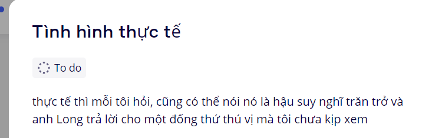
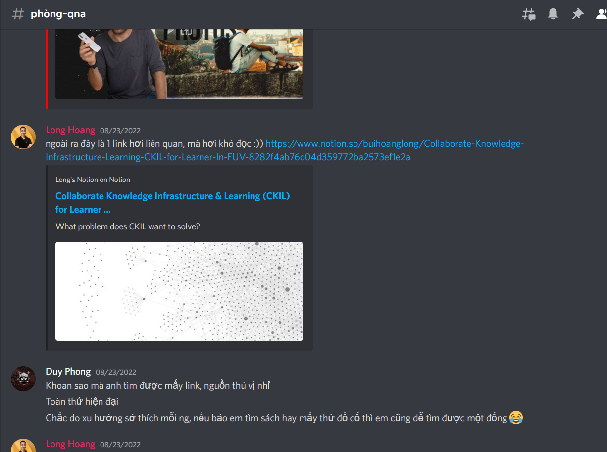

- Khi đang đọc Game obu Familia, những tập 26,27 có đứa em của main rất hứng thú với tri thức. TÔi cũng nghĩ về coding là một mảng cực kì rộng, chẳng hiểu sao. Người ta đầu tư và phát triển nó nhiều trong suốt những năm qua? Nhiều người học? Thế còn văn học khoa học xã hội mấy năm ấy làm được gì? Không rõ.
- Nhưng tôi chưa dám nói câu làm được thứ tốt hơn hoặc làm được thứ ưu việt hơn tất cả...
- Chợt tâm trí nảy ra một thứ từ cái ý rộng đó. Rằng mày sẽ mãi kém cỏi nếu không hiểu được sự rộng lớn của thế giới này.
- Đúng, nó không chỉ là biết những cái đỉnh cao chót vót, những cái vực sâu thăm thẳm (nếu đỉnh là người là kiến thức thì vực là gì, là cảm xúc? tại sao mày đánh đồng, vì mày hay nói chiều sâu tâm hồn? ừ tại sao người ta nói thế làm mình hình dung thế và cảm thấy thế hay thực sự là thế. Nhưng có vẻ cái sâu có sự kết nối tới nhau và tất cả nhiều hơn là cái cao. Giống như tâm hồn kết nối ư?) mày còn phải biết cái rộng, cái gợi mở và thậm chí cả những phạm trù mới chưa đạt đỉnh, chính nó cũng là cái đỉnh, nếu mày xoay lại cái hình mà đúng không. Ừm có lẽ. Mà nếu mô phỏng nó dưới dạng không phải trục Oxy thi lại là những vấn đề mới, có thể mỗi cái là đỉnh riêng.
- Dù sao mày mới muốn vượt hơn con người thôi nên... Google và sách không phải vô tận, dù nó rất nhiều. Mày còn có thể làm gì đó, nhưng để kiểm soát mình đã nắm được hết chưa, mày phải kiểm saost được thì mới giỏi, an tâm. Mày phải kiểm soát được mọi thời gian của những con người, nếu có thể thì cả của những sinh vật khác trên thế giới xem, xem họ đã làm gì, mảng nào, họ được điều phối đi đâu,... và sinh vật thì nó phát triển thế nào. Con người cũng thế, phát triển ra sao mà tìm quy luật, à không, phải là phương pháp của sự phát triển thực sự. Cách để bứt phá và thực sự có thang đo để biết mình tiến lên. Đôi khi nó không thực sự là cái thang khách quan trừu tượng nữa mà là chủ quan so sánh với nhân loại. Có khi nó chỉ là hướng đi thôi, nhưng mày phải nắm được và so sánh được, không phải mày hơn gì ngày xưa ở một số thứ mà so sánh toàn bộ con người ở 1s trước với 1s sau xem, 1s sau, 10s, 1 năm sau hơn gì một năm trước? định luật bảo toàn tất cả các thứ có tồn tại không, không thì mày thiệt.
- gần 11 giờ hôm qua đã họp xong nhưng tới tận nay 02:06 tôi mới có sức ngồi vào viết và làm vì không có gì để bỏ bụng và cái lạnh khiến tôi buồn ngủ.
- những trang viết thế này, thật khó để đưa nó vào một dạng topic, nhưng nó có ích trong việc định hướng con đường. Tạm cứ cho vào đó đi, dùng nó như tuyên ngôn nữa. Dùng cái sự hào hùng của cảm xúc này!
-
- Những lời viết cho sau này
	- mày đã nhìn thấy gì mà nói được những lời đó, nhận định đó dù mày chưa biết hết và không biết trọn về nó
	- như quản lí không cần biết rõ hết, mày biết hạn chế của cái này mà
	- yeah nhưng bằng cách nào đó mà nó đúng\
- thì tôi phải làm được gì đó để chứng minh nó đúng và đòi lại quyền công bằng và sự hỗ trợ cho lũ trẻ. Gửi những kẻ sẽ tung hô mến mộ. Tôi làm được những điều đó khi còn nhỏ không phải vì tôi là thiên tài. Mà là vì các người đã đánh giá quá thấp giới trẻ.
-
- Chap 2 Game obu Familiar, lại vấn đề những kẻ thông minh IQ không đủ thông minh để hiểu ác ý con người, nó gọi là sự khôn lỏi, yeah tại sao, vì nó là EQ? kiểu vậy? tôi không biết, hoặc tại chưa ai viết thành sách hay vào văn kĩ như vậy về con người. Biên niên sử, bách kho toàn thư về loài người. Không chỉ là tri thức mà tất cả, từ nhỏ nhặt vụn vặt đến lớn lao, tất cả những gì con người chạm vào, nặn ra, đều là của loài người.
- Tôi mà viết được, hay ít nhất tôi viết được như này, liệu đã giúp cho văn học phát triển, đã kích thích tư duy? đã tạo nên hay đẩy giới hạn của cảm xúc lên một tầm cao mới? Không rõ, nhưng kì thực nó vẫn thế, mọi thứ vẫn có sẵn ở ngoài kia, tôi chỉ viết lại vào văn nên mới có nhiều việc cần làm thế. Như là IT, một hình thức mới?
-
- 19:48 xem đi
	- 
	- 
-
- 20:01 haha nghĩ mãi về chuyện cái nào nên dùng thread, cái nào không, rồi liên quan tới báo nữa, chẳng hạn có bài báo là thread ... đã hồi sinh? rồi tương tác không tốt, à ừ ai là tổng biên tập, tôi phải học và nếu là tôi và tình hình không khả quan thì tôi sẽ được quát chị Hà hê hê :)))