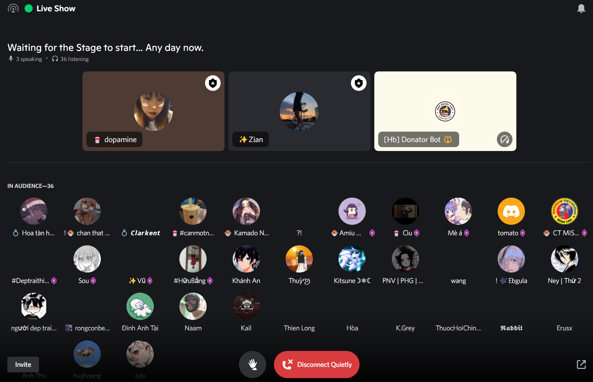

- Sáng ôn lái xe, trầm cảm vì suýt mất hết kỉ niệm, tìm cách lấy lại, không vượt quyền được, chỉ còn cách hack? nhưng xin được mà
- rồi làm tiếng anh
- chiều ngủ dậy rồi mà không tỉnh nổi, phải ra đường đi tập xe (4-5h)
- về làm tiếp tiếng anh rồi trước khi 9h vào họp github thì phải tìm hiểu sơ qua
- tí lại là cuối tuần với lớp, dù có thể không có ai mà có thì cũng hoảng vì chưa chuẩn bị gì, sợ không có gì hay để nói, sợ phí thời gian bọn nó, sợ bọn nó không quan tâm
	- mà lần trước bọn nó cũng chưa thấy tầm quan trọng, tôi phải branding bản thân với bọn nó nữa ư hay bọn nó vẫn biết tôi giỏi mà không muốn như tôi thôi, tôi lại bảo tôi sẽ nuôi sẽ chiều nữa thì ai muốn học
	- tí cũng xem buổi chia sẻ của Thái Anh và Thuận.
		- Thuận ốm rời rồi
-
- Nghe Show âm nhạc ở trên Discord [[Phố Người Việt]], có con host bằng sự thân mật bình thường của bọn nó: chời ơi Chủ Nhật mà học gì
	- 
	- làm tôi muốn khịa mày có bao giờ học à lắm, hoặc có thì thật sự học? nhưng đừng look down on people và coi bọn nó vô học như thế
- Dù sao bọn nó cũng gợi ý tưởng hay mà. Lúc đó có đứa trả lời bằng một câu sến súa
	- học toán để tính thời gian ta tìm ra nhau
	- 
	- nghe thì đúng là nực cười, kiểu chơi chữ chữ hơi ẩn dụ đặc trưng chứ chẳng hoàn toàn là ẩn dụ? thực ra cũng có đó nhưng chỉ là mày khinh nên mày không cho bọn nó được mang cái định nghĩa đó
	- Nhưng nhìn lại lần nữa, có khi cũng là một cách, cũng được nhỉ, quan trọng lúc đầu là tin đã, mà thực sự có thể tính xác suất hai người gặp nhau, nhưng thực sự giỏi có thể tham số hóa rồi tính mọi đường để xem có cách nào tôi đến với người đó. Tất nhiên bản chất nó là tham số hóa chứ không phải là tính, vì tính sẽ đi kèm với nhiều lĩnh vực khác nữa mới hoàn chỉnh được không thì có gì mà tính
- Hai con MC tôi sẽ gọi là vô duyên, chỉ là người cầm mic nói, nhưng cũng có hai thứ đáng chú ý: tạo một vibe nói chuyện quá small talk mà tôi không thể nào hòa nhập được và ít nhất cũng có phần giao lưu hậu ca hát nhưng chỉ hỏi bạn vào đây không, bảo rủ bạn vào hát cùng và hình như là có người yêu không nên mới hỏi một đoạn tôi nghe được là ở đây có bạn nữ nào 2005 không?
	- thay vào đó có thể hỏi tại sao bạn chọn bài này hoặc bình thêm về bài hát, cảm xúc của mình? Mà không bật cam thì phải nói được hay như trên radio. Người trên đó nói đỉnh vì họ tập trung hoàn toàn vào giọng. Khiếp cái đó mà kết hợp cử chỉ ngoại hình thần thái nữa thì perfect?
	- ừ tư duy MC trong tôi hiện lên, đáng ra phải có lời dẫn hoặc giới thiệu bắt sự chú ý chứ không nhảy thẳng vào bài hát được như thế. Nhàm chán
	- ừ bọn nó biết bình giọng bạn mới dễ thương quá
	- cười cũng vô duyên thở vào mic quá!
	- nhưng được cái là bọn nó dẫn chân thực, như những gì bọn nó có, mỗi tội có ít quá thôi
-