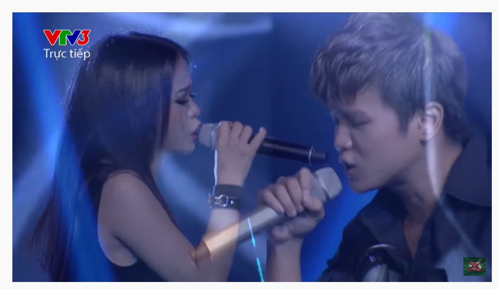
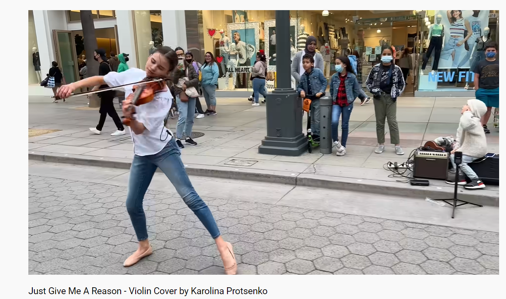
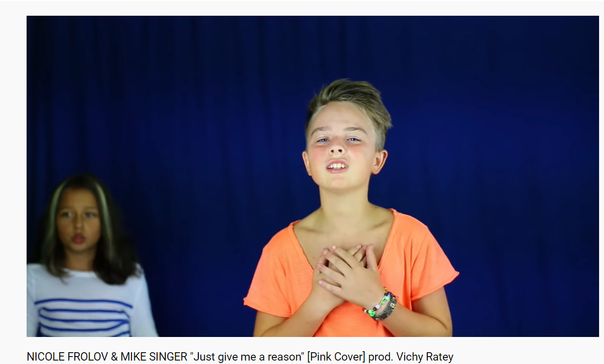

- khuya tầm 0-2h channel cuộc sống thường ngày mới của anh Long cũng cool, nhưng chẳng biết nó sống được bao lâu, chỉ biết lúc mới tạo ra có người tham gia nó. Nó lại giống thread rồi
-
- Và nhận ra cái inbox của discord mà mình không bao giờ để ý vì nó không nháy số
- nhưng mình có thể tận dụng cái này để mọi người không miss tin quan trọng. Ai cần gì cứ @mentions role như subcribe mảng IELTS. nó sẽ hơi nhiều, thu nhỏ lại thì là questions, mọi quest. Và mọi người có thể tắt thông báo đi, bao giờ vào thì ra inbox check đầu tiên
-
- 09:22 sắp uoload xong hết Teams lên [[synohyperspace]]
	- chỉ cần dùng ổ E vừa tải về, double check rồi xóa
	- chẳng hiểu sao recording của Teams khá ít dung lượng. Chỉ lúc tải về hay lỗi mà hỏng thôi
- tôi cố giữ cho bản sao chép này giống cái thật sắp vĩnh viễn mất đi nhất có thể
	- trong những lúc như thế, tôi tưởng tượng về mình
		- như một thằng bệnh hoạn yêu những cô gái này lúc còn xanh này, yêu cái không khí và tuổi học trò tươi trẻ
		- và tất cả những thứ từ những cái bọn nó comment, bọn nó đáp, tôi có thể ngồi vào học, học cách quên và xóa nhòa kí ức cũ hoặc tạm cất nó đi để mình như nhập vào hẳn bản thân hồi xưa. Như vậy chắc cũng được thôi, phải thuyết phục bản thân kia là hiện thực
			- mày vừa ngồi làm việc khác vừa nghe cũng được vì thực tế mày vẫn luôn làm thế mà...
			- nó sẽ càng thật thôi.
		- chỉ mong là mình cảm thấy bản thân muốn phát biểu gì đó, chắc phải mang cẩ sách ra học lại, chuẩn bị không gian các thứ cố giống học ở trường nhất thì viễn cảnh đó sẽ được tái hiện lại thật chân thực.
		- thế mày phải work on cái thời khóa biểu đó. yeah chứ không không nhớ tiết nào mà xem. bản chất là không học liền tù tì mà từng môn
		- nhưng nếu được thế thì thích quá, quá thổn thức luôn, nó như mình hút vào và sống trong màn ảnh chứ không chỉ là quan sát nó, thấy nó. Cảm nhận sự thổn thức này và gọi nó là sự chân thực khi được du hành thời gian về quá khứ đi...
		- rồi nếu chưa được thì cứ cố cứ cố. thư viện cũng là một loại bảo tàng, bảo tàng của kí ức. và làm sao để nó thực nhất có thể hoặc là một nơi để ai đó đi dạo cùng bạn như tôi với Phương Thảo từng đi hai tầng của bảo tàng Văn học. Ôi kỉ niệ đáng yêu sao đau xót thế, sao thổn thức phải ngập ngừng như ngắt từng nhịp thở thế. mày cứ làm như tao đau vì nó lắm. Có lẽ là thế nên thổn thức như thế hay chỉ là thổn thức nó là thế thôi?
			- như nhiều khi tôi xem mấy bộ anime cũ để cảm lại cái hay trong bộ đó, hoặc như xem mới với sự bất ngờ hoặc ôn lại những tháng ngày, ôn lại cảm xúc xưa của mình, ôn lại những sự lay động.
	- khác với lúc tách khỏi thân để quan sát bản thân đơn thuần
- 12:26 nghe thêm về các version của bài hát
	- có nhẹ nhàng có cháy bỏng có điên khùng
		- và có hiệu ứng edit
			- (TMKM : JUST GIVE ME A REASON - SONG TÚ ft THÁI NGÂN : NTBA 2014 ( SEASON 1) - LIVESHOW 8 BÁN KẾT)
			- 
		- kết hợp loại hình nghệ thuật
			- 
		- body language
			- 
- 22:17 xem anh Hà dạy
	- không có giáo trình cụ thể mà chỉ có người kèm cũng cực ghê
	- giáo trình có thể là kiểu ứng dụng tập làm quen, tập hiểu tư duy của anh Hưng ở DC gửi
	- a hay quên nhỉ, hoặc k biết, nma nếu thế thì cx phải bt cái mình kbt là gì, ở đâu trên bản đồ thế giới kiến thức và mình chưa biết đg tới nó hay gì, hay chưa biết nó ở đâu cụ thể, hoặc ở đâu luôn?
- tập trung xem và cố mà hiểu cái mớ bùng nhùng anh đang làm đi
- sao k xem youtube hoặc cùng học cùng xem từ YT?
- cái cách người ta sắp xếp các dòng lệnh lùi và thứ tự, quy tắc quy luật ra sao dựa trên đâu?
- xem livestream của anh lúc anh mò thì quả thực không hiểu và cũng khó để giải thích anh đang mò gì và tại sao lại thế vì anh có nền khác mình
	- nên đôi khi mình k chắc chắn, tự cảm giác thấy nó làm người nghe rối là phải. Lúc đó có lẽ thay vì không nên nói hay đưa ra câu trả lời không chắc chắn thì hơn
	- hiểu cảm giác ghê - chứ thấy bọn bạn tư duy toán tôi còn thấy bình thường dù vẫn khó hiểu. nhưng không bị các cửa sổ làm cho lú
	- 22:27vừa tra cách chia màn hình xong, wins + mũi tên
- cách để chỉ nhanh đúng là nên gọi tên thanh ribbon chẳng hạn, hoặc nắm sẵn ở đâu. Nhưng cách gọi tên xác định vùng đỡ khổ hơn nhưng tại sao lại có cái sự không nhìn thấy đấy nhỉ
	- hay do rối chưa hiểu chứ biết khoảng nào thì lướt phát qua luôn được mà
- 22:41 thay vì xem anh giúp các bạn thì mày đi tìm mẫu sổ đoàn cho Lê...
- 22:46 máy ảo là gì?