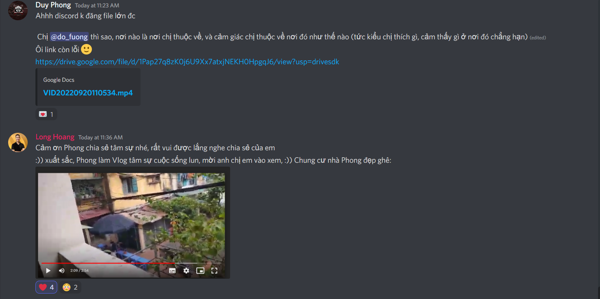
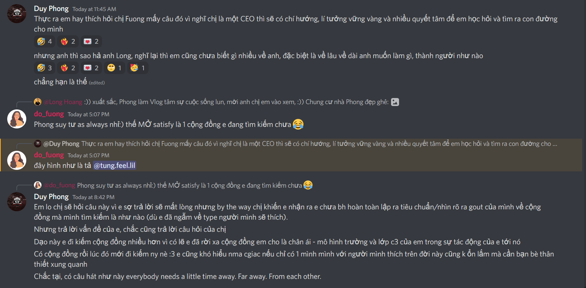
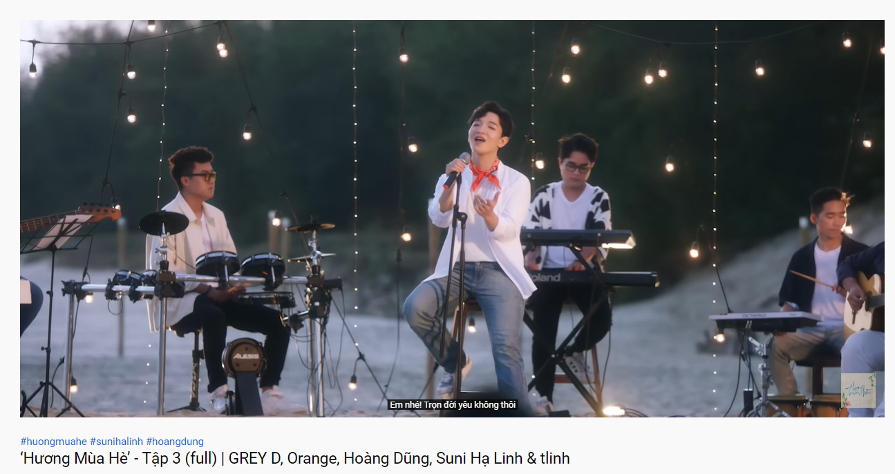
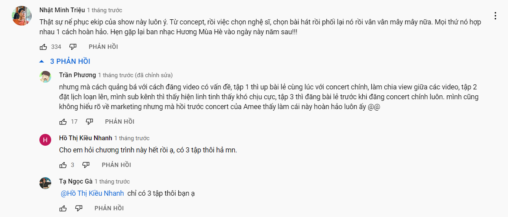
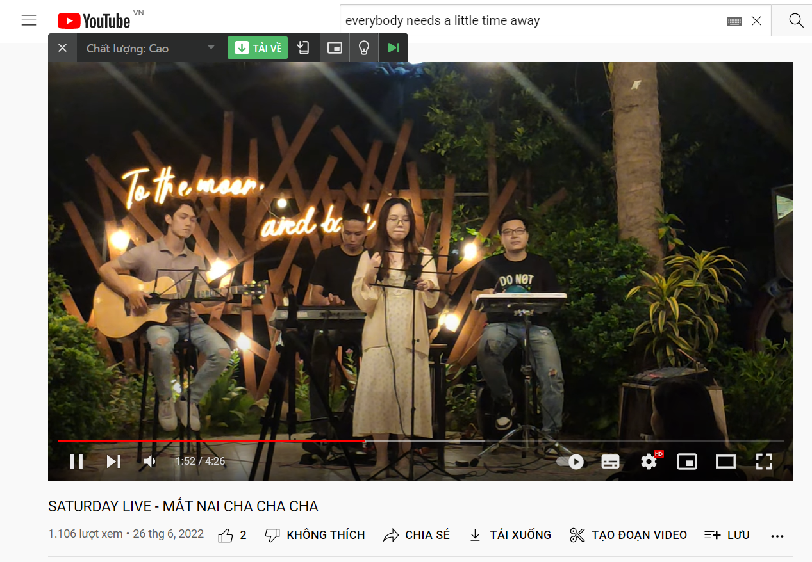

- Nhắn xong cái này trên MỞ, tôi nhận ra tôi còn đi kiếm một cộng đồng trong quá khứ, là chìm lại vào khoảng thời gian cấp ba
	- 
	- 
	- 
	- tôi đã suýt quên vì ghi mỗi khi viết cái này ở MỞ rồi đi embed context kèm ý tưởng hay vào. Lúc quên rồi thì cứ làm việc cũ là up từ Teams lên [[synohyperspace]], đi nặng tua lại từng thứ mình đã nghĩ trong khoảng thời gian đó, không theo một trình tự nào vì mình không nhớ rõ. Các ý này tách nhau quá. Chợt nhận ra việc mình làm chính là đang xây cho mình lại cộng đồng quá khứ. Cái này muốn nhắn nhưng không nhắn thêm được vì chưa ai nhắn tiếp, mình suy tư nữa thì tự kỉ quá :)))
		- chị Megan có comment rep chị Fuong, chắc cũng đọc tôi nhưng chỉ tym. Buồn ghê, ít nhất chị có thể là một người chị mạnh mẽ hoặc tỏ ra mạnh mẽ: thằng em này mày lại nhắn linh tinh cái gì thế hả, rồi bảo có gì cứ nhắn riêng hay đi chơi với chị? tôi mượn hình tượng chị Megan để làm điều này
		- nếu ai nói câu đó thì tôi sẽ cười nhẹ, để tạm nỗi bận lòng kia của mình sang bên mà về hiện thực, không phải ở một hiện thực song song của suy tư nữa. Tôi hiểu chứ, chẳng ích kỉ trách họ không hiểu đâu, vì tôi nói để tìm đáp án và tự tôi toàn tìm được đáp án như trên
			- tiếc là chẳng giúp được ai và chẳng kiến tạo nên được một cái đáp án có ích cho thế giới
			- không có ích thì ít tương tác được bất kì ai thôi
			- nhưng có lẽ nếu mày đi đến đáp án cuối cùng được rồi thì đời mày sẽ hoàn toàn trọn vẹn chứ không hẳn cần một sự giúp đỡ, một chân ghép từ mảnh ghép khác trên đời để trụ vững. Nó sụp rồi mình sụp theo. Dù thế cũng không quá tệ
- Copy file, có những cái tên thật đơn giản như Bài thực hành ở trong GDQP, tôi lập nó hoặc ai đó chỉ để dùng lúc đó, cho người ta biết chứ không ghi date ngày tháng, deadline ở đấy cũng được - dù chúng tôi không coi nó hoàn toàn là công việc mà check, chỉ là một bài tập thôi, một bài tập chơi chơi. Đáng ra lúc đó ra vẻ với gái về sự sắp xếp chinh chu của mình bây giờ cũng hay
- và cảm giác về mùa đông
	- nó làm ta thấy ấm áp hơn ở duy nhất một chỗ, là ta thấy lạnh và ta cần người ấp ôm
	- và cơ bản là nó thấy lạnh, chứ cứ man mát hoặc nong nóng như dở hè dở thu như vậy chẳng cảm thấy chút gì cả. Thời gian đã không chảy vì không có người đẩy nó đi, không gian cũng đóng lại những thì thực chết dở mà
		- cần học cách khiến thời gian bản thân vận động không ta dễ lệch nhịp sinh hoạt, làm việc với thế giới lắm
		- tuy nhiều người lệch thế mà mình vẫn phải đúng à, thực ra đúng ở đây là đúng với cả những người lệch kia
			- như mày là từng người và cả thời gian chung là năm học - thứ thời gian bất định, chỉ có mày thay đổi chứ thầy cô thì không
- Biển khơi và bài hát bài ca tình yêu
	- 
	- tôi cũng xem đoạn đầu, tôi vẫn chê edit series này nó cứ ảo ảo bởi màu và out nét mà chẳng nên loại video cũ hay loại điện ảnh surreal
	- tôi nghĩ đến bài này hát chiều lúc trời lặn thì hay, chẳng hiểu sao
		- từ xưa đã thế
	- và tôi cũng nghĩ đến cảnh đi chơi mà ngồi hát với nhau thì vui, nhưng ngẫu hứng thế thì sẽ phải dụ mãi mới mời được mọi người vào
		- tôi muốn My phiêu và hát
		- nhưng yeah tính nó
		- nhưng nếu mà bảo nó, lên agenda từ trước thì nó ra trước, ai đó ra cùng rồi mọi người ra ca hát nghe shơ cùng kiểu này cũng hay
			- hoặc nó ngồi bên chòi rồi nhìn gió thổi mà hát thôi? góc quay là từ phía sau, chỉ rõ màu trời còn người và chòi thì tối. Nghe lãng mạn mà cô đơn thế.
			- Được như thế chắc phải kiếm mấy đứa chịu được cô đơn hoặc có trách nhiệm như mày, hoặc một loại rất tận tình với âm nhạc, muốn nhân cơ hội đó để đua âm nhạc của mình đến mọi người - nghệ sĩ hay làm việc độc lập trong phòng thì cái chuyện đàn một mình với cảm xúc hay đàn trước mọi người mà chìm trong tâm trí mình cũng không lạ
- Đôi lúc phải đọc mấy cái này
	- 
	- vì mình hay quên góc nhìn đó, một phần vì không theo dõi theo tiến độ thời gian nên không rõ mà chỉ rõ sản phẩm cuối
	- một phần cứ nghĩ người ta sẽ làm tốt
	- mình chỉ chú ý cái nhiều người chú ý như comment chính, dù khác góc nhìn, mấy cái lịch kia không ai rõ, nó tệ thì người ta mới thấy vì không ai đến đây vì cái lịch
- Sự kì lạ của việc truyền năng lượng
	- 
	- tại sao nghe tiêng ồn giữa đêm hay cảm thấy lạnh lại có sức hơn? cơ chế thực chứ đừng chỉ nói là cái gì tiết ra cái gì và nó làm gì. Sao nó biết và cái gì khiến nó, kích nó? Cho tao một hệ thống xem nào