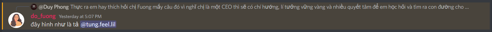
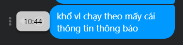

- Hôm nào nhờ anh Long xem hộ các dạng note của mình mà góp ý, giải đáp thắc mắc băn khoăn rằng nó chưa tối ưu, nhờ anh site nguồn khác học hỏi hoặc mô hình của anh
- Chị Fuong né tránh rồi anh Tùng đẩy lại nhưng raise lên vấn đề trao đổi hay
  id:: 632a00e8-503b-4439-8e91-2906807df5a4
  collapsed:: true
	- 
	- 
	- Nó không chỉ là chị thấy thuộc về đâu mà là chị dưới cương vị CEO. Nói hơi relate đến việc là một CEO hơn là 1 con người bình thường có cuộc sống bình thường
	- nghe kích thích hơn hẳn vì bình thường người ta chọn nơi mình thuộc về nhưng chưa bao giờ phân tích tại sao, cụ thể hơn là phần nào của mình thuộc về đó
	- Cái này có thể thành chủ đề cho các buổi trao đổi thảo luận ở giai đoạn break the ice cũng vui - vui hơn cả là mình có thể host và cứ để người ta adds on
		- như hồi xưa có cái câu hỏi nghĩ về cái chết tích cực hay tiêu cực để mọi người suy nghĩ và kể chuyện mình cũng hay
		- anh Vũ Hoàng Long chắc chắn làm cái này tốt, để sang bên kia xem anh có làm gì không vì anh hay kể về chiêm nghiệm mình rất vui
	- Và tiết mục đấy tuy tổ chức ở tám chuyện nhưng nó thuộc về câu chuyện mỗi người nhiều hơn, là channel câu chuyện cuộc sống nhiều hơn
		- vậy nên ở mỗi channel mình có thể lôi ra một chủ đề chứ không tự dưng đưa một chủ đề vào và nghĩ nó thú vị để thử nghiệm mà mình kích thích cộng đồng tương tác với nhau luôn bằng những topic ở cac channel, có xây dựng kiến thức hay bổ não chẳng hạn. Thử liên kết tất cả bài ở đấy vào xem được một cái gì
			- không hẳn là đem kiến thức đó nhập vào mình mà xâu chuỗi các thông tin từ một channel và thnafh một tác phẩm như bộ phim - tôi làm thì dễ nhưng để nó hay hơn thì có thể thêm các bài học của anh chị dạy vào làm phương pháp làm được như tôi
			- và làm thế này đỡ phải làm pool hỏi rồi đợi ai đó đề xuất chủ đề - nhưng có thể thử mô hình này, nếu không ai đề xuất hay hoặc không đủ tương tác thì mình tự host, tổ chức show
				- ừ mấy kênh discord khác tổ chức kiểu gì, cứ làm thôi à, vì kiểu gì cũng có bọn rảnh xem và đăng kí
				- hình như thế chứ đâu có nhân dịp gì hay lên lịch sự kiện gì hay làm gì đâu nên mới phải bảo người ta hát nhiều lên - cũng một phần nó không đắt khách, chất lượng không cao nữa
				- tổ chức sự kiện rất khó ở cái mảng người xem này, khảo sát nhu cầu ở đâu và quảng bá kiểu gì, làm cho người ta thấy cái hay của mình hay thấy cái người ta thấy hay kiểu gì,...
			- có một cách dễ như là hôm nay channel câu chuyện cuộc sống xôm thì raise vấn đề trên cái cao trào cảm xúc của đám đông sẽ được hưởng ứng và đạt đỉnh của cảm xúc tức thành công. Ai cũng mãn nguyện
- Để học tốt thì tài liệu nên được in ra hơn là ngồi đọc trên máy tính. Trên máy tính chỉ đơn giản là ngồi đọc và take note thôi chứ không phải học ý. Xem lại note không hẳn là học, là nghi xý tưởng mới thì để trên máy tính được
	- Vì cách giở sách nó giúp xem lại các đề mục dễ hơn là lướt và đéo biết nó ở quãng nào
- Muốn học tốt Tiếng Anh chắc phải share grammarly + chia tiền với chị Fuong - khi nào xin thì xin một thể luôn
	- tôi lo connection word và word accuracy
		- {{embed ((632a6935-2c46-4fcf-bca3-f93fc74c9941))}}
- bảo chị ý share butter luôn nhỉ
- ĐM 
- Không biết nước ngoài thủ tục các thứ như nào
- Khiếp phải làm calendar rồi bảo nó thông báo rồi
	- google được không nhỉ
- Có đuôi mail đuôi edu rồi thì phải tận dụng triệt để
	- app
	- tài liệu kiểu academia?
	- hỏi anh chị MỞ thêm đi...
- Đi lấy máu xét nghiệm nên nhịn ăn
	- suýt thì lan truyền tin phi khoa học
	- mà doube check có thực sự không, món nào cần nhịn, nên ăn gì và làm gì phòng tránh ngất mà tí máu chẳng ngất đâu nhỉ
		- đây mới là khoa học thực sự - đòi hỏi tính toán tư duy kiểm chứng chứ không phải vài câu chữ và lý thuyết cóp nhặt trên mạng rồi cứ thế áp vào dựa trên sự tương đồng
- 21:51 các chị cười nhiều quá tí tôi phải vào nói về việc cần visualise hóa và 1 agenda hoặc cái gì đó để bàn, 1 bản nội dung và rồi chọn topic nào hôm nay phải xử lí xong rồi giao btvn...
- nhưng có vẻ mọi người quay lại làm việc rồi, không biết note và xử lí được mọi thứ đến đâu - nay tôi được nghe và thấy hệ thống 1 buổi họp hơn là deep into it nên nó hơi khác. nhưng nếu vẫn hiệu quả thì ok
- chỉ cần tí vào hỏi mn bàn đc gì rồi thôi
-