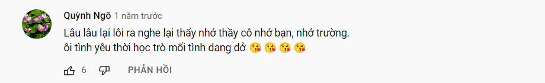

- Vừa record lại video [[Gặp mặt khoa]] vừa nghe nhạc
	- [Beautiful Girls nhạc ngoại lời Việt](https://www.youtube.com/watch?v=LUfklQhpkNk)
	- thấy comment này mới biết
		- 
		- hồi đó họ ca những bài này ở trường
		- và câu mối tình dang dở thời học trò
			- toàn câu từ cũ
				- nhân đang tìm hiểu về ngôn ngữ học
				- sao một thế hệ mang theo từ ngữ lại bước qua
				- các từ đó không bị truyền lại
				- và mấy từ đó chứ không phải mấy từ khác bị thay thế?
				- cái gì đã khiến nó thế (sự kiện, phim, trào lưu,...)
		- nhìn lại mình, cũng đi qua tuổi học trò, một thời ở Chu đã đóng lại
			- ôi vl thế tình mình là tình dang dở à
			- mình không muốn sau này thành như họ đâu...
				- dù ít tình mới nói được thế, khác giới trẻ bây giờ...
				- nhưng mình giống họ thật