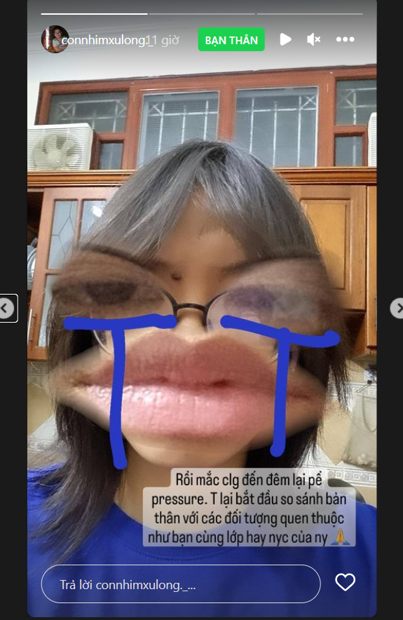

- đến mphuong còn tập kịch, xem amateur diễn để học hỏi nào
  collapsed:: true
	- 
- Cap lại bảo ngân for nothing, chỉ là girl này khác girl xưa (thg những girl sống ảo, vibe hot face mới đăng nhiều, xét ra bngan đăng ảnh bản thân nhiều nhất)
  collapsed:: true
	- 
	- ngày nay girl lớp dù xinh xắn thì cũng thể hiện nội tâm qua story nhiều hơn là đăng ảnh mình (nếu có thì sẽ là khoảnh khắc đáng nhớ)
	- khác khi xưa chỉ có mỗi post đứng nguyên và xem lại được - giống một thứ để brand bản thân hơn nên ngta thg chăm chút hơn, h mọi người lười, hạn chế, k còn thói quen
- sách để đọc và để ứng dụng từ cách người khác làm
  collapsed:: true
	- 
	- 
	-
- kỉ niệm ngta tặng quà nhỏ xinh thế này thôi
  collapsed:: true
	- người bình thường đó, xưa mày cũng hay hỏi chị để tham khảo xem người bình thường yêu như nào
	- nhưng mình vẫn không cho phép bản thân làm thế, vì tính ra tuy đời nhiều cơ hội nhưng chẳng hạn là bao nhiêu cái điện thoại, máy tính xịn hay bao nhiêu loại mà mình dùng, có bao nhiêu lần kỉ niệm và tuy nhiều món để mua để tặng, thì được tặng được dùng bao nhiêu món. Tính như tính thống kê lúc người ta đã chết đi. Số liệu sẽ làm mày buồn bất ngờ đó.
- hồi xưa sẽ lưu những cái này lại để tham khảo thêm các thú vui ở đời hoặc biết loại hình vui chơi mà đứa con gái này thích để hôm nào có dịp mình mời, mình tạo sự kiện dành cho nó
  collapsed:: true
	- 
- lại là những màn chế tên, ai cũng giỏi, ai cũng làm được, tuy không dễ, tôi thì sẽ cố deep hơn
- nhưng nên có liên kết tính toán trước từ 10 năm chẳng hạn hoặc gắn liền với thười đại, con người thế hệ đó thfi sâu sắc hơn?
  collapsed:: true
	- 
- Linh Chi và những khoảnh khắc đời sống vô tình bắt gặp
  collapsed:: true
	- 
	- lâu lắm mới thấy maybe
	- 
	- hoặc do mình đang rush và bị cách ly game, zalo, insta vì hỏng điện thoại
- sự kết hợp thú vị và ảnh cũng đẹp với mái tóc em bay
  collapsed:: true
	- 
	- cái gì đẹp ta gọi là em
- wao dinner sinh nhật
  collapsed:: true
	- 
- tham khảo ước mơ và ăn trọn, phủ định, sáng tạo hơn
  collapsed:: true
	- 
-
- sao mình không nghĩ đến chuyện làm video
	- 
	- có lẽ vì trước giờ cứ aim hàn gắn chứ chưa chấp nhận việc chia xa để mà làm những điều như vậy
		- vẫn thiếu bạn và kĩ năng để làm mảng sound, học cũng được nhưng thế thì phải chuẩn bị trước cả hai tháng...
		- hoặc nhờ Tâm... again?
		- well cũng được, động lực để mua điện thoại mới và all in Cam
		- áp dụng mấy cái điệu nhảy của mày học được thật tốt ý
	- và cũng chưa có thời gian
	- thấy nhớ MV của mấy anh nicotin xưa ghê, mà cái này thằng Vũ cũng đóng một vai trò quan trọng cho mà xem, nhìn MV cũng không quá trau chuốt dù hay, rất mang phong cách của nó.