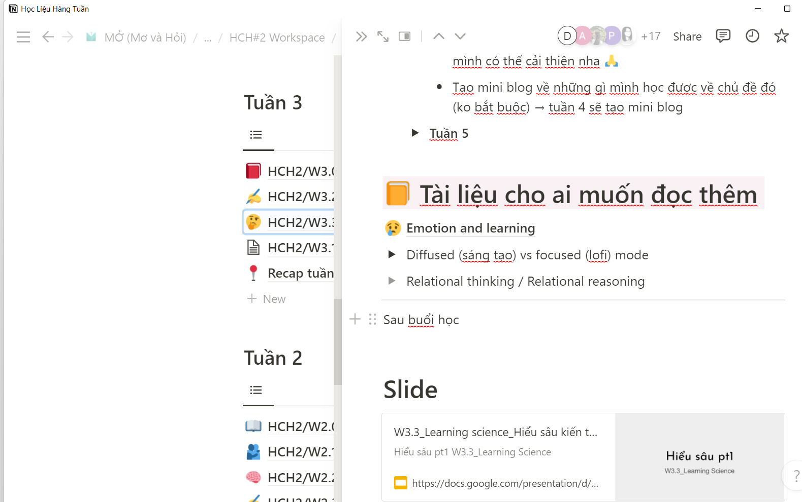

- 
- 01:53 Chỉnh sửa một số cái cho chị Fuong, chẳng hiểu sao riêng vụ layout chị không chau chuốt lắm :))
  collapsed:: true
	- 
	- 
- Kết cấu tư duy của một template recap #DOING
	- và hình ảnh ở discord mang ý nghãi của từ nhưng chỉ là sự chế, chém chứ chưa có gì đó thực sự hệ thống liên kết, bớt cảm tính, nhiều toan tính
	- tra bằng từ khóa tiếng anh, paraphrase từ nội dung của câu
		- vd kết nối với các bạn cùng lớp -> link/ global
- Quy trình tổng hợp thông tin làm recap từ những nguồn nào
- Lịch trình làm việc của Phong đối với recap
- Một số lỗi mắc phải khi làm recap
	- sao chép quên sửa: cái chủ đề quên cập nhật ở Notion, ở Discord thì cứ ghi ở tuần 1 là tìm hiểu tổng quan
	- cái mục review lại kiến thức vẫn ghi ở tuần 1, phải để chị Fuong ghi 1&2 nhưng thực tế có lẽ là 2 thôi... tôi cũng chưa theo dõi kĩ peer learning để làm recap chính xác như nhà báo...
	- sao mạch làm việc ở mỗi bài kiểu gì mà xảy ra lỗi thế? không check lại là 1 vấn đề
- Một số thứ rút kinh nghiệm
	- Lâu lâu rảnh cập nhật luôn của tuần 4 nếu sau mỗi buổi cũng được thì sẽ đỡ khổ việc phải chọn lọc, hiểu mình viết gì và tư duy liên kết kiến thức/thông tin từ các nguồn mày hay lấy và hiện thực
	- và thực sự recap nên được gửi trước peer learning, dù không rõ chỉ sau một ngày có đủ cho ai đó đọc, nắm được gì đó và góp phần cho peer learning hiệu quả hơn không, recap thực sự làm được gì không, ít nhất, quan trọng nhất là giúp cho live class cuối tuần thành công hơn chẳng hạn?
- 11:45
  collapsed:: true
	- 
	- 
	- 
	- 
	- hmm những điều này đã được viết, được nói ra, được chiếu lên đầy ở phim
		- không thực sự là vấn đề thời đại này thì cũng là vấn đề chung của xã hội (chứ không phải vấn đề nằm ở con người, con người là một phần của xã hội đó thôi, chứ tự xã hội có tính chất chi phối riêng)
		- chỉ sợ sau này nó sẽ dần mất thời gian, phải tìm cách tìm đúng vấn đề, không mình sẽ beat around the bush mãi
	- vấn đề thực sự cốt lõi, thử nhìn bằng cái nhìn thấu thị học được ở văn xem, nhìn một thứ chẳng liên quan mà bằng cảm xúc suy ra được cả vấn đề của nhân sinh nhân loại
		- liệu chăng vẫn do không yêu thì làm đến mấy cũng không yêu, muốn thì tìm cách, không muốn thì tìm lí do?
	- hay vẫn là vấn đề trước giờ không biết bọn nó cảm thấy gì, muốn gì để phục vụ, xưa thì còn bên nhau, có thêm lí do ít nhiều đi với nhau (bằng mặt không bằng lòng chẳng hạn), nay xa nhau nhiều thứ khác mê hoặc, có thêm lí do, có thêm lớp màn xa cách
	- tôi làm một mình một sự kiện thì vẫn được, ít nhiều sẽ có người tham gia và thấy vui, chứ làm cùng nhau thì khó vì không ai rảnh? không ai có động lực thúc đẩy? nhưng cứ thế này thì sao ra được một sự kiện harmony từ người xem đến người tổ chức (như hương mùa hè có cái ngồi với nhau ấm áp thế á)
	- mà tôi làm thế này cũng chỉ phục vụ một số đứa nổi (hay nói chứ mấy đứa không nói thì biết contact kiểu gì)
	- đây relate đến vấn đề nhân sự, con người nhiều ghê
	- tôi cũng phải học thêm về cách faci một lớp không còn là lớp nữa :)))
		- không phải level faci đơn thuần đâu vì faci ở kia dù tốt thế nào cũng là một lớp người ta commit active
		- nói học từ faci vì tôi thấy cách mọi người quan tâm đến từng người được, khá là thành công - nhưng đó là mô hình nhỏ, giới hạn một sự quan tâm một người cũng chỉ đến thế được thôi
		- nên muốn khai thác bản chất và những điều cốt lõi để quan tâm một người, một nhóm như nào
		- những yếu tố cốt lõi đó sẽ là các tiên đề phương pháp không đổi
		- faci tôi nói ở đây được link tới ý nghĩa đó, mang ý nghĩa đó, và sau khi bóc tách được, tôi sẽ củng cố cho việc faci ban đầu kia nữa
	- nói là học thêm, nhưng hỏi ai, học ở đâu, case study nào, không biết, toàn phải mượn tài liệu, suy ra từ những context có liên quan chứ không thực sự là của bộ môn này
		- có lẽ bộ môn này đủ chiều sâu về giá trị, sự cần thiết và nội dung để làm thành một bộ môn nhưng thiếu trầm trọng nhân lực và tài nguyên để phát triển
		- anyway, học những thứ rất thực tế, rất khó, một mong muốn hão huyền - hơn cả việc kiếm được 1 tỷ, vô cùng phức tạp vậy mới hay
		- nó không chỉ là học lý thuyết viển vông mà sẽ cần cả những bài học thực tế, chiêm nghiệm chưa thành định lý
		- muốn học mà không ai dạy, muốn giải quyết vấn đề nhưng không thấy giải pháp nào là thực dụng mà chỉ thấy những khả thể, những trường hợp để loại trừ
		- reflect lại bản thân thì mình cũng không cống hiến với lớp đại học nhiều vì mình không coi đó là nơi hợp, chê bọn nó như thể chê tầng lớp dưới, mặc kệ, đôi khi nhận chứ không chủ động trả, tặng cái gì đó từ mình
			- nó gọi là không cống hiến xây dựng thành một không gian chung có mình trong đó mà chỉ để người ta xây, mò và xây
			- người ta coi không gian đó có mình, còn mình chỉ thực tế sống trong một không gian và không quyết định tạo thêm vì không thấy có gì thú vị
			- liệu người ta có thay đổi đủ để thú vị hay ai đó phải chấp nhận, thay đổi hoặc đơn giản hạ mình xuống
			- case này đúng với tôi hơn không biết người khác như nào
- 13:29 xem parody hôm qua thì còn thấy vui, chứ parody một thời đã chết rồi, hài kiểu vậy, thời nay cũng chết rồi nên tôi đã không nghĩ tới nó nữa
	- tại sao lại thế nhỉ, nó chán đi, hết hay, mấy cái thời đầu còn hay không?
	- đầu tư cũng không ít, liệu tôi có làm sống lại parody vì mục đích xa cách nhau nên gửi gắm qua thư, video và các hình thức khác?
- 14:01
  collapsed:: true
	- bài học làm cha
	- 
- 
- 
- 
- 16:56 mấy cái gọi là bio này hay, đặc biệt là nếu thực sự đọc chứ không chỉ lên điền rồi để đó, hi vọng ai đó sẽ tìm tới mình qua bio
	- vì không biết là ai nên mới phải lùng bio, tại cái tên discord cũng bí ẩn
		- 
		- xong nhận ra ồ mình nên đọc chứ không chỉ ghé xem như nãy ghé xem cái của chị Fuong
			- 
	- thế thì phần reach out ở những chỗ như linked in phải viết kĩ mình đi về mảng nào và hiện tại đang làm mảng nào
	- 
	- mỗi tội chưa được tối ưu là lúc cần thì cũng chưa rõ tìm ai, cũng không chủ động có thói quen tìm để nhờ giải đáp kiểu qua giới thiệu bio mà qua đánh giá ấn tượng cá nhân của mình với họ nhiều hơn
	- có lẽ nên tự tạo bio về người khác của riêng mình để khi nào cần mình ghi khái niệm, thuật ngữ của mình ra là tìm được bio họ và những lời họ nói ở những chỗ khác nữa
- 17:29 làm CNTT
	- nên xem kĩ và học
	- tìm được cái này từ bài kiểm tra hay
	- 
	-