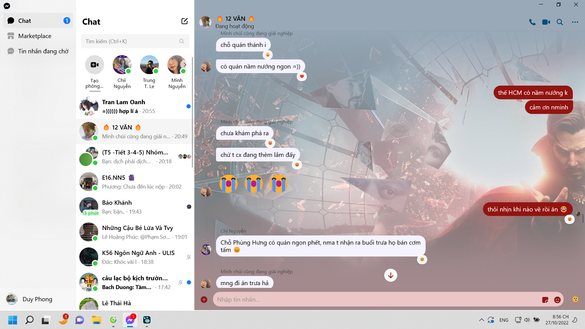

- 00:27 cụ thể là how to chế ra một thứ cùi hơn? bớt tính năng hay tạo một hệ thống cùi toàn diện đỉnh nhất?
  collapsed:: true
	- 
- 20:02 vừa về từ sáng học ở trường, chiều ngủ dậy họp MỞ và với chị Tân
- chuẩn bị tìm nốt điện thoại, học tiếng Pháp và đọc viết luận maybe
  collapsed:: true
	- 
	- 
	- 
- một tuần trôi nhanh quá, chưa cảm giác sang tuần mới, vẫn kẹt lại từ lúc mất điện thoại...
- 20:55 chẳng hiểu sao mọi chuyện thành được như này?
  collapsed:: true
	- 
	- 
	- 
	- 
	- 
	- 
	- 
	- 
	- 
	- 
	- 
	-
- có lẽ là nhờ cả những chuyện trước đây (cách mấy giờ, mấy buổi), hoặc từ rất cả trước đây
- cách mỗi đứa vào góp 1 câu cũng rất ấm nồng rồi
- không trách được bọn nó vô tình, như Thơ đâu sao không vào, hay một số đứa tính sẽ không thích nói như mthao
- vì tất cả đều bận, và được sự quan tâm như này, dẫu không có giúp việc hiện tại nhẹ đi hay ngày đỡ mệt mỏi hơn, nhưng nó vẫn không phải một gánh nặng hẹn hò xã giao, thế là được rồi
- rồi lúc nào đó mình sẽ viên mãn hạnh phúc hơn khi nhìn lại, và kì thực nhìn từ góc độ một Phong yêu lớp, điều này vô cùng tuyệt vời
- cảm ơn mọi người đã sắp xếp
- ...
- làm sao để có thể như này mãi, thêm nữa
- không biết, vì mỗi lúc là mỗi khác, thời thế con người luôn đổi thay, chỉ biết đi tìm tòi và mang những giải pháp, sáng kiến về thử chứ không chắc có cái gì sẽ chắc chắn thành công. Cả việc xác định tình trạng lớp cũng vô cùng khó, chẳng biết tại sao bọn nó lại quay ra nhắn nhau ở đây như thế, nhẹ nhàng, không ghét, không quá hào hứng. Có lẽ có phần nào đó vì nhau, mỗi người cố góp thêm một câu. Và tôi sẽ trả lời để nó không bị quê... và không nghĩ về sự quê, nếu có, hoặc bon chuyện thôi chứ Nguyệt Minh đứng ra, dù ở xa, học RMIT cũng bận, bình thường hay là Dung, hoặc ở tổ hay là Lã thì điều này là một phép màu kì diệu trong cuộc sống rồi
- chỉ hi vọng mình sẽ sớm nhìn ra pattern hoặc ai đó đọc được sẽ học được, biết được, có cách nào đó để dùng cho việc xây dựng cộng đồng, tập thể.
- và liệu hiện tại mình đang ở có phải cái tốt nhất? kệ đi quan tâm làm gì, chỉ là câu hỏi đó sinh ra từ việc liệu nó có thể tốt hơn, có hành động nào thừa, có hạnh động nào thất bại, có hành động nào bỏ được, hành động nào tiên quyết thiết yếu?
- kì thực tất cả đều cần để có được một ngày như hôm nay, vậy thì again, liệu có ngày nào hơn hôm nay? ở hiện tại song song và tương lai hỡi?
- sự lo lắng không chắc chắn mọi thứ sẽ đến đích này, không biết nó đi đâu, chỉ biết làm theo cảm tính và cố vì không thể khoa học được... có cần thiết?