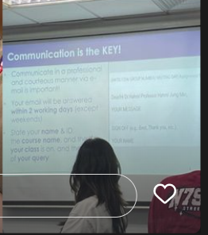
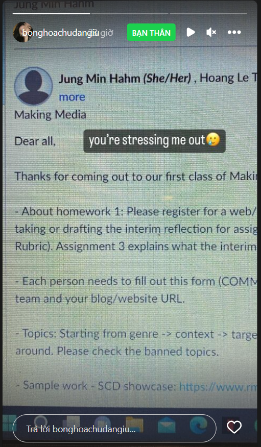
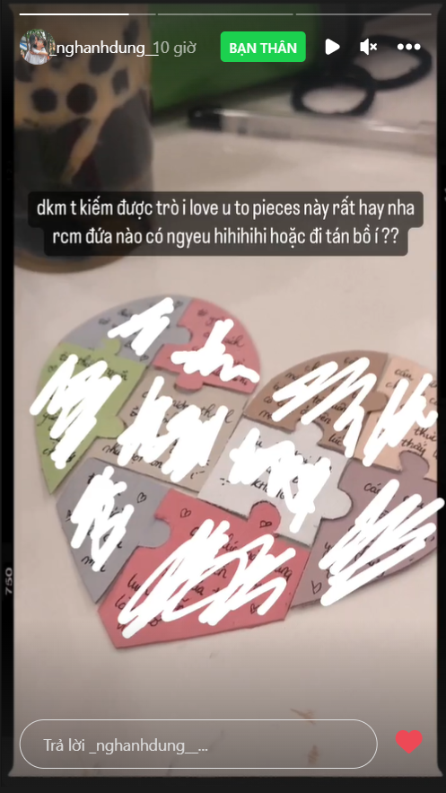

- 00:00
  collapsed:: true
	- 
	- 
	- 
	- 
	-
- Xem lại insta (stalk lã vì muốn xem nó đã thay đổi như nào, đặc biệt là vòng 1), tôi mới nhớ, chúng tôi còn Phongbarbaotap, và chúng tôi từng chúc sinh nhật nhau, nhiều hơn chỉ là đăng ảnh đẹp rồi đính kèm những câu chúc. Còn tôi từng tặng quà. Giờ chỉ một câu vỏn vẹn và một lời nhớ về. Vậy có buồn không, có buồn không? Chẳng biết nữa, nếu là tôi, có lẽ sẽ có, nhưng tôi không dám nhận, tôi có lỗi, tôi không được nhận buồn... Vì thế cực tội lỗi, lỗi vì đã vô tâm chứ không phải vô cảm. Giờ phải làm sao. Chẳng món quà nào bù đắp vừa điều đó, chẳng cơ hội nào để lấp lại quá khứ ít ỏi kia. Một đời người, ta quen được mấy người con gái, và ta chúc họ được bao nhiêu lần sinh nhật, rồi đi bên họ được bao lâu... xin lỗi những người con gái đã có sinh nhật trước hôm nay. Xin lỗi vì tình cảm của tôi nhanh tàn và vội như gió bay. Không thể nào giữ được cơn gió ấy lại nữa, cũng như chẳng xoay chuyển được thời. Chỉ còn cách hối hận, và nhớ về, và ăn năn, và đền tội. Phải trả món nợ tình. Lời này nói ở đây có ý nghĩa gì không. Nói ra rồi mong mày chớ có quên. Ngày mai ngày kia là sinh nhật Nguyệt Minh đấy.
- Chẳng so đo với ai nữa, hóa lại thành một thứ tai hại vì mình dễ qua loa không mặn nồng. Ân hận quá, nghĩ thêm về những sự ân hận đã lỡ đi, để biết rằng sau này mình sẽ tiếc như nào.
- Tao bảo rồi, trước mỗi tháng phải nhìn lịch, phải nhớ tháng đó có sự kiện gì. Và sinh nhật, chỉ là sinh nhật thôi, nhưng là một cơ hội không bao giờ được bỏ lỡ. Sắp tới hỏi thăm và cảm ơn nguyệt minh đi. Tình cảm này nếu còn và có thời gian có lẽ sẽ viết nên được điều gì đó. Như là lưu bút dang dở của cấp ba.
- Tất nhiên đây cũng là một món quà, một cơ hội tùy hứng, bởi nếu không biết gì về người ta bởi dạo này ít nói chuyện, cũng khó lắm. Như thuận nè chẳng hạn.
- Đành cố thôi, mong sao yêu được tất cả mọi người.
-
- 08:22 dậy lúc 5 giờ, tắt hết báo thức đi ngủ thêm mẹ 2 tiếng rưỡi nữa. Kì
- Xong bận chẳng làm được gì ngoài tắm, phải tắm vì cả tuần bận không tắm rồi
- May tối qua ôn chút ít. Dành 45 phút còn lại làm bài tập trong sách (chép giải, nghe giảng chứ cũng ít tư duy) và khi tắm bật những bài này làm phương án cuối để ôn
	- nghe cũng nhộn nhịp hợp không khí tắm phết mà không bị vội nhồi, sau này nên chia kiến thức ra các gói để ôn theo từng cách và từng lúc (tùy tính chất gói đó)
	- một bài nào đó về các ngày trong tuần, thứ trong năm nhưng chưa đủ nhạc tính
	- https://www.youtube.com/watch?v=DnrTrbJ6mYs
	- https://www.youtube.com/watch?v=golDmUTCx_A
- nhận ra dạy một ngôn ngữ mới nên bắt đầu từ đâu: alphabet, các con số, ngày tháng,... nó dễ nhớ như cho trẻ con nhớ vậy
- và quan trọng tự tin nói thì sẽ nói tiếng Pháp nhanh thôi (dù chưa ôn lại mấy kiểu câu cô Thu hỏi)
- mẹ lại bỏ đói
- thôi đến nhà cô Thu nhanh, còn thời gian thì ôn, hơn là đến muộn không thì xin lỗi cô, xin lỗi thầy em bận quá không có nổi thời gian ôn... dù đã cố cân đối. xin lỗi tiền 600.