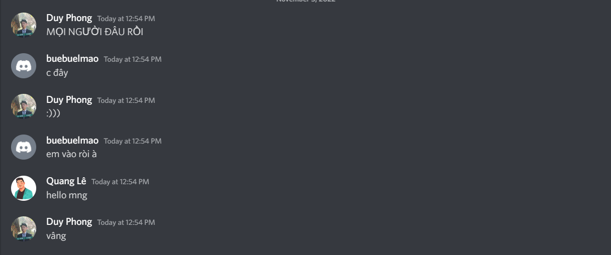

- Ngày loz gì mà buồn vãi chưởng
- Ban đầu chỉ định đến Chu để xem đá bóng và gặp gỡ bạn bè, rồi một nhiệm vụ quan trọng, nhưng không phải ưu tiên là lấy bằng
- Tôi có tự hỏi con Thảo đến không
- Thoáng thế thôi, xong nó đến thật, lại còn nhắn trên nhóm lớp rủ đi ăn không
	- chen ngay vào đám chỗ chúng tôi đang đứng (Ngân Diệp Thanh) ở sân 2
		- tôi né nhìn nó khá nhiều, đeo kính rõ nhưng chẳng dám nhìn rõ, cũng không thấy rõ cái gì nó đẹp, mà mình cứ theo đuổi mãi thôi
			- tôi soi khá nhiều em ở trường hôm nay, nhiều khi cũng nổi hứng trap-boy
- Nhiều đứa không mặc áo lớp, càng lúc tôi càng thấy tôi như một trò hề.
- Chụp xong cái ảnh lớp là thôi, mỗi đứa một phương, mấy đứa không đi ăn chung, nên chỉ còn tổ tôi, mấy đứa bận
- Con mthao vẫn nói có đi như lúc nó nhắn ở trên kia, nhưng chẳng đứng gần nhau đợi nhau, bọn này cũng đi qua kệ nó đó, tôi không dám hét lên gọi nó theo lúc nó đang đứng nói chuyện với mấy em. Thì ra nó định đợi câu lạc bộ nó chụp ảnh xong chẳng thấy ai. Mọi người tan, nó quay ngoắt cái chạy sang C-team, giống Quang hôm nay đến để support các em. Nhìn ghê nhỉ, oai ghê gớm. Hôm nay là sân khấu của bọn mày, những con người đã ra trường nhưng quyền lực. Còn tôi là ai, thành viên một cái lớp không còn tồn tại
- Hôm nay cô Thủy cũng đến rồi đi luôn, chỉ kịp gặp con Diệp
- Tôi gặp anh Lê CSC, gặp anh Long và anh Quân, ngồi với nhau tí rồi thôi.
- Chụp một chút với Hương A và Trang Nhi
- Trang Nhi bảo nhiều ảnh rồi nên thôi không chụp
- Hương B cũng show up, gặp DC ngồi ăn mới thấy em Mai bảo Hương B nay xinh lắm. Nó vẫn thần tượng cô ấy
- Cũng có gặp Lan Anh và Vy, rồi lại thôi. Ý nghĩa của sự gặp gỡ chỉ đây ư
- Tôi đi theo nó ra chỗ nó ngồi với mấy em. Chẳng ngại ngần gì, lấy cái chìa khóa có con mèo Linh Chi chạm chạm vai nó mấy cái, tôi nghĩ nó không phải không để ý, nhưng nó thực sự không quan tâm. Tôi chẳng dám gọi nó đi nữa, vì nó cứ nhận xét cho em đó hoài.
- Tôi có nghĩ nó muốn thử thách tôi hay gì à, tôi có tức vì ôi nó lại như cũ rồi. Không bao giờ theo một timeline nào cả. Nhưng tôi chẳng giận nổi, mà cũng chẳng dám giận, quát vào mặt nó ư, tôi sao mà làm được. Đành thôi, tôi bỏ đi
- Lấy xe xong định dừng ở trước chỗ Cteam ngồi mà gọi hỏi nó, dẫu biết kết quả rõ lắm. Đáng ra tôi nên nhắc nó ở kia là bọn nó đi rồi đó, mày mau lấy xe đi (giả sử thế, hoặc nó gọi xe, tôi có nghĩ nếu nó không có xe đâu nên sẽ nhờ ai chở, mà bọn còn lại đi hết rồi. Ngồi sau xe tôi nó chắc sẽ im lặng, trông có vẻ như hậm hực. Chúng tôi hôm nay nói chuyện với nhau một câu: Mày đi ăn không. Có. Vẻ mặt như phiền muộn, khó chịu với nhau nhiều hơn là lạnh nhạt hay ghét bỏ)
- Ra trước cổng trường còn muốn gọi nó và hỏi ê thế mày có đi không? không, thế thì khiến nó thấy ghét quá, có lẽ nên nhỏ nhẹ là mày xong việc chưa, mọi người đang chờ ở cổng nè. Mau lấy xe đi nhé. Rồi tùy nó nói mà khả năng tôi sẽ nói được câu ờm thế lên xe tao chở nhé?
- Nhưng nó đếch thèm nghe máy lẫn seen, chẳng nhớ nó bỏ máy vào cặp hay không nhưng tôi không tin rằng nó sẽ không chú ý đến mức đó. Thế này thì bị bỏ vào spam rồi. Đụ má. Tức nó vãi cứt.
- Viết lên những cảm xúc và mong muốn, suy nghĩ như vậy, rất cá nhân, nhưng trên chặng đường mà nhiều lúc tôi muốn quành mạnh xe lại, vứt xe ở cổng mà chạy ra kéo nó đi, mặc kệ nó chống cự thế nào nữa.
- Tôi không làm thế được. Người ta có thích mình đâu. Lí do muôn thuở, cứ hững hờ mặc kệ những đứa không thể theo được đám đông đi
	- nhưng thế thì tôi phải làm gì, và tôi nên làm như nào - vì trước đây tình cảm gắn liền với nghĩa vụ, phần nào trong tôi là tôi, phần nào trong tôi là lớp trưởng
- Nhưng đồng thời tôi cũng không thể dứt được, vì cả ngày hôm nay tôi nói chuyện với nó dưới góc độ lớp trưởng: không để một thành viên nào bị bỏ lại, thế này là bỏ người ta lại. Cảm giác không tốt chút nào, chẳng ai báo dù chỉ một câu, tôi sợ nhờ ai đó báo vì sợ khiến bọn nó khó chịu. Nhưng thật sự Mthao lạc bầy ra khỏi lớp.
- Tôi có nghĩ đợi lúc nó nhắn gì? trả lời cái kia, có lẽ tôi sẽ mắng hoặc nhắn vài câu lạnh lùng, chỉ dám vậy thôi nhưng mà đéo có đâu
- Còn tôi lạc mất tổ tôi, phóng vòng vòng mãi chẳng thấy số 105D1 ở đâu cả. Nhưng tôi không tức mà chỉ buồn. Còn biết làm gì ngoài buồn
	- Có lẽ tôi đã mong mọi thứ tốt đẹp hơn, mọi thứ đạt được đúng những khả năng của nó trong mắt tôi: Minh Thảo đi ăn cùng, có lẽ tôi không nói chuyện nhưng có một nhóm ngồi với nhau cũng vui, và thế là lớp trưởng xong nhiệm vụ, không áy náy, còn bản thân tôi sẽ không đau xót vì như này
	- cả lúc đi vẫn thi thoảng check xem nó seen chưa lở điện thoại ra thấy tsau kiểm tra giữa kì Pháp thấy nặng nề áp lực vl
	- đến mức mà thấy có lẽ chẳng có gì tốt hơn một vụ tai nạn giao thông
		- cho hết buồn MỞ, buồn mối quan hệ rạn nứt, buồn cô đơn, buồn con l kia, buồn không có thời gian
		- tôi cũng mong nó đến thăm tôi trong bệnh viện đấy
- Chuyện Mthao, chuyện tổ tôi, chuyện MỞ làm tôi nặng lòng, chuyện học tập còn đang thật dang dở. Chắc chuyện bọn nó có người yêu hoặc có mập mờ cũng ảnh hưởng tôi đôi chút, cái thì cảm thấy cô độc, cái thì bị mất niềm tin
- nhưng tôi chẳng nghĩ được gì, chẳng tìm được cách giải. Chỉ biết là hóa ra mình mới là đứa nên tránh gặp nó, vì sau mỗi lần gặp là đau đớn vô cùng. Nhưng mà mình vẫn muốn gặp, vẫn muốn bám lấy cái trách nhiệm nửa vời, không chịu sống hoàn toàn đời cá nhân.
	- Dù sáng nay có nghĩ gặp nó tôi sẽ ngượng lắm, nếu nó tỏa sáng rạng ngời, còn bây giờ tôi như thằng rẻ rách vật lộn với deadlines... xấu xí và kém cỏi.
- Tôi đọc, Hỏa Nhân tối qua, có đoạn bỏ người mình theo đuổi để thấy hạnh phúc hơn với những gì mình có. Tôi đã bỏ Minh Thảo, nhưng vẫn lại lạc mất tổ tôi với một tâm trí đi đường không tập trung được nổi, không nghĩ được gì nổi.
- Nếu tôi đứng lại đó đợi nó, đợi tổ tôi đưa địa chỉ cũng được mà nhỉ? Không.
	- Vì Lã bảo đi đi, đã biết ăn chỗ nào đâu
	- Và tôi bị bí thời gian
	- và sau này, mãi tận sau này chẳng thể gặp nó nữa đâu
- Và nếu không thì ít nhất chúng tôi có thể đi với nhau. Nó sẽ không bao giờ đi ăn một mình với tôi đâu
	- tôi không mong gì xa xôi ngoài thời gian ở bên nhau
- Nhưng nó đi với C-team chắc rồi, hoặc không, dù sao công việc của nó mà. Tôi cũng có việc riêng. Việc chia tách chúng ta xa nhau. Tôi yêu Chu nhưng chẳng thực sự còn kết nối nào ở Chu...
- Tôi phóng về, chẳng đi ăn trưa với ai, một viễn cảnh không ngờ đến, nhưng thế này là tốt nhất.
- Buồn thì biết làm gì, gặp ai, nơi nào là của ta, nơi nào ta thuộc về?
- Chỉ biết gần như mọi thứ trên đời đều có thể giải quyết bằng vật chất: rượu bia, nghiện ngập, gái gú...
- Tôi mệt mỏi bế tắc đến mức muốn bỏ, chẳng muốn tổ chức 20/11 nữa. Cô cũng không rep
- Gặp được một ai đó ở cùng một thời điểm khó lắm chứ chẳng đùa.
	- 
	- Vì nếu không có cơ hội, thì kì thực vẫn gặp được, nhưng nó sẽ là nghịch lí ở đời nếu bạn sống, vì sống phải tuân theo luật lệ bận bịu của xã hội...
- Nãy call với tổ, bọn nó hỏi sao tôi ngồi nhà
- 30 phút tìm đường không thấy tôi phải về
- Lã bảo tôi thấy Mthao tôi bị đơ cả ra
	- biểu hiện khuôn mặt??
- MThao đã thay đổi (upgrade)
- Tôi hỏi lã: Lí do mthao k đi
	- vì tôi
	- vì k đông
- Mthao đang như đẩy tôi ra.
- tôi bị mthao đánh ở cả trách nhiệm lẫn tình cảm
- cơ thể tôi run lên vì tức vì lạnh vì đói
- [[Nov 6th, 2022]] Một câu muốn hỏi Mthao, một điều lo sợ khi người con gái bạn yêu đã thay đổi:
	- Is having me as a friend ashame you that much that you hate me and don't even talk to me or look at my face?
	- Or is it because you went to a better place, the best university? better than Chu maybe, and it changed your mind. No, actually it show you how bad i was, how ridiculous i am and i'm the one who you should detest, cause an underclass like me should be despised.
	- That's very unlikely to happen, but this is the kind of sad, deep, overthinking question that's gonna bring you back, set you a view point and help me to checl whether you have changed
	- or maybe you changed because you don't like me, do not like the past, or maybe it just something you want...
	- it just i sense more hatred toward me...