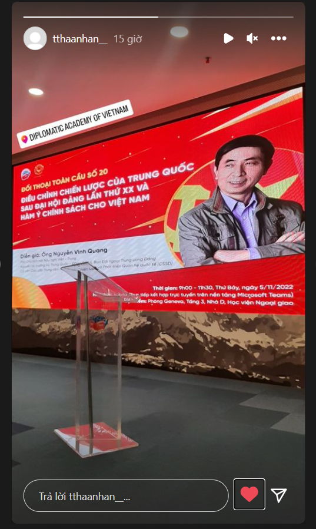
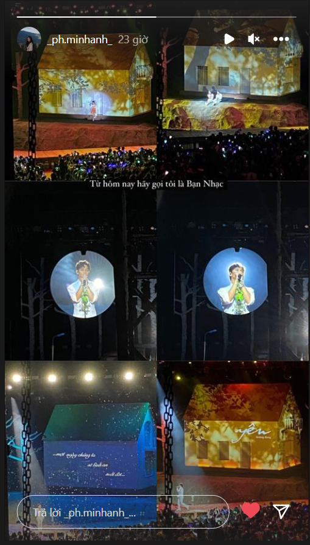
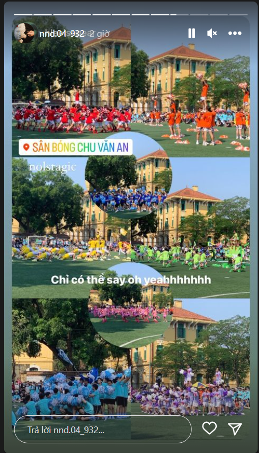
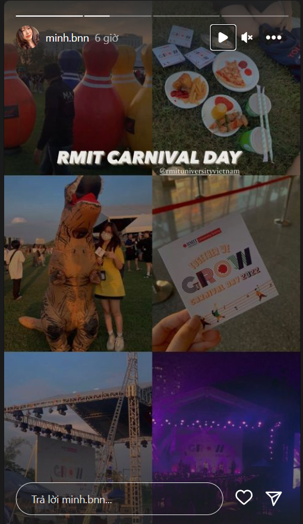

- 1:00
	- 
	- 
	- 
	- 
		- Diệp luôn có những content hay cả về hình ảnh lẫn nội dung
		- 
		- 
	- 
	- 
	- Sau này phải tạo ra những sự kiện tốt hơn, đẹp hơn, đỉnh hơn về caascu trúc và logic từ nhũng cái mà mình chụp hôm nay
- Kĩ năng đại học: bypass paywall (a kind of must have mindset: dù tệ: tìm cách lách)
	- easy nhỉ, tôi cứ tưởng nó là cái gì quá khó khi mà người ta chặn không cho mình xem thêm tin, nghĩ trên mạng có cách nhưng nếu chỉ là paywall (không phải ẩn đi cái chữ như hệ thống tài liệu cần tài khoản login thì ok)
	- The New York Times: Java Script
		- sự liên quan giữa java script và web? chỉ biết tra thì người ta bảo tương tác qua Java Script
	- 
	-