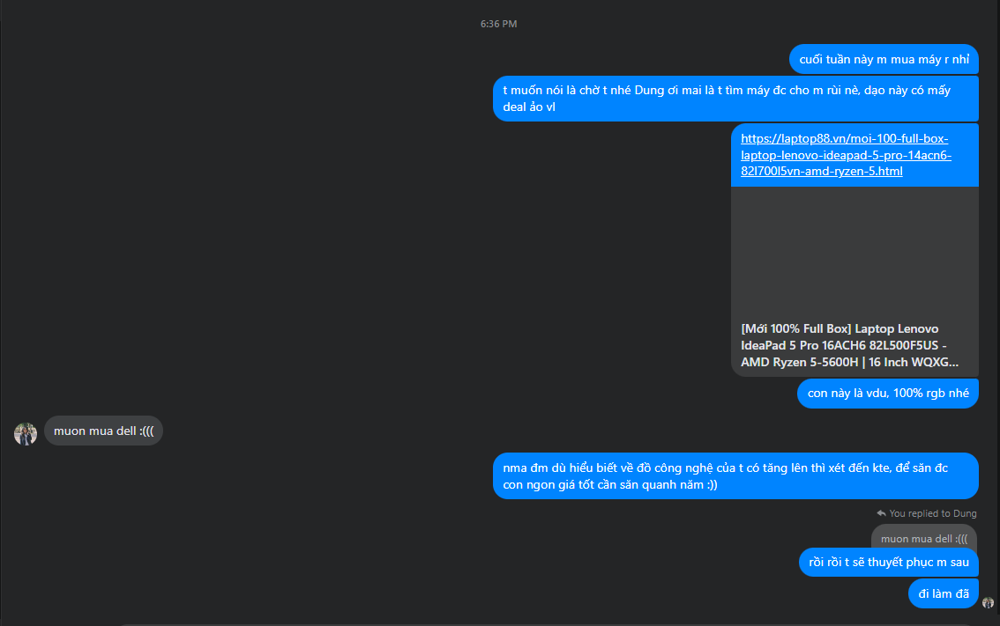

- 10:00
	- 
		- 
	- 
	- Nhớ lại htrc đi, Bảo Ngân giữ được cái nhìn khách quan mà bảo tôi bọn nó mặc quần áo riêng vì ở độ muốn thay đổi bản thân, thể hiện bản thân
	- Còn tôi thì sao, well không thực sự hứng thú cái đó với lại mình cũng không quan tâm cái gì mặc lên người mình lắm. Mình quan tâm đến việc blend in not stand out
		- vì kiểu gì cũng stand out?
	- yeah mình không biết nữa, mình đánh giá vào việc họ đặt cái gì lên đầu, qua cách biểu lộ cá tính đó ăn nhập với cộng đồng không, dù cộng đồng tập thể giờ không còn, không bao giờ còn
	- nhưng sau này thì sao nếu Bảo Ngân coi đây là 1 giai đoạn
	- giàu nghèo, đẳng cấp có phân chia?
- 16:00
	- Lòng tôi không tin tôi toàn tri, một vài lời định được cả cuộc sống.
		- Nhưng tôi vẫn luôn tự hỏi, đeo bám, lụy, chưa thể bước khỏi một người bao lâu thì mới chứng minh tình mình là thiên tình (tình ngàn năm?), và người ta là chân ái? (nhưng thế chỉ từ có một phía? hay mày thích viết nên loại truyện một lần gặp nhớ cả đời như thời trung đại ngày xưa bên TQ)
		- lâu rồi mày không muốn xây dựng một cái gì đó mang yếu tố phim, lúc nào cũng có sự hấp dẫn người xem, kế thừa và phát triển hơn những gì đã có của quá khứ nhỉ
		- Ừm
		- Mà chứng minh thì được gì đâu, cứng đầu được gì đâu, may ra bạn bè mày công nhận là thực sự mày sinh ra để yêu nó còn ngược lại thì không?
		- và có tình trăm năm? và yêu đương không phải là sự chưa dứt được, như sống không phải là sẽ chết, mà nó đang tiếp tục kiến tạo nên một thứ gì đó, và thậm chí có thể là mãi mãi?
	- Thôi thực tế một chút nhé, không có ai tốt hơn, có thể sẽ hơn nếu xét hệ quy chiếu là đối xử với mày, nhưng nếu xét ra thì mỗi người là độc đáo, và nếu không thể yêu ai như ai vì ai cũng độc đáo, thì là mày sẽ yêu độc nhất một con người mà thôi à.
- 16:55 tương tác của những buổi tôi ngồi đợi bọn nó dần giảm đi, như Nminh chắc sẽ chẳng bao giờ vào nữa
	- Mai vào rồi out, có thể bấm nhầm hoặc tò mò, mà lúc đó tôi đang làm gì đó không để ý, chưa nói được nó một câu nào cả...
	- Tôi tự hỏi, điều này nghĩa là gì? Chán ư, nhìn mặt tôi chán, hết sự tò mò hay chẳng còn gì để vào làm cùng, chẳng còn lí do nào, thường nếu có một thì sẽ có hai dễ hơn, mà toàn tổ tôi...
	- Học thì bọn nó sẽ không vào? Thấy Diệp đôi khi học bảo thế, hoặc máy hết pin...
	- Ngồi im với tôi cũng được mà
	- Nó kiểu như nghệ thuật đương đại nhỉ, tức thời, thế khó mà sâu, mà dài mà hay nhưng thế cũng sẽ có cái đặc trưng riêng cần có của chủ nghĩa tiêu thụ? liên tục sản xuất và tìm cách duy trì cái gì đó, tạo một cái gì đó thống nhất theo năm tháng
		- Quy mô vẫn hoàn toàn có thể to mà
		- Đôi khi bọn nó bận không vào, nhưng chất lượng vẫn hay, mọi sự kiện mình tổ chức ra cho người khác chỉ là thứ yếu, cho bọn nó là thứ nhất thì sao. Như triển lãm, tôi chỉ chực chờ ai đó đến để giới thiệu, dù bọn nó không làm cùng nghề và cũng chỉ ngước nhìn lên tranh, hoặc thứ gì đó treo trên tường, hoặc treo giữa nhà, xoay xoay và ồ, cố hình dung gì đó theo lời mà tôi giảng giải?
- 
	- khong nhắn được lên nhóm lớp, cũng ngại dần nhắn tổ...
- 
- 
	- cái này phải học kinh tế, đôi khi sẽ có những giai đoạn sale, không chỉ là dịp lễ
	- biết tại sao giá giảm và giảm tốt không - công nghệ và kinh tế
	- nhưng việc săn và nắm thời thế thế, như làm phim phải nhất định là ngày đó trong năm chứ không phải thôi thfi mình còn ngần này ngày, mình sẽ chọn trong số đó
	- tán gái cũng thế, chứ không phải cứ đợi thật lâu, mua máy cũng vậy
	- sẽ có cơ hội, hi vọng nó chưa qua đi, và mày không bao giờ được lỡ nó. Nên phải tính trước đi, hi sinh những cơ hội mày không cần: là những ngày bình thường, mà có ai cần một ngày bình thường như thế không? liệu cơ hội mình cần có phải cơ hội tuyệt nhất?
	- và có những loại chờ đợi nào, ăn may, kĩ tính và ăn may như mình, toan tính, toan tính và bận như mình, thế thì để hơn tất cả mình phải thật thấu tỏ và tính cả thiên cơ
	- tất nhiên cần tính cả cách bảo trì, trân trọng nữa, điều đó mình làm chưa tốt
		- y hệt cái sự may mắn hoặc nhận được tin đúng lúc, đầu tiên dù đã follow tin (có lẽ lòng không đau đáu nên không chủ động check thì không được đâu)
		- 22:49 cái đấy còn phải phụ thuộc vào việc mình mua ở những shop nào nữa, biết các shop cũng quan trọng
- Tạo aution, hoặc trung gian trao đổi, kết nối cũng vui
	- 
	-
-