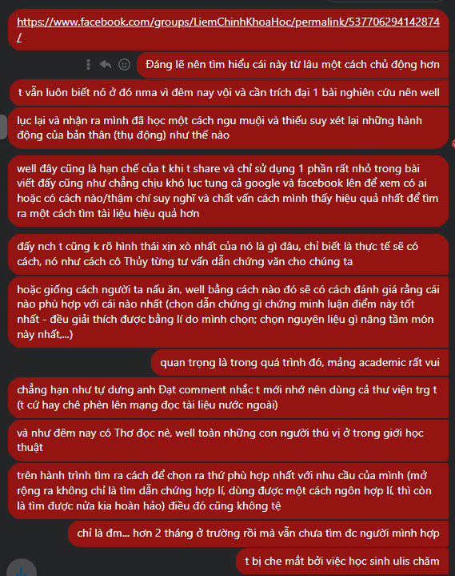
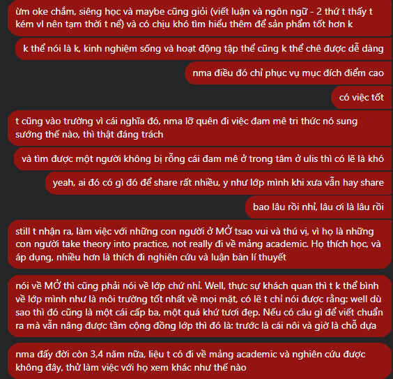

- Thật kì lạ, 02:03 mình cày chainsaw man suốt hai tiếng. Đúng là hay thật, chết chóc đánh nhau y như Chú thuật hồi chiến nhưng mà hay hơn
- Quan trọng là bắt gặp từ rendezvous. Tra thử thì ra cuộc hẹn, nhớ y nguyên cái từ mình chẳng nhớ, chẳng biết, chẳng quan mấy dù không biết ở sách bài tập
- tra lại thì nó chỉ khác nhau mỗ dấu -. Ồ, vậy là thaorng một giây mình đã nhớ luôn cả từ và cách phát âm. Rendezvous. Giờ đang vang vang trong óc mình.
- Thôi nên coi đây là cơ hội học bài, làm nốt bài thầy Trung chứ không nên lại cắm đầu vào rồi đi ngủ, bài thầy Trung đâu khó thế, mà mày đã muộn dl thì chớ. Dù thấy trong đó nhiều cái hay, tao khá chắc mày sẽ không gặp thêm nữa đâu.
- 03:18
	- 
	- 
	-
-