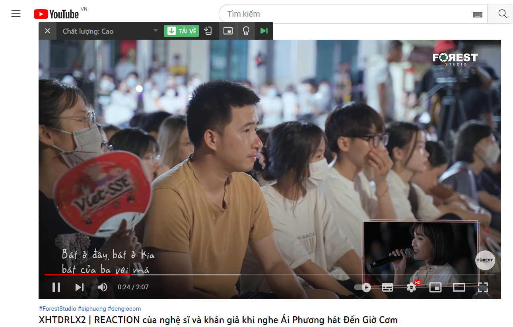

- 02:07 vừa ngồi viết được nửa bài luận
- Vừa học vừa ăn
- Có lẽ sẽ có hại
- Cha mẹ hay ai khuyên thì tâm trạng chỉ muốn nói: kệ, chết sớm như ông ngoại (cũng không hẳn) cũng có sao đâu
- Không có Minh Thảo thì cũng chẳng quá thiết tha đời (không hẳn đời không đáng sống nữa)
- Nhưng nói thế thì nặng nề cho nó quá
	- nặng nề như thể một đứa trẻ già khụ (sắp hết đời) vòi vĩnh muốn được yêu thương vậy
- đặt cả khả năng quyết định sống chết một người - trọng trách lớn lên tay một người như kiểu giúi tai ương
-
- 8/10 6:30-7:15 giờ đi xe tới trường, học đến 9h35. Ngồi ở ULIS station gì đó tìm lab cho Dung nhưng vô vọng vì có quá nhiều thứ không nắm được, sợ chọn sai lap hại đời nó 4 năm, phí tiền nó mấy tháng...
- Đi in news để chiều đọc. Đi ngủ
- 1h-4h30 học viết luận. 5h hơn qua nhà Diệp đưa đồ
- đi với nó ra Chu ăn phở cuốn rồi qua Phan Đình Phùng tiễn nó học IELTS. 6:30 mới về đến nhà do đường đê tắc, còn trong phố bình yên đến lạ kì
	- chợt ngâm nga một bài mình quên tên: bình yên trong nắng chiều, mấy bài liên quan đến thiên thanh của bọn chuyên gì ý
- Làm một số chuyện, có đọc truyện rồi ngủ hơn một tiếng đồng hồ tới 9 giờ mơ màng mệt mỏi ngồi vào làm bài
- 02:11 ý tưởng hay để ra thêm 1 vid
  collapsed:: true
	- 
	- mà giai điệu đàn rất nhiều cảm xúc, liên hồi giống bên Nhật