- 5 giờ tối 9/10 mới đi ngủ
- 08:08 định chỉnh sửa nhưng hình thức nay (nhất là mấy cái cuối) cũng hay, chỉ cần thêm highlight là đủ
  collapsed:: true
	- **Hôm nay là ngày thứ hai t nghỉ học, toàn nghỉ vì những lí do vớ vẩn: nào là nhầm lịch, nay là một dạng ngủ quên. Và tiết tao nghỉ lần này là Tiếng Pháp**
	  
	  Enter
	  
	  You sent
	  
	  **Tất cả là bởi hôm qua ngồi từ 11 giờ tới mãi tận 5 giờ sáng để suýt xong bài luận? đúng**
	  
	  Enter
	  
	  You sent
	  
	  t biết khả năng cao mình sẽ ngủ sâu và lỡ giờ nên đã đặt năm cái báo thức. Kết cục là vẫn dậy đúng giờ
	  
	  Enter
	  
	  You sent
	  
	  nhưng sau mỗi lần chồm dậy t lại vứt mình xuống chỗ nào đó để ngủ. Từ phòng tao, qua phòng mẹ
	  
	  Enter
	  
	  You sent
	  
	  Tao đã cố chạy loanh quanh để tỉnh và đồng thời chuẩn bị để đi học
	  
	  Enter
	  
	  You sent
	  
	  tao đã không thắng nổi mình, thắng nổi sức lôi cuốn của giấc ngủ đã lôi kéo t đi ngủ
	  
	  Enter
	  
	  You sent
	  
	  Tao bàng hoàng dậy lúc 7 giờ, cũng chính là giờ vào học
	  
	  Enter
	  
	  You sent
	  
	  Nhưng kì thực, tao thấy nó không tệ đến thế
	  
	  Enter
	  
	  You sent
	  
	  câu này chưa đủ nhấn manh
	  
	  Enter
	  
	  You sent
	  
	  bất ngờ hơn là lúc t thức giấc
	  
	  Enter
	  
	  You sent
	  
	  t bước ra khỏi phòng mình và nhận ra giờ đã là 7 giờ
	  
	  Enter
	  
	  You sent
	  
	  việc tao còn ở nhà chính là một nghịch lí
	  
	  Enter
	  
	  You sent
	  
	  nhưng nó lại là một sự hợp lí đến tột cùng cho một ngày dài liên tục thức (lên tới 15 tiếng vì họp và hẹn)
	  
	  Enter
	  
	  You sent
	  
	  cơ bản môn Tiếng Pháp là môn phù hợp nhất để bỏ
	  
	  Enter
	  
	  You sent
	  
	  không phải tao chưa bỏ buổi nào
	  
	  Enter
	  
	  You sent
	  
	  mà tao thấy rằng việc đến lớp không quá có ý nghĩa
	  
	  Enter
	  
	  You sent
	  
	  nhất là so với việc đi 45 phút một chặng đường rồi ngồi gật gà gật gưỡng suốt 2 tiếng rưỡi
	  
	  Enter
	  
	  You sent
	  
	  ngủ thêm 1 tiếng thôi, tức đêm qua t ngủ được 2 tiếng rưỡi
	  
	  Enter
	  
	  You sent
	  
	  lại cảm thấy đủ đầy hơn hẳn
	  
	  Enter
	  
	  You sent
	  
	  t k cáu gắt khi thức dậy
	  
	  Enter
	  
	  You sent
	  
	  dù người mình có hơi chuếnh choáng
	  
	  Enter
	- #### 
	  
	  You replied to yourself
	  
	  Original message:
	  
	  t k cáu gắt khi thức dậy
	  
	  như bố t, khi phát hiện t nay muộn học
	  
	  
	  
	  Enter
	  
	  You sent
	  
	  nằm trên cái ghế mà vung vẩy tay chân, luyến thoắng kể lể chẳng ngừng rằng tao đã có lỗi như nào: chính nó đặt một đống báo thức rồi dậy tắt đi,...
	  
	  Enter
	  
	  You sent
	  
	  well t chỉ trầm ngâm nhìn, rồi kệ
	  
	  Enter
	  
	  You sent
	  
	  nghĩ xem có bù được buổi này sang hôm khác không
	  
	  Enter
	  
	  You sent
	  
	  Không hôm nào tao trống lịch
	  
	  Enter
	  
	  You sent
	  
	  thì thôi nghỉ vậy
	  
	  Enter
	  
	  You sent
	  
	  Giờ đến cũng được, nhưng đồ tao còn chuẩn bị chưa xong, chưa ăn, đói
	  
	  Enter
	  
	  You sent
	  
	  Tao chẳng thích đến trường
	  
	  Enter
	  
	  You sent
	  
	  Nên tao đã nhắn cô nghỉ
	  
	  Enter
	  
	  You sent
	  
	  Cái cảm giác hơi có lỗi khi báo nghỉ muộn, vì một lí do không chính đáng, cái cảm giác tội lỗi đó xuất phát từ môi trường nơi tao đã sống không chỉ bằng trách nhiệm đơn thuần mà còn bằng trách nhiệm của cảm xúc
	  
	  Enter
	  
	  You sent
	  
	  sợ mắng mỏ? không, sợ mất lòng
	  
	  Enter
	  
	  You sent
	  
	  còn cái không gian như đại học hay khi đi làm, ngủ quên thì thôi
	  
	  Enter
	  
	  You sent
	  
	  bỏ một ngày lương
	  
	  
	  
	  Enter
	  
	  You sent
	  
	  cùng lắm là bị phạt
	  
	  Enter
	  
	  You sent
	  
	  chẳng gì hơn, mọi người thờ ơ với nhau, mình lo sẽ bị quở trách, nhưng chính mình cũng thờ ơ với việc đó khi nghĩ lại thấy mình đã nghĩ ngợi quá nhiều
	  
	  Enter
	  
	  You sent
	  
	  và cuối cùng là một cảm giác nữa
	  
	  Enter
	  
	  You sent
	  
	  lại overthinking nhưng dù sao thì đó là lí do t viết lên đây
	  
	  Enter
	  
	  You sent
	  
	  t nghĩ đến bọn m, những người tao coi k chỉ là bạn bè
	  
	  Enter
	  
	  You sent
	  
	  t nhìn mình và tự hỏi, sao tao lại được phép nghỉ, trong khi bọn m vẫn đi học và cố gắng đi học (maybe?)
	  
	  Enter
	  
	  You sent
	  
	  ít nhất là nếu có chật vật lết xác mình đến trường (dù t không hình dung nổi điều đó, dù có nghe bọn mày kể ra như một chuyện cười), trong mắt t, bọn mày vẫn là những con người rất lí tưởng về trong chuyện học hành và đầy trách nhiệm trong công việc
	  
	  Enter
	  
	  You sent
	  
	  chẳng hiểu sao tao luôn nghĩ thế dù đã trải qua bao nhiêu thứ với bọn mày
	  
	  Enter
	  
	  You sent
	  
	  nên có gì thứ lỗi cho tao nếu tao không hình dung được những gì khác của bọn mày mà đồng cảm... hoặc nhận ra, hiểu ra sự tương đồng giữa chúng ta, sự khó khăn của bọn mày để mà quan tâm hơn
	  
	  Enter
	  
	  You sent
	  
	  đấy vì t coi bọn m lí tưởng thế
	  
	  Enter
	  
	  You sent
	  
	  nên t thấy mình sẽ thật bất toàn, đầy khiếm khuyết nếu t nghỉ một buổi, nếu t k vẹn tròn tạm thời cái hình thức, và méo mó một chút cái bản chất/nội dung
	  
	  Enter
	  
	  You sent
	  
	  t thấy tội lỗi
	  
	  
	  
	  Enter
	  
	  You sent
	  
	  t sợ t k xứng đáng với bọn m
	  
	  Enter
	  
	  You sent
	  
	  dù t biết xét ra, quan trọng là học được gì và học như thế nào,...
	  
	  Enter
	- #### 
	  
	  You replied to yourself
	  
	  Original message:
	  
	  dù t biết xét ra, quan trọng là học được gì và học như thế nào,...
	  
	  nhưng cái suy nghĩ này chỉ đến sau khi t đã cảm thấy cái kia trước, hoặc khi t có tgian nghĩ về nó
	  
	  Enter
	  
	  You sent
	  
	  t không đến lớp và record buổi này vào máy - vừa sửa lại máy cũ xong, không biết tao có nhớ rằng buổi hôm nay tao nghĩ không
	  
	  Enter
	  
	  You sent
	  
	  bao lâu thì tao quên rằng tao đã nghỉ học 2 buổi
	  
	  Enter
	  
	  You sent
	  
	  chắc t sẽ note lại xuống
	  
	  Enter
	  
	  You sent
	  
	  note cả lại rằng trong 2 tiếng ít ỏi trước khi đi học tiếp, tao chọn nhắn với bọn mày
	  
	  
	  
	  Enter
	  
	  You sent
	  
	  tao có thể ôn tiếng Pháp bù, coi như mình đầy ăn năn không đến trường học thì tự học, chất lượng học tập vẫn đảm bảo, vẫn là có học
	  
	  Enter
	  
	  You sent
	  
	  hoặc tao đọc bài Việt ngữ trước cho tiết sau
	  
	  Enter
	  
	  You sent
	  
	  chẳng bao giờ có thời gian đọc trước và nghiền ngẫm tài liệu
	  
	  Enter
	  
	  You sent
	  
	  dù sao cũng k đủ
	  
	  Enter
	  
	  You sent
	  
	  k thích lắm
	  
	  
	  
	  Enter
	  
	  You sent
	  
	  nên t sẽ ngồi edit lại cái mớ outline hỗn độn của hqua
	  
	  Enter
	  
	  You sent
	  
	  và tìm hiểu một chút về cúc họa mi
	  
	  Enter
	  
	  You sent
	  
	  có lẽ ở gần trường mình có
	  
	  Enter
	- #### 
	  
	  You replied to yourself
	  
	  Original message:
	  
	  và tìm hiểu một chút về cúc họa mi
	  
	  câu này k hay, k nên dùng từ tìm hiểu
	  
	  
	  
	  Enter
	- #### 
	  
	  You replied to yourself
	  
	  Original message:
	  
	  và tìm hiểu một chút về cúc họa mi
	  
	  và chuẩn bị sắm mấy bông cúc họa mi
	  
	  Enter
	  
	  You sent
	  
	  bỏ chữ mấy bông đi
	  
	  Enter
	  
	  You sent
	  
	  mẹ tao bảo t nên tìm hiểu chút về cúc, như cúc họa mi ôm chụp ảnh có khi đẹp, còn cắm thì well... gần trường Chu có (ôi tao phải ghi Chu, sợ ghi chữ trường mình khiến bọn m khó hiểu), nhưng khi mua cẩn thận nhầm với cúc gì đó cánh ngắm và xấu hơn
	  
	  Enter
	  
	  You sent
	  
	  chắc tầm chút nữa tao đi mặc quần áo, thong thả đến lớp chứ chẳng cần gấp gáp như mọi khi
	  
	  Enter
	  
	  You sent
	  
	  nhiều khi sự gấp gáp đấy hay
	  
	  Enter
	  
	  You sent
	  
	  và nhiều khi mình kiểm soát thời gian, tối ưu thời gian tốt hơn thì sẽ đỡ, đặc biệt là nhiều khi tính cả việc mình hi sinh cái gì, để có thêm thời gian bên cái gì hơn
	  
	  Enter
	  
	  You sent
	  
	  thời gian này có thể không chỉ là thời gian hò hẹn, mà là cả thời gian sống. T sẽ chết sớm thôi nếu t sống với giờ giấc bừa bãi như vậy nhiều
	  
	  Enter
	  
	  You sent
	  
	  thế là có chuyện để kể cho một bạn chiều nay t sẽ gặp
	  
	  Enter
	  
	  You sent
	  
	  bạn ấy ở buv, chỉ vì cái hẹn ra thư viện ở  ba đình mà sẵn sàng bỏ tiết học
	  
	  Enter
	  
	  You sent
	  
	  còn t thì k
	  
	  Enter
	  
	  You sent
	  
	  dẫu biết ngta k hẳn bỏ vì mình
	  
	  Enter
	  
	  You sent
	  
	  nma mình vẫn thấy mang ơn
	  
	  Enter
	- #### 
	  
	  You replied to yourself
	  
	  Original message:
	  
	  nma mình vẫn thấy mang ơn
	  
	  *rất mang ơn
	  
	  Enter
	  
	  You sent
	  
	  thú thực thư viện với t vẫn là một nơi khó hợp
	  
	  Enter
	  
	  You sent
	  
	  t biết thư viện để làm gì, nhưng chẳng bao giờ tao ra đó vì mục đích đọc sách
	  
	  Enter
	  
	  You sent
	  
	  những mục đích khác tao không thể nào làm nổi: học ở đó, đến đó làm việc, kiếm tài liệu,...
	  
	  Enter
	  
	  You sent
	  
	  tao không tìm được mình trong thư viện, trong những trang sách ở thư viện, qua việc tìm sách ở thư viện
	  
	  Enter
	- #### 
	  
	  You replied to yourself
	  
	  Original message:
	  
	  tao không tìm được mình trong thư viện, trong những trang sách ở thư việ…
	  
	  *trong không gian thư viện
	  
	  Enter
	  
	  You sent
	  
	  nên t đã nghĩ kệ mẹ công việc đi, chiều nay đi tìm hiểu bạn ý là chính thôi
	  
	  Enter
	  
	  You sent
	  
	  xem bạn ý làm gì mình làm chung
	  
	  
	  
	  Enter
	  
	  You sent
	  
	  thế mà trong cơn bận của đêm qua t suýt nữa mang việc đi cùng đấy :)))
	  
	  
	  
	  Enter
	  
	  You sent
	  
	  suýt thành cuộc hẹn tay ba
	  
	  Enter
	  
	  You sent
	  
	  nói đùa vậy thôi chứ bạn ý làm cùng t ở MỞ, lâu lâu catch up bonding với nhau sẽ tốt hơn
	  
	  
	  
	  Enter
	  
	  Write to 🔥 12 VĂN 🔥
		- 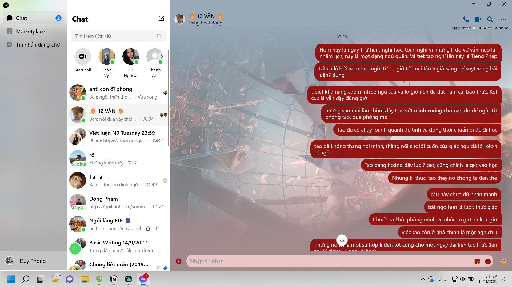
		- 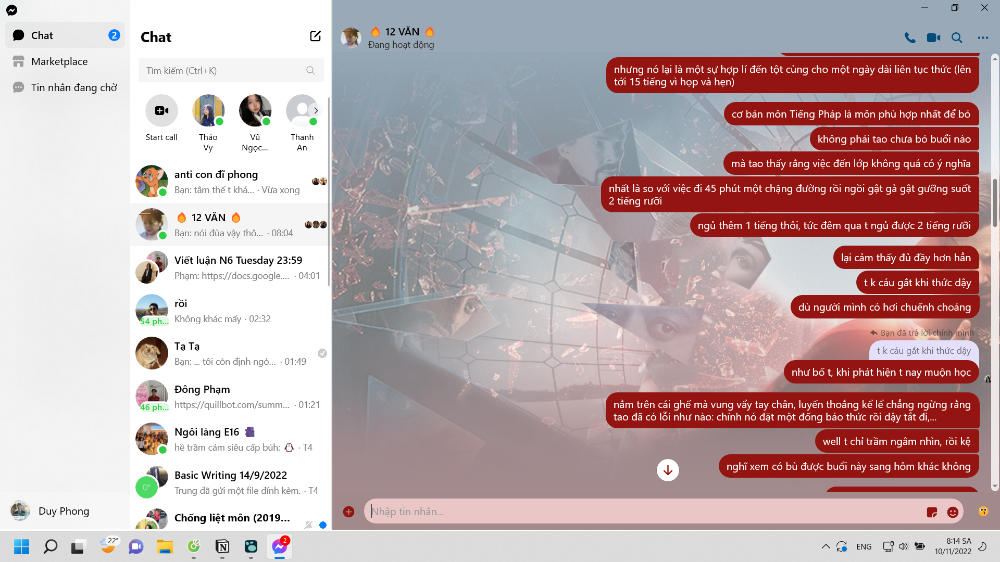
		- 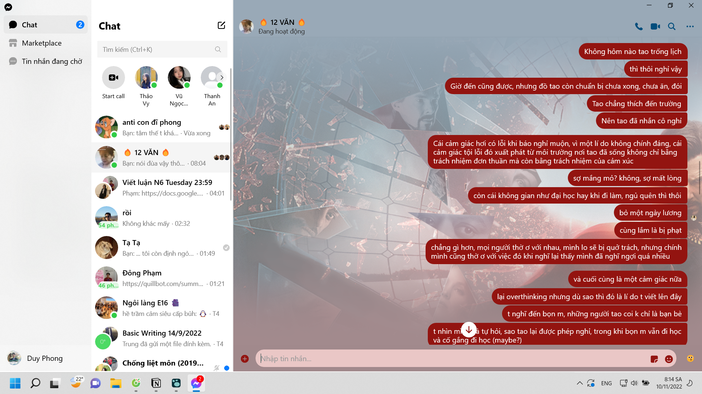
		- 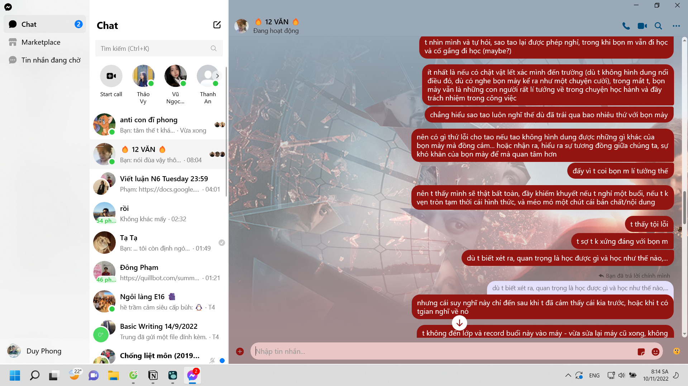
		- 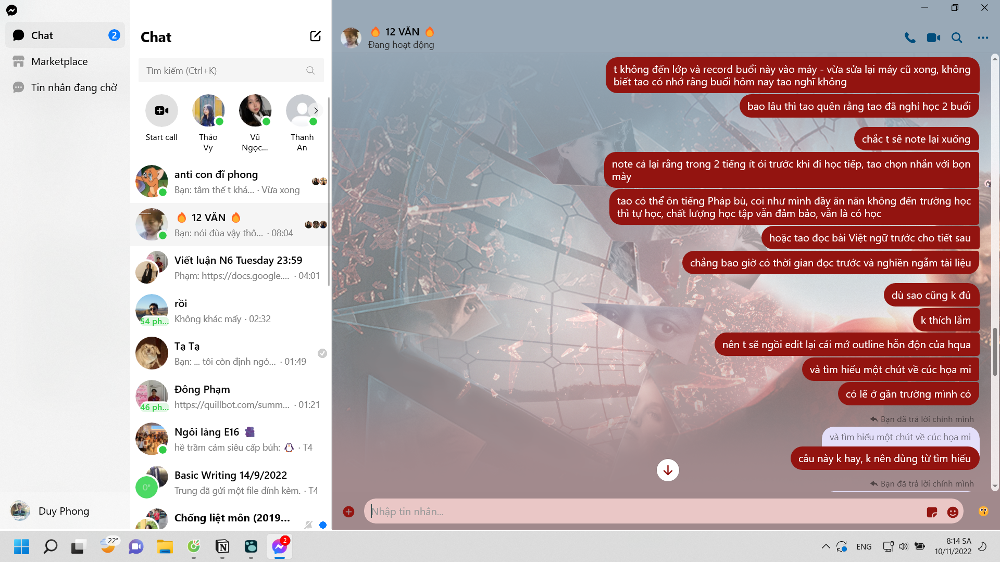
		- 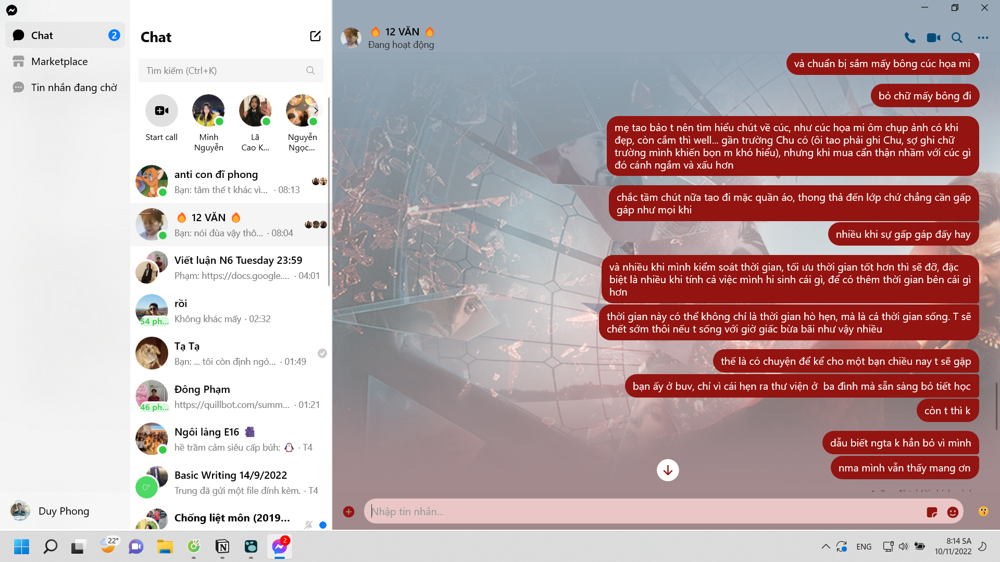
		- 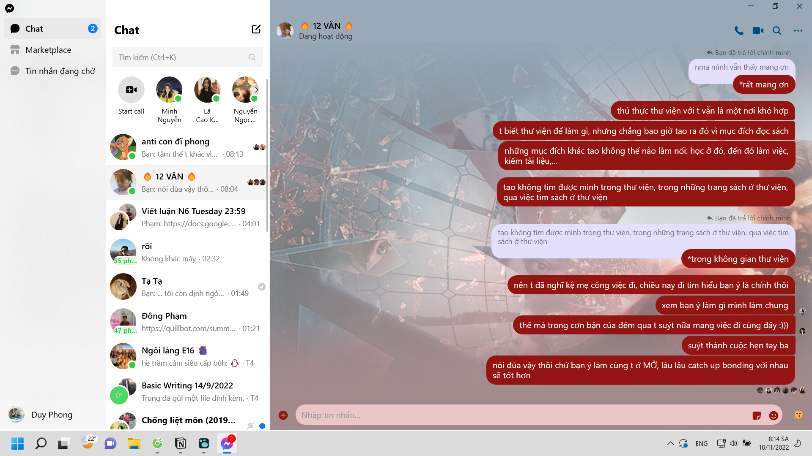
		- In một viễn cảnh khác
		- 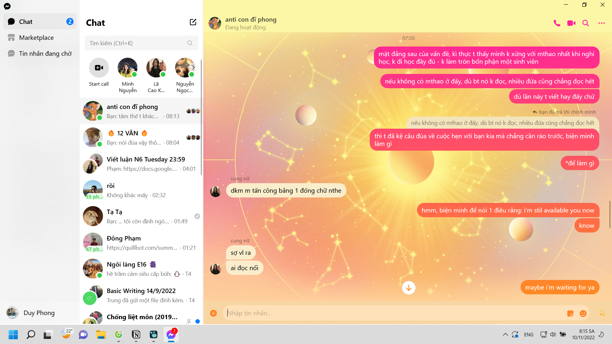
			- mỗi khoảng cách một tí giữa các tin nhắn là mấy phút sau nhắn lại
				- 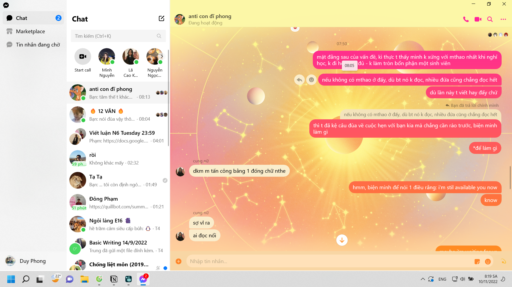
		- 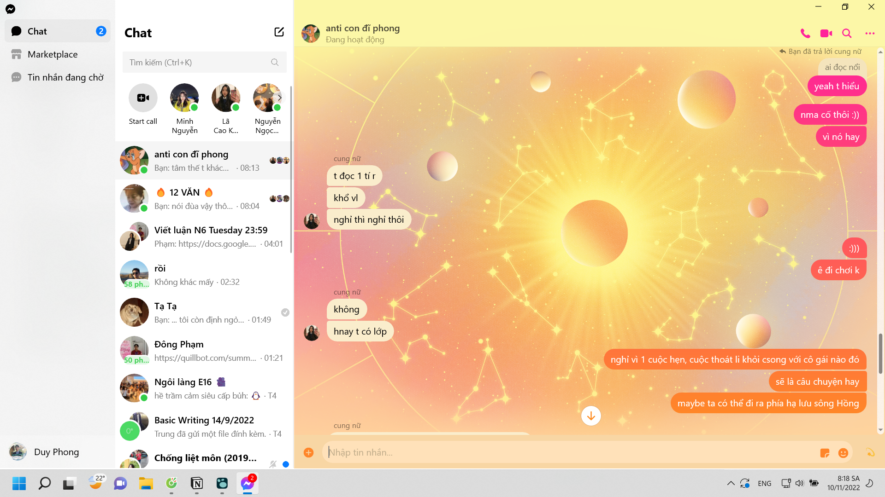
		- 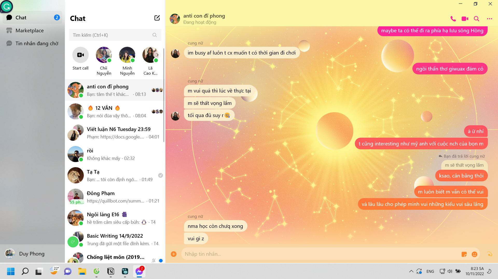
		- 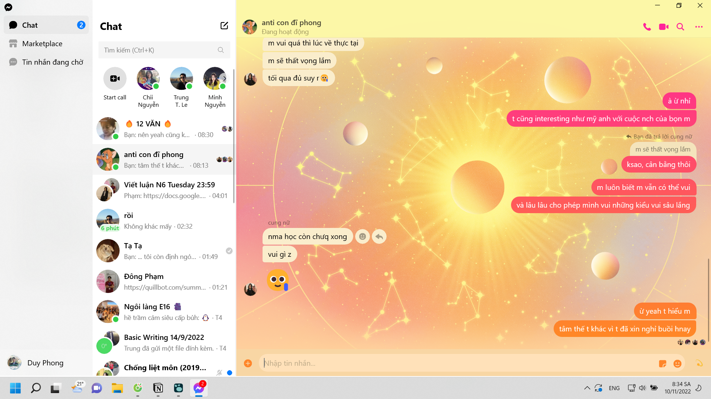
	- 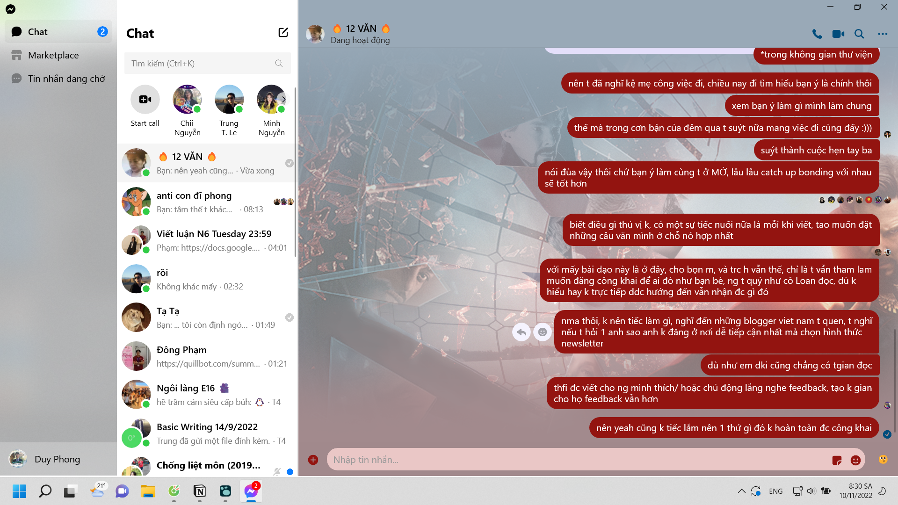
- sáng nghỉ nhưng đi học nhập môn vẫn buồn ngủ
	- lăn ra bàn và rơi cả điện thoại
- học Tiếng anh Đương đại 1 bình thường, nhẹ việc và cô không cho quay video
- được tan sớm chút, đi nói chuyện với Xù ở quán Chim Xanh
- về chỉ kịp hoàn thành nốt evaluation sheet, giúp Khánh Chi ở bài tập nó một chút rồi đi ngủ. Định học một chút tiếng Pháp nhưng ngủ gà ngủ gật và bật nghe người ta nói cho có một chút giá trị
-
- Việc học đại học không phải chuyện của cuộc đời, việc học thì may ra
	- vì học đại học 4 năm thì hết, và học lúc nào cũng được miễn là xong
	- thậm chí còn được bảo lưu
		- nếu học là đam mê, tao thấy gác lại đam mê chứ không ai bảo lưu đam mê cả, nghe cứ như gánh nợ cuộc đời, dù nó là nợ thật nhưng người ta vẫn (ngợi) ca
	- và việc học theo đam mê không tính theo tín, theo số năm bắt buộc phải hoàn thành, mà là theo tiến độ, và từng niềm vui trong việc học
		- dù có hơi mất trật tự
- Tôi biết nhập môn Việt ngữ quan trọng, nhưng lí do duy nhất khiến nó hay, bớt khô khan mớ lí thuyết, thiết thực và thú vị là khi nghe mấy bài tinh hoa ngôn từ Việt như giọt nắng bên thềm, tôi lại nhớ tới một bài tập của cô, và muốn dùng Việt ngữ học, tìm hiểu thêm về nó để đào sâu thêm về cái đẹp ngôn ngữ mình.
- Nhật kí ngày 9/10
	- Sáng định ngồi phản tư thì bị lôi đi viết luận
	- Chiều chở bố về quê, đi vào chỗ đường xấu làm bố tuột ra khỏi yên xe
		- vì có chuyện gì đó làm mẹ ở nhà đập phá đồ vào sáng, trước khi mình ngồi vào session viết luận muộn nửa đến một tiếng vì cày với nhau mấy đêm liền
	- đi lấy điện thoại
	- tối về ngủ, không thoát khỏi sức mệt ì của ngủ mà chuẩn bị bài
	- nhà mất điện nên ra quán
	- học chẳng vào được vì cày game và do nhạc ở quán
	- tối lại cắm đầu vào viết luận