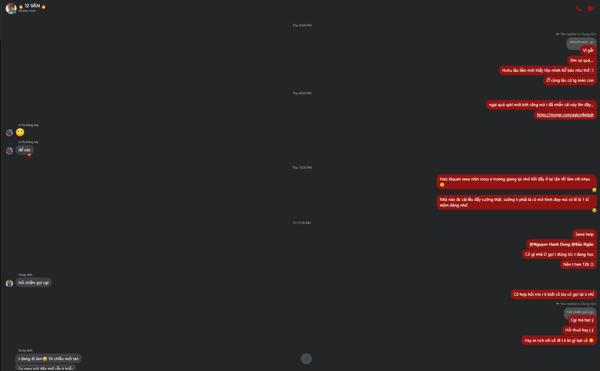

- Sáng dậy từ 5h30, dạo này thiếu ngủ nên khá ì ở trên giường, 6 giờ mới vào bàn, vừa học vừa chơi, không ôn căng thì đi học đỡ mệt nhưng thể hiện lại thấp
- bài không khó hơn nhưng thế không hay, giờ môn này là môn dễ ôn nhất rồi đó
- xong đi mua hoa cho sinh nhật Nhật Anh, vẫn nên nghĩ thêm gì đó tặng
- xong đi ra chỗ rạp chiếu, hết vé
	- nhắn Kim Ngân, Bảo Ngân, Diệp, Bình Nhi, Linh Chi hủy kèo
	- một số đứa có thay đổi lịch đi chơi
	- chẳng ai mặn mòi với bộ phim, có thì mặn mà với việc đi với nhau thôi
- xong đi ra nhà cô Đào, ăn rồi uể oải, định xin cô ngủ 1 tiếng nhưng rồi lại có động lực, vẽ tuy chưa hoàn thành nhưng sẽ cố
	- cô cho sách Phan Khôi (vẫn đang để trong cặp)
	- còn vụ biên soạn văn luôn làm mình day dứt
- xong về đi ngủ, dậy ngồi viết phản hồi comment của Xù
- rồi đi đến chỗ tượng đài cảm tử
- xem phim đi dạo nói chuyện với chị Trang
- rồi về xem tiktok, định quay tay, đọc những cái gì mình chưa nắm được, lúc đầu nghĩ mới nhất là định chơi game trong lúc làm, trước nữa là nếu còn sức thì viết bài thầy Trung đi
	- nhưng việc viết lách cho Xù thôi cũng tốn thời gian
	- và may đi sớm vì chú Thành thì phải, sửa xe đầu ngõ còn thay bugi và dầu cho một xe trước nữa nên mất lâu
	- chú thay dầu và luôn bơm hai lốp cho, lấy 100k
- chắc mai sẽ ghé trường, ở nhà cày dl cũng được hoặc để chiều, ngẫm đi ngẫm lại thì chưa thấy có lịch gì
- 
- 
- 
- 
- 
- 
- 
- 
- 
- 
	- bonus thêm về chị Trang: yeah mẹ tôi trước đây bảo một lời tương tự rằng chị ấy vẫn bình lặng chứ không đôi khi xốc nổi với cảm xúc. Chị ấy nói lúc đi ăn nem là tiếc không làm họa sĩ nhất, yeah i can understand, nó sâu lắng hơn cả việc chị đi theo giáo dục tới tận du học... và cảm thức về nơi chốn thân thuộc của chị là Hồ Gươm (hầu như tuần nào cũng lên, không chán, bất thường như người bình thường với một cuộc sống nhìn chung lặp đi lặp lại bởi sự kiện thường và đặc biệt diễn ra trên đó, có lẽ nhiều cái cũng giống tôi như về làm việc cũng mệt, nhưng quen rồi), của tôi là hồ Tây vì nó có Chu. Hay nhỉ, biết thêm một số điều như chị thích học, thích chơi, thích du lịch, thích tỏa sáng (không nói kĩ sau đọc lại sẽ không nhớ rõ cho mà xem)
		- chúng tôi có nói về những mối quan hệ bạn bè, lí tưởng, hình mẫu, bản thân là hướng ngoại hay nội hay gì
		- nhiều khi vẫn chẳng biết nói gì, ngại, không có được sự tuôn trào như nói về cái mình thích, nhưng thoải mái đi với nhau như thế là tốt rồi vì tính ra mình với chị cũng không tiếp xúc nhiều
- Nên viết phản tư đi vì mai chị hihoha hẹn họp...
	- và phản tư thì không chơi game cùng lúc được đau mà phải tập trung nên là max rank đi
- Lúc cô Đào đưa quyển sách, nhìn cũng thú, cô bảo người ta cho cô hai nên cô cho, quyển này không bán
	- chỉ muốn về đọc bình thường chứ không quá nặng nề outcome
- về nhà mà chỉ việc chill và chuẩn bị ngủ bất cứ lúc nào cũng vui, không phải đầu thành quen là làm việc đê