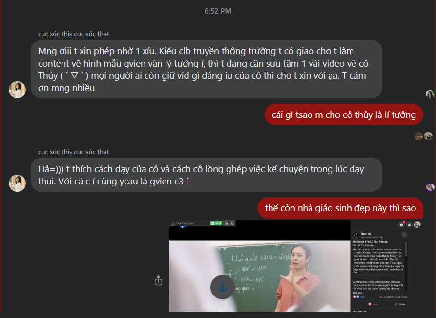
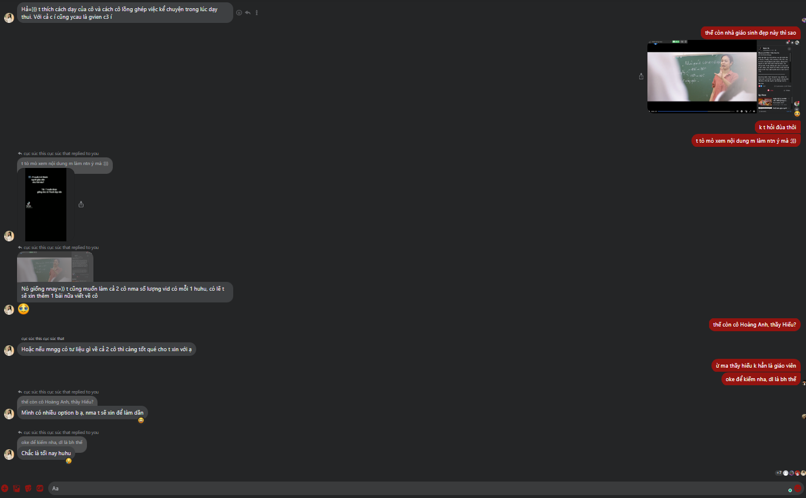
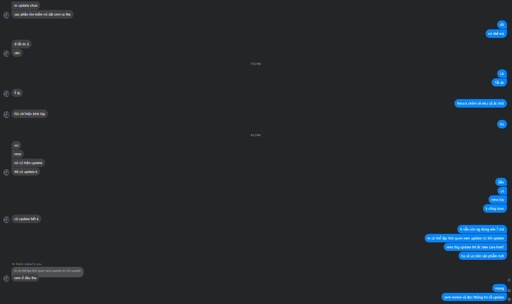

- Cái ý tưởng của Thuận hay vãi (đúng hơn là bài tập của Thuận)
	- 
	- 
	- Nếu là tao, tao sẽ xếp ranking các thầy cô (tổng khả năng của họ để rồi chọn, tất nhiên kiểu gì cô Thủy chẳng thắng)
	- Và làm việc đó để làm gì, để làm script, để chia ra các mảng và chọn dẫn chứng thích hợp nhất cho nó.
	- Về kiến thức
	- Về giảng dạy và điều phối
	- Về con người, không phải khi làm nhà giáo?
		- những lúc yếu đuối?
	- Thực ra chia thế này chưa chuẩn lắm
	- Nhưng yeah nó sẽ cần nhớ lại và ngợi ca nhiều
		- vibe?
		- ý tưởng
		- sự tận tâm
		- mấy cái này không thành catagories thì phải toát ra hoặc được nói lên.
	- Và mở đầu phải bằng hình ảnh mà mọi người hay thấy, ngưỡng mộ, là một nhà giáo mang những đặc điểm truyền thống rất tốt, và phá nó bằng chính cá tính của bản thân
	- Và quan trọng là phải đặt ra câu hỏi thế nào là một nhà giáo tốt? Dạy hay, có nhiều chuyện để kể? Thậm chí là rất hiểu giáo trình và có khả năng mở rộng tốt, có cả rổ kiến thức ở trong đầu? Không, người nhà giáo đó phải truyền được cái gì đó cho học sinh, đặc biệt là sau khi họ chẳng còn là học sinh nữa.
	- Lúc này liên hệ và nói tới giá trị, không nhất thiết là nói tới mình
	- Đấy mục đích là làm mọi con người trên đời này đau khổ mà chết đi vì không sướng được như mình.
- 
- 20:43 (ồ viết cái này ra mới để ý cũng 8 rưỡi mẹ rồi) Về Minh Thảo, chẳng hiểu sao đợi mãi chẳng thấy Lã đâu, chắc nó quên rồi, nãy còn vào bảo giờ tao đi tẩy lông đây bye. Không mang theo mày xuống được vì ở đó có nhiều người. Giờ chắc bận hoặc quên mà chẳng vào. Tôi check lại, ồ phòng đóng, đó có thể là một lí do. Và ngay giây phút trước khi nhấn bật lại, tự tôi sững người lại, tôi cố tình làm thế với bản thân: rằng ồ, mày đang làm MỞ, còn nhiều bài chưa làm và mày còn delay, giờ mày có thể break và bắt đầu làm luôn, và mày đợi Lã vào nói chuyện. Hình như một ngày của mày đang thiếu gì đó. Ồ thiếu những phút giây nghĩ về Mthao. Hừm have i moved on already?
- Trong lúc break lướt insta, thấy insta của Tâm để đầu, tôi có thói quen xem những cái nào ở đầu trái, xem nó đánh cũng hay, âm thanh trong nhưng xem được 10s, 3s hơn mỗi một tin thì vội lướt nhanh sang. Chợt nghĩ lại câu nói của Lã: mày không thấy dạo này Minh Thảo thay đổi rồi à, cách nó ăn mặc và cách nó đăng story. Ừ thực ra cũng có (nghĩ lại thì may mà minor. Chứ chẳng hạn bắt đầu branding bản thân như hoa hậu thì tôi sẽ mồm chữ o mắt chữ a đấy)
- Và story nó đầy về buổi hôm nay ở trường
	- well tôi cũng đoán nó sẽ đến, nhưng điều đó chẳng hối thúc tôi đến
	- xem ra thì nó thiếu gì bạn để đi cùng
	- và ồ hóa ra nó đi lấy cả bằng, hôm trước không lấy (tôi không biết, không để ý điều đó đấy)
- nhìn lại thì mỗi lúc nó đi với một đứa, con người tự do ghê, tự do được như vậy vì nó thuộc về nơi đó. Tôi có thể tự do, kiểu tự do của một đứa chẳng thuộc về đâu cả (ồ khác biệt này, nhưng i don't really care - đang đối sánh với câu chuyện ngày hôm qua chị Trang kể: anh chị giống nhau từ gu nhạc, cùng ở Hà Nội, cùng thích nghệ thuật, cùng thích đi chơi,... nhưng giờ khác nhau rồi, nghĩ thì sẽ buồn đấy nên chẳng nghĩ nữa. Ai đi chơi người ấy. Xưa anh ấy hướng nội hơn, chị hướng ngoại thích đám đông - cái sự hướng ngoại này khá healthy hơn so với nhiều đứa thời nay chơi game, có lẽ chị ấy không nghiện phim hay game gì, và cũng khác giới trẻ ngày nay, mấy đồng nghiệp của chị: là thích đến những nơi vắng người, kín đáo)
- Chị muốn tỏa sáng, ở nơi đâu cũng có người nhớ đến thì đúng hơn là phải tỏa sáng trực diện như MC (dù chị có nhận lời làm MC và diễn giả)
- Tôi muốn hỏi là thế nếu không được thì sao, nhưng chắc chị sẽ lạc quan bước tiếp thôi, tự chị nhận chị là một con người lạc quan.
- Còn tôi, tôi thì muốn được cần đến, ai, nơi đâu mình đi cũng cần đến mình  như đến trường, nếu không ai cần tôi thì tôi đến là gì. Minh Thảo không cần tôi thì tôi đến làm gì, lí do gì mà ngày xưa chúng tôi đi với nhau nhỉ, vô tình gặp thôi, tôi không nhớ tôi bám nó thế, chắc chỉ hên xui gặp, gặp đúng mấy lúc nó mất điện thoại, còn tôi đang chán đời chẳng có gì để làm, nhà có nhưng chưa muốn về. Giờ không thoát nổi cái nhà này để mà gọi là nhà như kia.
- Hừm trọng tâm mối quan tâm của hai người đặt ở mình và người khác. Và không đạt được tôi dễ buồn vì chẳng dễ gì mà đạt được (dù hành động và lối sống có thể như nhau, nhưng tâm tôi đặt ở bè bạn)
- Và nay khi tôi cầm bát cơm lên, tay run dữ dội, càng ngày nó càng không yên được, có lẽ cần ai nắm mới bớt  rung? hoặc nếu tôi bị bệnh gì đó giống trong một lít nước mắt thì ừ tôi phải nghĩ đến việc sống với suy nghĩ đến cái chết, sự giới hạn của thời gian nhiều hơn là mình đang sống hướng tới đích ở tương lai xa xôi. Có lẽ tôi sẽ sống như cô gái trong tháng tư là lời nói dối của em. Đoạn nhiều sách thế này thì không đọc hết được rồi. Ừ như tôi cả đời cũng bận không đọc hết được, khác gì một người nằm giường bệnh và không còn đủ thời gian không?
- KÌ thực ngồi nhà chờ bọn nó đến chắc cũng như là ngồi giường bệnh đợi bọn nó đến thăm thôi. Cái khác là mình rũ bỏ được một số gánh tương lai, có thể về hưu trong việc học vì xã hội (không thực sự là vì thân mình thích hay vì sự thích, cái câu vì bản thân người ta nói đặt trong khuôn khổ xã hội, đúng hơn là vì bản thân mình sau này. Nên phân tích cái gì chi phối câu nói đó, context xã hội và tầm tư tưởng người nói)
- Tôi có nên báo bọn nó tôi bị thế không, giờ nói chắc maybe ai đó để ý hoặc cùng lắm bảo đừng nghĩ thế, còn có giấy báo bệnh thì nó sẽ khác.
- Khiếp một thằng thanh niên từng năng động như tôi mà giờ lại liệt giường được thế sao. Mà có khi bọn nó đến thăm online ý :)) thôi cũng được.
- có lẽ Minh Thảo sẽ đến một ngày, tôi cũng bất ngờ và vui nhưng vẫn thích nói lời cay đắng
- có ai bảo tao rằng minh thảo sẽ chỉ đến một lần thôi, không ngờ đó là lần này
	- ý nghĩa câu đó rằng cái sự kiện này rất đáng trân trọng mà nó cũng là sự buồn, có thể nó bận, hoặc thậm chí nó chỉ đến một lần vì nên thế, cả hai chẳng còn là gì của nhau, hoặc tệ nhất là nó đến tạ từ lần cuối, thế thì lúc nó về tôi không cười nổi đâu. Nhưng nếu thế thì hi vọng nó có thể dành một ngày cho tôi chuyện trò và đưa tôi đi trên chiếc xe đẩy, làm gì đó, cười ra về như thường lệ nhưng là không bao giờ gặp lại nữa.
	- Nếu làm điều đó nó có diễn quá không, đi ra về nó sẽ dùng cái mặt sắc lạnh và nghĩ chút thương, chút khinh
	- Có lẽ nó sẽ nức nở nói: sao đến lúc này rồi mà mày còn nói vậy được hả.
	- Thế tao biết nói gì bây giờ. Tao rất vui, thực sự bất ngờ. Vào đây ngồi với tao đi, ngồi sát vào? Tôi đang ngồi trên giường, chùm chăn lên chân
- tôi hình dung ra thước phim như thế đó.
- và tôi sợ cái lúc là người quen mà không đứng cùng nhóm với nhau, đặc biệt là cái khoảnh khắc như hôm sinh nhật Mở 2 tuổi, có giây phút anh VHLong ra ngoài hút thuốc thì phải, xong vào nhìn quanh, mọi người ai cũng có nhóm, anh đang phân vân xem vào nhóm nào, nghe thử, được một lúc rồi anh chào mọi người đi về
- Nhật kí hôm nay: Nửa đêm đến hơn 4 giờ sáng, đánh game và viết lại note lên Notion. Vô bổ thật, đáng ra có thể ngủ và sáng hôm sau đi lên trường
- Hoặc chấp nhận buồn ngủ và lên trường
- Dậy làm tiếp MỞ, đăng kí mọi app mà Notion suggest hiện ra để embed và kiếm plan education
	- app nốt Miro lần trước quên, chuyển figma vì well nó offer tốt hơn, dễ đăng kí education hơn
- Cả ngày toàn làm MỞ mà chẳng đúng trọng tâm, mới beat around the bush mấy cái cấu trúc, plan này nọ kia, chắc chẳng cần thiết chút nào đâu nhưng mình cứ làm
- Còn bao nhiêu thứ của tuần sau nếu mày không chạy luôn thì tối chẳng chạy kịp đâu
- Mong muốn của một ngày. Tôi không đến trường cũng được, nhưng sẽ chỉ không tiếc khi không đến nếu như ngày đó có thể nhắn nó một câu thân thương như thế hôm nay đến trường thấy thế nào? Rồi nó nhắn lại vài ba tin. Còn tôi sẽ vào vai anh chàng người yêu hơi tham công tiếc việc.
- Ở nhà cả ngày, trầm cảm thì có nhưng thôi cơ thể cần nghỉ ngơi. Mình toàn đi những sự kiện của nợ, chơi với những con người "kì cục - thực ra họ rất giỏi, nếu có thể làm chung và thân hơn thì tốt cho mình, tôi nói điều này không vụ lợi, vì làm nhiều thứ với họ sẽ rất vui. và tôi chắc chắn họ tốt hơn tất cả những con người mà network của bọn kia có được (mthao,pthao, rồi...). Quality của tôi"
- Tối ngồi học với Lã tôi muốn kể nó nghe những chuyện trên này ghê
- và cách tôi nhắn ở group lớp, share lại bài của nhà D cũng mang hơi thở của một kẻ bất cần đời. Ai mà comment chỉ ra thì cũng vui, không nhất thiết phải là một độc giả soi xét kĩ mà chỉ cần nói cho bạn bè, hoặc họ đọc cái này và chú ý thôi. Tôi không nắm rõ được mình có những gì quan trọng để mà nắm rõ nữa
- nay lớp tôi (á đù mày viết gì thế này, mà đúng rồi, lớp đại học) đi với nhau, tôi không đi để làm việc tốt hơn, và cũng chẳng muốn đi với bọn nó đến thế, đi về trường dự cái thời gian này thì tốt hơn (ừ mày nên để ý là từ nay đến tận năm sau éo có nhiều thế đâu)
- tôi muốn đi sparkling, đơn giản vì tôi muốn đi, chill và xem các em làm, chỉ thế thôi, không phải là không học được gì, có thể thực sự biến thành case study mà quan sát nhưng thôi đi về trường tìm bình yên thôi
- còn minh thảo như nào thì, nó sẽ đi, không phải ghi chữ chắc là luôn, chỉ là gặp được nhau không thì chịu. Có khi nó về giúp các em. Mà còn vụ snight mate. Hừm, đáng lẽ ra nay nên đi mà rủ nhỉ. Ừ hết mịa dịp rồi đm. hôm đó đến rủ thì hơi kì, mà bị từ chối cũng đau, thôi kệ, mình dạo này luôn chậm chân, được thì vui, có mthao chắc tôi sẽ nhanh lại
- à tại sao tôi không thấy cảm xúc gì với nó mấy, bây giờ thì có nhưng đáng ra nếu không chủ động nghĩ linh tinh thì sẽ không có gì đâu
- vì tôi không chủ động bắt mình nhớ về quá khứ để nhung nhớ nó thôi, không biết bao giờ quá khứ đấy thành xa xôi thực sự. Giờ thấy xa xôi và xa lạ vì khó có được rồi nhưng để gọi là xa đến mức không cảm nhận được gì thì tôi không tin. Đấy chứ nếu làm thế thì không dứt được nổi khỏi nó đâu
- May ra khi đó tôi thấy bọn tôi như trẻ con thì mới thực xa, còn giờ vẫn thấy hồi đó chuyên nghiệp, trưởng thành lắm
- Record mấy buổi làm việc, tâm trạng, suy nghĩ cùng với lớp còn giá trị hơn record bài học
- Chẳng thấy có gì ấn tượng thực sự về cách giảng, điều phối, nếu có thì sẽ nằm ở việc tôi học như nào
- à có một ý nữa về cái sự kiện của nợ là đáng buồn gu bọn tôi có lẽ hơi khác nhau nên là mối ràng buộc duy nhất với nhau giờ chỉ còn là Chu. Không bao giờ nghĩ mình sẽ gặp nó ở sự kiện ngoài nào khác