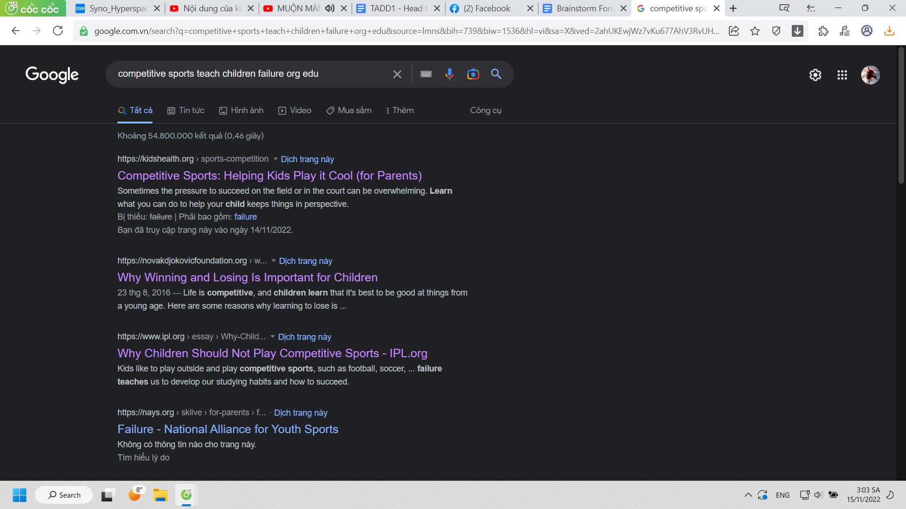
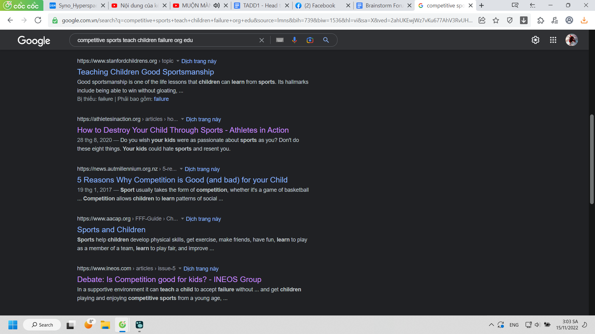
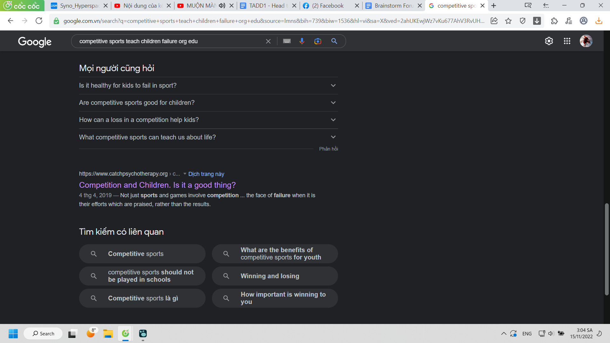
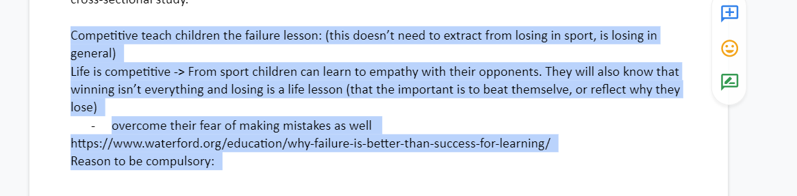
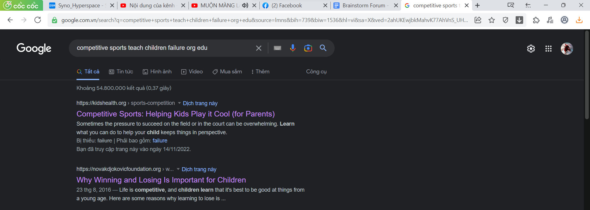
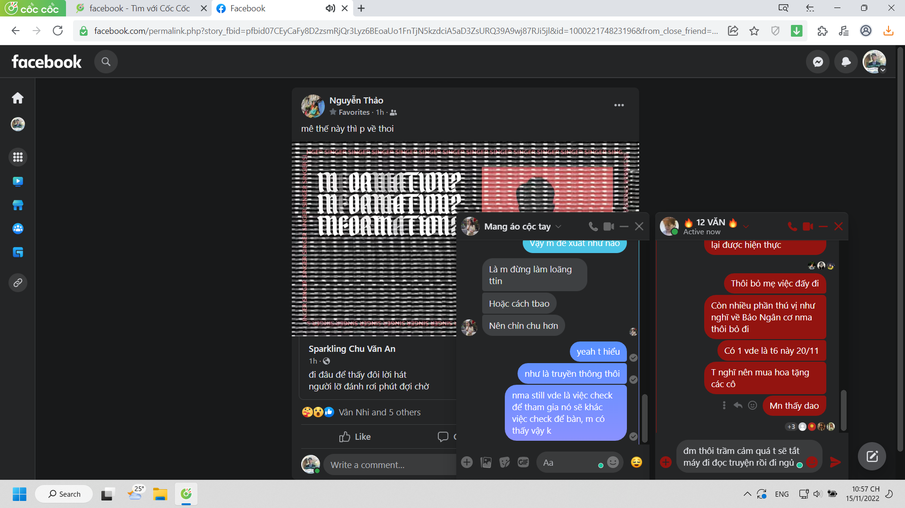

- 03:03 tra cái này ra nhiều ý ngoài learn from failing vcl (mà còn sát ý đề, nhưng lấy ý để debate như nào, plagiarism như nào chưa rõ nha, làm ít và chưa think through)
	- cái vấn đề think through của Lã bảo cũng muốn học kĩ nhưng chỉ kĩ được hơn (nhưng hơi miễn cưỡng) khi làm bài để hiểu
	- yeah tôi nghĩ có lẽ cách tốt nhất là cho tình yêu vào, yêu nhau và học cùng nhau, think through với nhau, 2 não kiểu gì cũng nhanh hơn nếu xét đến trao đổi reflect (khi 2 người đồng điệu thời gian)
- 
- 
- 
- And I realised
	- 
	- From this because they doesn't include sport or especially competitive in it (cause this is psychology - apply for all human not health from sport)
	- of course this is logic shift but believable cause it's easy to think losing are the same, actually some factor in sport can lead human emotion out of this track.
	- {:height 424, :width 1162}
- Thinking about mThao, vì tôi không tin chuyện người không hợp, đúng hơn là chúng tôi không hợp nhau, nên không có nó tôi coi như một nỗi nhục cay đắng, một thất bại ê chề, một minh chứng cho cái sự kém cỏi nhiều hơn là yêu chơi, hay là không thích, không hợp thôi
- tôi tin cái gì hợp nên ghép lại, kệ mẹ thứ cảm xúc dễ sai khiến đó, nó còn dễ sai hơn, tôi tin tôi còn chứng minh được
- và sao không nghĩ không có nên mới muốn kiểm soát - muốn có, có rồi sẽ trân trọng hơn, cũng không chắc nhưng có thể thử mà.
- 22:58 Giới hạn 1 con người là khi thấy có đứa nói câu đó, tôi tin là nó nói thật, và thế là thế nào, nó có phải loại hám ca sĩ không
- 
	- đây không phải mất niềm tin, đây là đổ vỡ chỗ dựa: lớp Văn, MỞ, lớp đh, hình tượng mthao
	- Còn mỗi truyện để ghé vào

- Buồn chuyện không ai hiểu được mình, không thực sự mình buồn vì không hiểu được ai, mà cũng khó để sống theo cái lối đó của họ khi mình mãi như thế này. (Cảm thấy và suy nghĩ)
- Mình emotional quá, không hợp làm giáo dục, cũng chẳng hợp làm thầy đâu, thầy Trung bảo thế, chị Fuong bảo thế. À còn quên báo cáo giáo viên, mai chuyển cho mẹ tiền và bằng khen vậy. Mình cũng nhắn với Phương Thảo rồi, việc nhắn tin cũng nên như một dạng truyền thông, dù mày muốn gắn kết lớp thì phải nín nhịn tránh cái dịp quan trọng ra.
- Mày còn tự an ủi rằng Phong không phải thiên tài, nhưng tính cách cậu là tính cách thiên tài, tức xuất chúng trong mọi loại tính chứ chẳng phải tính cách cô độc dạng thiên tài. Tao sẽ không chê là thảm hại như một kiểu tự nhạo đời đâu vì tao chẳng cảm thấy gì nữa.
- Chỉ là khó biết người ta muốn gì. Tôi sinh ra toàn làm chuyện thừa thải. Chỉ thích lông bông đi ngao du giúp đỡ bạn bè. Họ cần, có lẽ, nhưng không phải tất yếu. Thế có nghĩa gì. Chỉ là tôi tồn tại, thằng khác cũng làm được ở mức độ nào đó, có khi hơn vì nó sống với đời. Tôi cũng muốn giúp chị Fuong nhưng giúp kiểu của tôi thì khó, giúp kiểu chị thì nhám chán quá nên chẳng biết làm gì tiếp. Mình không quen tự do trong khuôn khổ nhỏ... Chẳng nghĩ trình mình giúp họ đọc tài liệu rồi review. Không cảm giác có được sự tin tưởng. Hôm nay họp ở Mở cũng sợ chị Phương, người lớn họ phán xét là ngu vì họ hiểu chừng mực nào đó lời tôi nói.
- Biết làm sao đây, chỉ còn cách sống với nó, như việc tôi sẽ lên thuyết trình ở cái đại học chết tiệt theo tư duy cảm xúc muốn tạo nên tác phẩm trác tuyệt của mình.
- Tôi mãi không hiểu được bọn nó, tưởng Dung nói ok ngủ đi, tôi chờ bọn nó bàn tiếp mãi. Tôi cứ xả cảm xúc ra như thể bọn nó không là người. Ừ làm tôi không cảm biết được đằng sau chấm tròn kia đang thấy gì mà không rep. Đau khổ hay vui. Cười chê hay yêu quý,... Tôi không hiểu ý bọn nó nhắn. Tôi không hiểu tôi không hiểu. Lấy Bảo Ngân làm ví dụ, tôi không hiểu đời này nó muốn gì sâu tronh lòng, còn bây giờ maybe nhanh thoát dl... Tôi không biết Bảo Ngân là ai, định nghĩa thế nào, dù với tôi. Bọn nó cho tôi cảm giác được hiểu được lắng nghe được tác động. Còn tôi chỉ ảo tưởng nên cảm giác đó.
- Mà giờ mất chỗ dựa rồi thì bao giá trị có ý nghĩa chi nữa, viết ra để làm gì nữa. Văn chương vị nghệ thuật à. Đâu còn vị nhân sinh. Tiền có ý nghĩa gì, bằng có ý nghĩa gì, đi thăm các cô có ý nghĩa gì, mình đã bỏ tick và chẳng ai xem, hay mình nên bỏ đi. Giờ chỉ còn cảm giác tiếc và một chút trách nhiệm, đặc biệt là hai vụ mịn chủ động hẹn cô.
-
- Chắc bọn nó cũng mệt mỏi với tinh thần của mình, còn mình nói chuyện với mình mãi chẳng thấy chút cô đơn. Thế thì nên thế.
- Tôi muốn mọi thứ khăng khít gắn chặt chẽ, nhưng chẳng hiểu họ thực sự muốn sao. Lâu lâu nhắn tin với cô Thủy? Vì đơn giản thích. Chẳng sâu xa ý nghĩa gì. Thế thì cái tôi thích là kia, chẳng hiểu sao tôi thấy thích hơn, nên hơn. À vì hợp vì đẹp thôi...