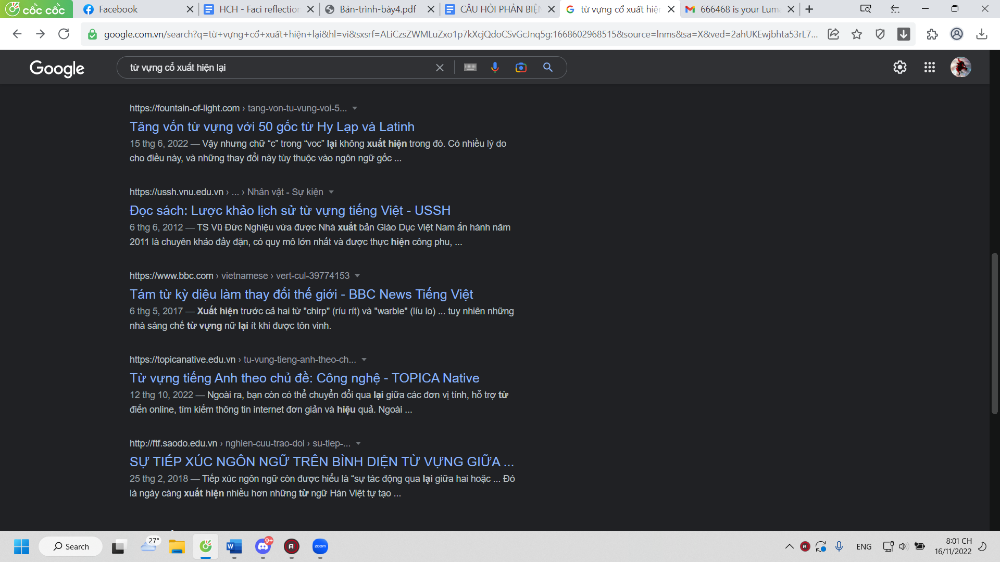
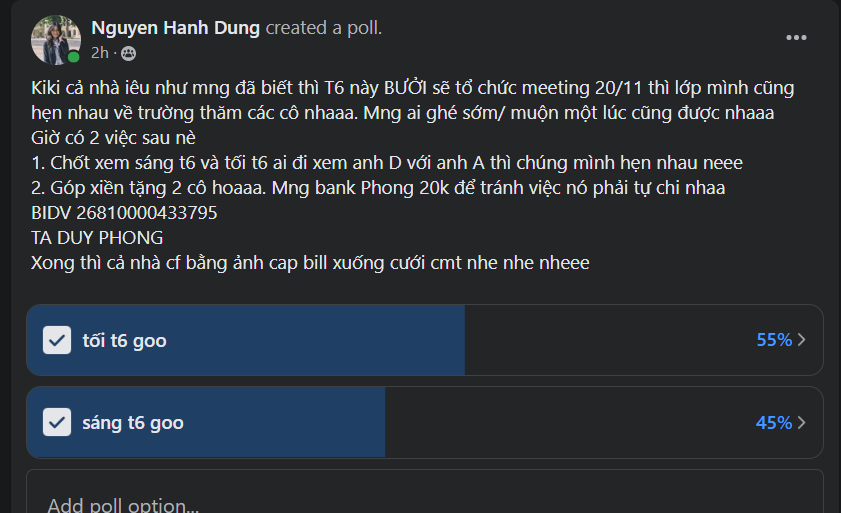
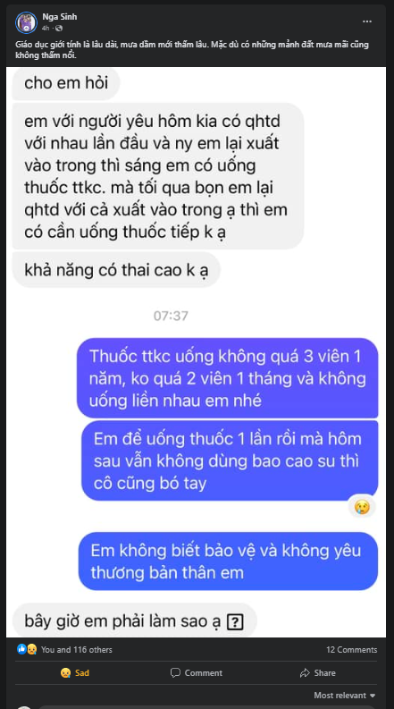

- 20:01 tìm được cái này hay vãi, chẳng hiểu sao nghĩ ra ý này đã không được liệt kê, kiểm chứng lại thì thấy người ta cũng bảo sự biến đổi phức tạp. Ừm ok, ai khai thác sâu, hết được sự phức tạp đó không?
	- 
- mà mình không có quyền đặt câu đó :))) bỏ dl thầy Trung, MỞ và chậm dl Việt ngữ (câu hỏi cũng chưa rõ thì haha nay mày ăn chơi thật đấy)
- 22:50 vừa học xong Academic Writing
- xem Diệp bình luận, check lại thấy mình đọc sai
	- 
	- nhưng yeah suy nghĩ vẫn đúng
- đọc cái này, chợt nhận ra là dù mình aim đến việc qhtd thì cũng đừng nên quá ích kỉ
	- 
	- nghĩ cho người ta là thương người ta đó
	- chắc phải đọc hết tất cả post ở đây trước khi tính đến làm
		- mà mày kiểm soát bản thân tốt mà, chỉ cay cú thôi chứ có hóa thú đâu
	- đấy thì ở tuổi này tình dục có thể thú vị, hoặc không, bản chất nó có, nhưng trách nhiệm thì không
		- nếu nó nghiêm túc mà chán quá thì cứ thú vị trong khuôn khổ maybe
		- tùy người
		- tùy mày
		- mày thương họ thì mày sẽ chọn được
		- lúc đó
- Giờ nhiều nhóm ở đh đang thể hiện độ lười, không biết do quen dl hay lười đi và sẽ ảnh hưởng điểm, bị trừ điểm để giác ngộ nữa, hoặc quá mệt