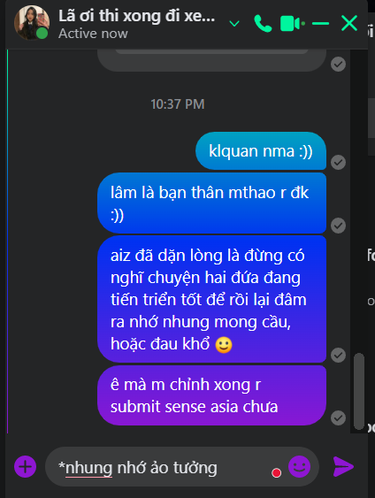

- 
- 23:31 vừa làm vừa nhắn lã
	- như hồi xưa thân minh thảo
	- chẳng chờ đợi tin nhắn, chẳng mong nó giúp gì
		- tin đến thì mình trả lời ngay hoặc đôi khi tập trung quá quên thì rep sau
	- mình nhắn và kể nỗi lòng suy tư như mình thở
	- hoặc giống việc mình uống nước giữa chừng khi đang làm gì đó
- đôi khi người ta tym hoặc nhắn gì đó không có tính gợi chuyện nữa thì mình nghĩ mình có chán quá không mà người ta muốn kết thúc rồi
	- thì cũng muốn nhắn thêm chứ chẳng thiết tha đến thế
	- nhưng như mình nhiều khi tym và nhắn kiểu đó mỗi lúc ai đó đang rep nhanh và đang kể nhiều thôi
	- mệt, đang chưa trong lúc rảnh, hứng thú chưa đủ cao
	- chưa có gì tò mò cần biết hay thấy quan trọng
	- cũng không chia sẻ được thứ đang làm xen vào để bù vào việc thiếu topic chung, lấp đầy khoảng thời gian trống (đây là gợi topic mới - nghệ thuật nói chuyện à :))) phân tích thôi chứ chưa tìm cách để ai đó luyện tập, vì luyện thì kì quá, cứ freestyle và sản xuất ra những cuộc nói chuyện tầm phào đi, đúng người tự nó sẽ đỉnh, hoặc trừ khi muốn lấy lòng ai thì yeah chúng ta sẽ tính sau)
- hừm chợt nghĩ về những cuộc chuyện trò miên man như thế này, sau này dễ quên, nhưng lại hay nhớ cái cảm giác đó, cả một thời gian dài đó
- và mình yếu lòng, mình không chịu đựng được cảm xúc nhen nhúm trong lòng
	- là do mình kém, hay mình vẫn cố được, chỉ là lúc đó mình nghĩ đến hoàn cảnh của mình chứ không hề so đo với người khác để rõ bề hơn thua