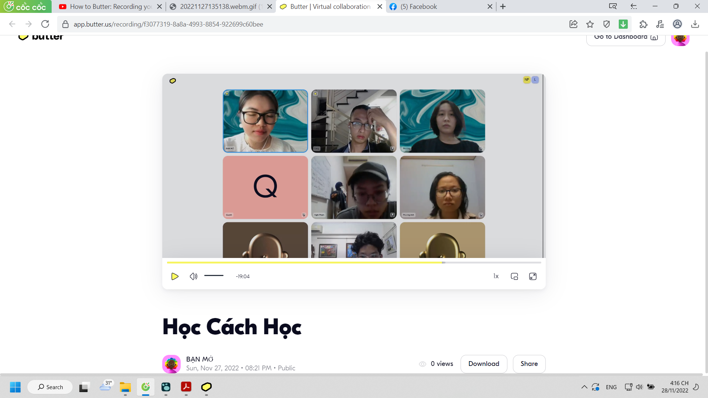
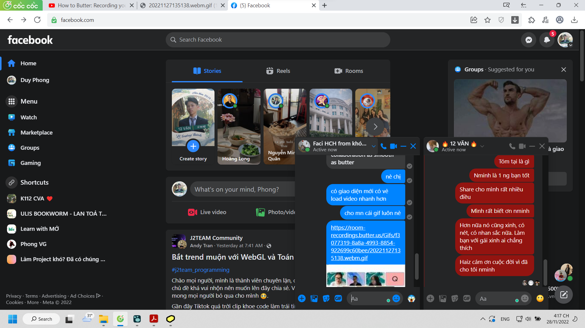

- dậy từ 12:30 chơi 2 game, lướt điện thoại và ăn đến 1:30 ngồi vào chuẩn bị bài
- sáng có 8 giờ thức một lần dậy xong ngủ tiếp
- thế là bỏ học với Lã, dù không hẳn là hẹn, thế là bỏ nhắc lớp sáng thực ra chắc sáng không cần nhắc đánh răng rửa mặt lắm? mà tôi vẫn không hiểu có cần làm liên tục thế không, tối đã làm rồi mà
- 14:25 ăn chưa xong vừa nghỉ 25 phút xem tiktok, đầu đinh ninh về những kinh nghiệm cần kiếm và cần làm sau này sau khi đọc chút về passive, giờ ngồi làm sẵn bài để tối chữa
- chơi quá thêm tí có lẽ đến gần 15:00 rồi làm đến 15:30 là xong
- chơi một trận game Tốc chiến tốn thêm, nhưng thôi nóng khó chịu lắm, đằng nào cũng phải tắm thì nay tắm sớm luôn đi, thích có thể quay tay thêm, mỗi khi chán mày toàn làm thế mà đúng không
- dù biết nên tranh thủ mọi thời gian xử lí những gì dang dở
- Có một cái rất buồn cười là khi đời tôi đã ổn định thật sự, gắn được đống công việc, cắt được hoặc tạm ngưng những gì thừa, hoặc lười chẳng làm nữa, gọi chung là ổn định thì lo sợ thua thiệt, vì bạn bè mình còn đang cắm đầu cắm cổ cân đủ trăm công nghìn việc
- dù thế chẳng tốt lắm về mặt cảm xúc và dễ burn out
- nhưng yeah mình toàn peer pressure kiểu đó, họ làm tốt thì không sao, cùng lắm đôi khi thể hiện ở điểm số cao, sống thoải mái thì ghen tị, nhưng thường ghen về việc họ cân được nhiều việc cùng lúc hơn, còn họ chưa thì mình vẫn lo sợ thua vì như thể không tiến nữa thì không mệt mỏi, không chạy đôn chạy đáo như lũ trẻ nữa là già
- và ì đi là tệ... cảm giác thế
- không lấy nhàn làm lãi được mà lấy làm lo sợ
- Hôm qua chủ nhật:
-
- 
	- giao diện mới
	- 