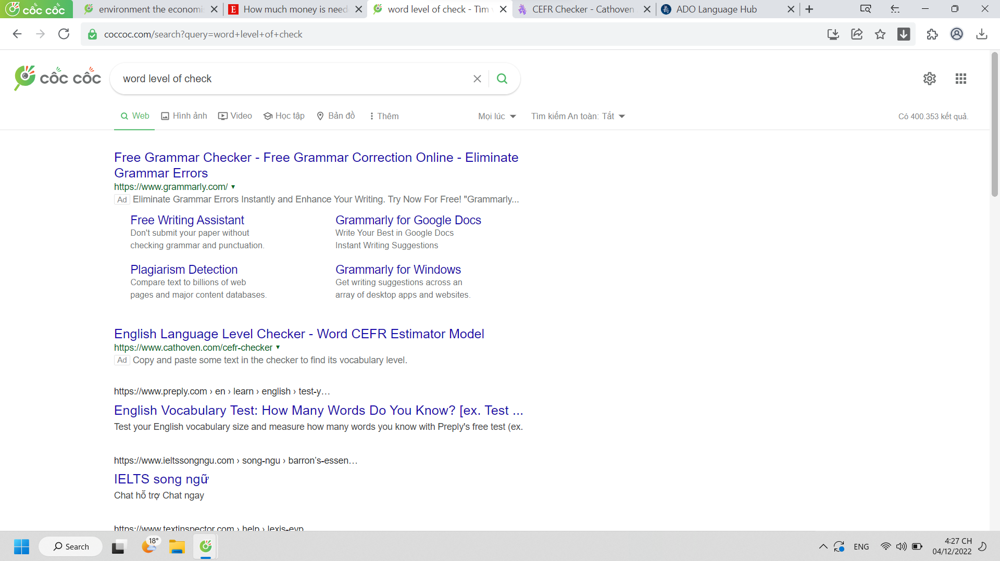

- 16:00 Dung kể học kinh tế vĩ mô nhiều đứa lớp nó không học rồi bỏ đống tiền đi học thêm
	- còn nó tự học trên youtube
	- hừm vậy chắc tôi cũng tự học theo được nhỉ, tôi cứ hay thích tự đọc sách hoặc xin giáo trình để luyện qua giáo trình
- Từ khi nghe Linh Chi bảo tặng cái vòng đá mà đi sẽ gặp lại người cũ
	- làm tôi từ lúc đó đi đâu đầu cũng ngó quanh không phải tìm chỗ đầu tiên mà là xem liệu nơi đây có sự hiện diện của người đó
- Đi cùng Lã dọc ven hồ mới thấy có mô hình kinh doanh mới khá thú vị: ngồi ngoài trời đông, ở quán nước, tô tượng. Ừ họ có thể cùng ngắm hồ, hoặc xem phim hoặc làm bất cứ việc gì khác nhưng thực sự thì tô tượng ở đó đúng là lí tưởng, ít nhất thì cũng tiếp thêm chuyện để nói hoặc ghi dấu kỉ niệm
	- nếu ngồi bên bờ biển thì maybe not nhưng cái tô tượng đó sao thấy quen quen dejavu, hình như trước đây đã từng có
-
- 16:27
	- 
- 17:01
	- nhiều khi để record voice tự chạy vì có khi lưu được cái thông tin gì thú vị hoặc quý giá, mang tính chất sở thích, xu hướng tâm lý sẽ xuyên từ quá khứ đến hiện tại: kể, và cả tương lai
	- nhưng nhiều khi im lặng quá, tập trung thì quên xong có thể vẫn sợ tốn dung lượng, cảm giác bồn chồn như có khối u phía bên phải sau đầu
	- nhưng sau này có thể dùng nó như voice lofi cũng được :P