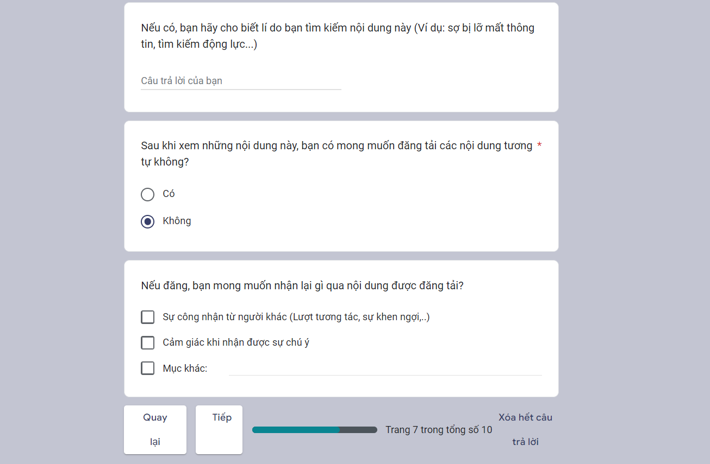

- 7:30 Việc riêng có lẽ đến nốt nay là hết, dù có chậm hẳn hơn 1 ngày, nhưng nghĩ kĩ ra thì có bao giờ hết
	- việc của riêng là giúp bạn bè và việc của mình là làm MỞ
		- thời khóa biểu chung còn chưa xong, luận thầy Trung nữa.
		- ít nhất sáng nay phải xem qua để đi đường còn nghĩ
	- và việc chung teamwork nên chủ động làm trước những phần cơ bản, chưa thực sự làm thì cũng nên biết và nắm được tất cả sơ bộ, đừng hơi bị động
	- chưa biết chạy cái nào vì việc nhiều quá thì cứ chạy theo hạn gần nhất, dù nó có vẻ không hợp lắm và cái đó dễ, có thể chạy bất cứ lúc nào khác,
- hôm qua đi ăn xiên về chỉ ngồi chơi game, ăn và đọc comment Chờ đợi có đáng sợ, mong tìm được phân tích MV
- 
- điền **đại** để xem câu hỏi
  collapsed:: true
	- 
	- [https://forms.gle/TFpBxk9fGWh6qx7k8](https://forms.gle/TFpBxk9fGWh6qx7k8?fbclid=IwAR1oxyvMW7ZYh97PIXyJAD1Qma5nvR3nnW6mm4o6gWb2Q6tJDBIpu5uYGGc)
	- 
	- 
	- 
	- 
	- 
	- 
	- 
	- 
	- 
	- 
	- 
	- 
	-
	- 