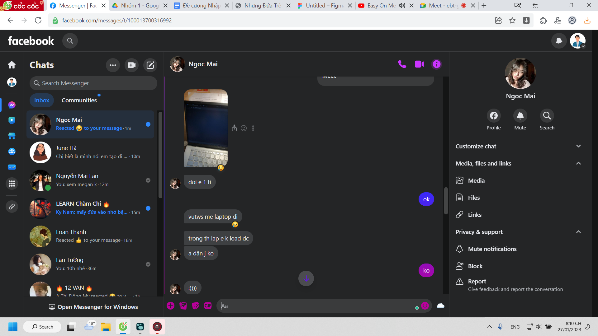

- 
- 
- 
-
- 
- 
- 
- 
- 
- 
- hmm tiếng Anh khác biệt trình độ thì dạy ngta lên kiểu gì
	- kiểu ng đọc nhiều bài sẽ khác ng đọc ít bài (về words họ hiểu)
- mình chỉ shape ngta được thôi chứ dạy ngta làm như mình khó
	- shape kiểu ok em đang từa lưa quá r tập trung đây, cách đúng là đây
- hoặc phải dạy ngta cách để ptrien
	- mình hồi như họ lên trình này kiểu j, có cách nào nhanh hơn mình k
- và thậm chí implement hộ vào
-
- 
-  
- 
- 
- 
-