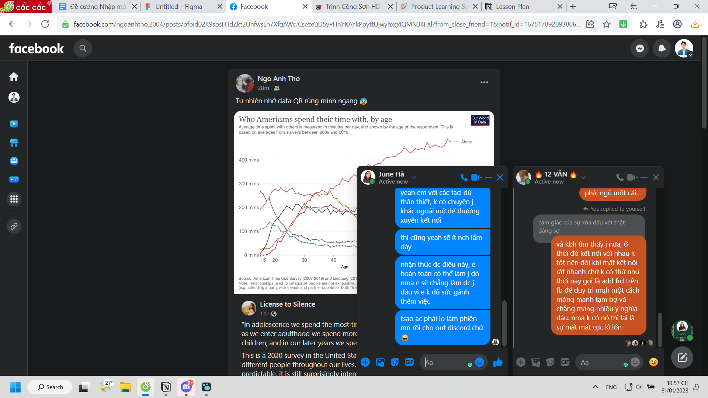

- 
	- will need to capture all those thing later...
	- nma kiểu nhắn tin và viết content trên tin nhắn nó dễ dàng cho mình sai sot nhiều hơn là phải hình thức 1 bài văn mà chỉ hình thức ý tưởng thôi là đc
	- rồi tùy từng lúc nhắn từng ng mình sẽ có 1 độc giả tiềm ẩn và thay đổi giọng văn, đổi background info và đổi cách nói, sẽ sinh ra một thứ mới hoặc bổ sung phần còn thiếu chưa tới
	- tôi nhắn lớp trc rồi nhắn chị june sau... (nên của chị june là bổ sung)
	- nhắn câu cuối kia, chị k rep, yeah em hay nhắn kiểu quái dị thế nma hi vọng chị k vì câu đó đi hỏi sự tình rồi làm gì
		- em có thể đàm phán nma thôi chuyện thế thì thế, kệ mọi thứ vậy, k nên ích kỉ vì em đâu vì lợi ích gì ngoài mình đâu (nói thế kia là xin cho mn ở lại túc trực nma yeah thôi)