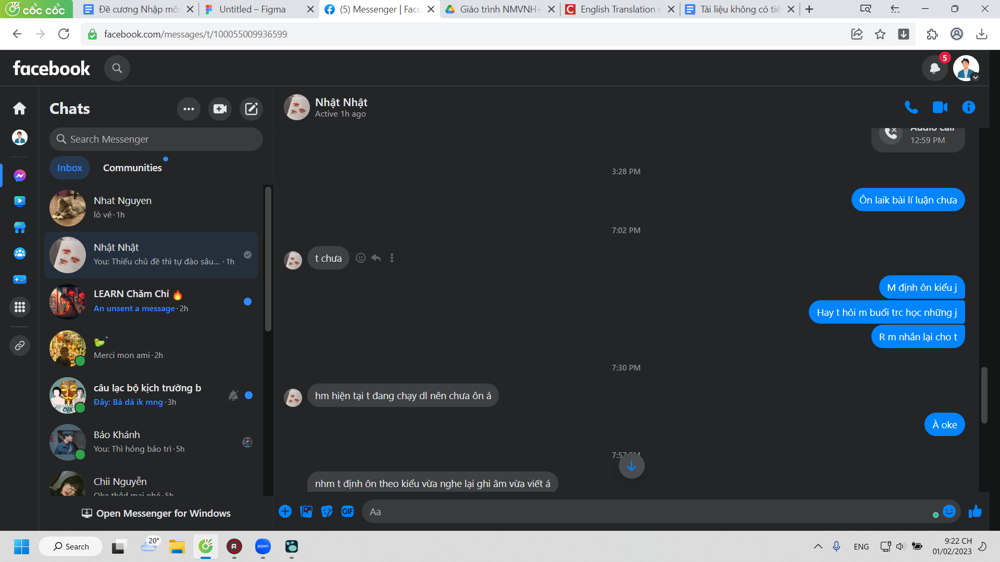
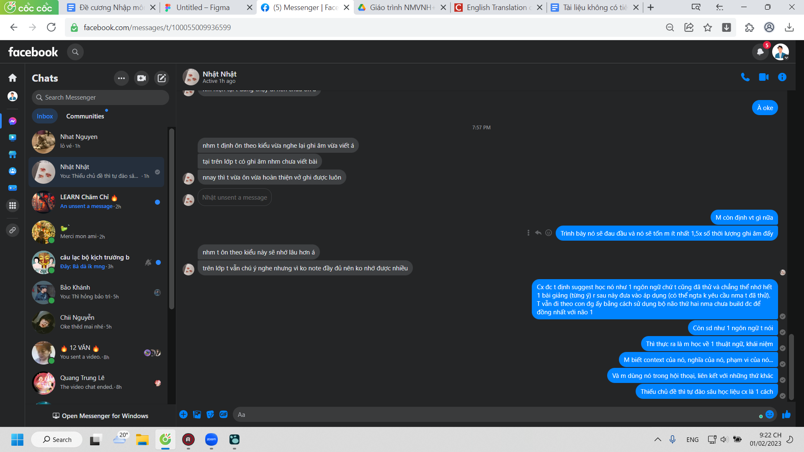

- học tiếng pháp kiểu lùng lại từ cũ, tra những từ mình chưa biết và tập phát âm
	- kiên trì thì có nhưng chán cũng có
- bởi vì mày phải dùng nó
	- ừ chính là tự nói với mình bằng câu này
	- car tu dois utilizer les mots so that ... chưa biết dùng so that
	- gg dịch: parce que tu dois utiliser ces mots
		- mày sẽ nhận ra mình thiếu sót chỗ nào, hổng từ vựng hay những từ dùng để làm keo dính các từ với nhau
		- hay có quên từ, có sai phát âm không
	- có thể học từ việc học một từ mới và đặt câu luôn nhưng mình thích việc dịch hơn là nghĩ câu: chả như một hôm nói ánh trăng lừa dối thế là tò mò ở tiếng Pháp họ sẽ nói như nào nhỉ
	- nhớ được hay không thì không biết, độ nhảy từ sau 2 tuần đã rất rất chậm chạp rồi... đúng là cách ôn lại của cô giúp mình rất nhiều, kì lạ vô cùng dù chỉ hỏi và trao đổi mấy câu bình thường và mình phải động não nghĩ cách trả lời, dịch sang và thế từ nó tự nảy ra. chẳng biết khi đã lỡ mất nhịp, chậm hơn tốc độ xưa thì có vớt vát được gì không
- nên học thế này không thì học tiếng Pháp chán hơn ngồi suy nghĩ đọc Việt ngữ quá. mà cả hai đều không phải cách để học được điểm cao nha, dùng tốt, nhuần nhuyễn, chinh phục kiến thức cũng là một cách đạt điểm cao mà học tủ, nhồi nhét cũng là một cách, không biết khi nào tủ hỏng hay tủ hỏng mình biết không, nhưng mình cho những kẻ điểm cao hơn là có cách học tốt hơn và khả năng hiểu hơn mình? hoặc đơn giản não quen để nhớ và hợp cách kiểm tra. chứ mình trên đường chinh phục kiến thức đã ngã quỵ từ lâu
	- nghĩ không ra cách combine ra một cuốn từ điển như bách khoa toàn thư dễ đọc và chứa mọi thông tin
	- cả hình thức lẫn nội dung, liên kết với các từ khác như nào, nổ não, muốn tự sát - như bọn học mà k hiểu bài than khó, tôi cũng than bài tôi tự đặt ra là khó
		- không thì làm trên ứng dụng nào, không ứng dụng nào phù hợp thì thiết kế
		- phải cách tân phải cải tiến hơn hẳn một cuốn từ điển bình thường
		- dùng phải cực cực kì tiện và tốt... cố nói thế thôi chứ hình dung cũng mơ hồ (nói cũng mơ hồ mà)
		- nhưng mà tại sao phải khó, cái gì làm nó khó, do những thứ mình đặt ra đang phức tạp hóa lên hay không biết cách, mình phải làm tất cả mọi thứ trên đời này thành dễ
-
- 
- 