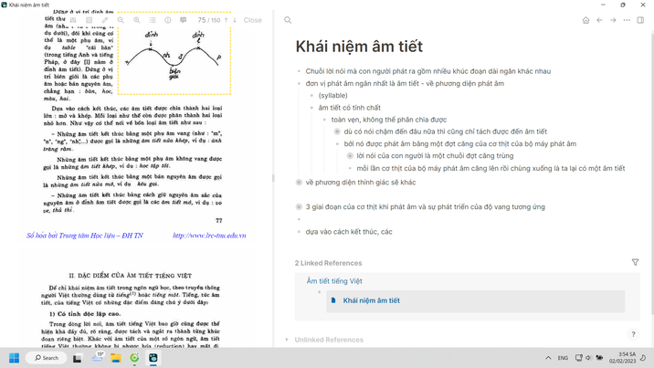
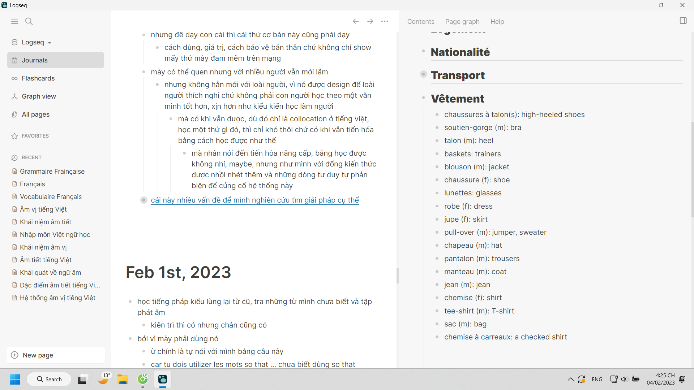

- 
- 
- 
- 
- 
-
- 
	- cái matrix, hệ thống liên kết kiểu đó có thể là link = đường kẻ hoặc hình vẽ rồi có các lớp nhỏ hơn bên trong là các thành phần khi được bóc tách, chụp cắt lớp
		- thậm chí có thể liên kết không chỉ ở trong một bài như mind map tỏa ra các nơi mà là các bài với nhau, rồi thậm chí có thể link theo giáo trình, hoặc theo ngành như 4 phần của hình cầu chẳng hạn.
		- xem thêm bình luận về cách chia ý ở các cloze trong [[Đặc điểm âm tiết tiếng Việt]]
- {:height 411, :width 716}
- 
- 
- 
-
- 
-
- 16:17 mình thì quen và chuyên nghiệp, bất cần đời kiểu người lớn và có những sự chai mặt rồi
	- nhưng để dạy con cái thì cái thứ cơ bản này cũng phải dạy
		- cách dùng, giá trị, cách bảo vệ bản thân chứ không chỉ show mấy thứ mày đam mêm trên mạng
	- mày có thể quen nhưng với nhiều người vẫn mới lắm
		- nhưng không hẳn mới với loài người, vì nó được design để loài người thích nghi chứ không phải con người học theo một văn minh tốt hơn, xịn hơn như kiểu kiến học làm người
			- mà có khi vẫn được, dù đó chỉ là collocation ở tiếng việt, học một thứ gì đó, thì chỉ khó thôi chứ có khi vẫn tiến hóa bằng cách học được như thế
				- mà nhân nói đến tiến hóa nâng cấp, bằng học được không nhỉ, maybe, nhưng như mình với đống kiến thức được nhồi nhét thêm và những dòng tư duy tự phản biện để củng cố hệ thống này
					- 
				- mình có tự nâng cấp tốc độ được không? chứ không thì kĩ năng tự học AI cũng thua, AI mới hơn, xịn hơn là hơn những gì
					- cả phần cứng và mềm, con người thì không hẳn làm được như thế
	- [cái này nhiều vấn đề để mình nghiên cứu tìm giải pháp cụ thể](https://www.youtube.com/watch?v=ZMa0J7Arc5Y)
	  collapsed:: true
		- mấy biện pháp của người ta vẫn chung chung và hạn chế lắm
			- chưa kể thực tế cũng không quá tâm huyết thì càng chết
			- giá con mình mà như mình, hoặc như hôm trước mơ là nó như emul, vui khi được một cuốn sách ma pháp mới để có ma pháp mới thì
				- đù, nó khác hẳn mình, mình có công nghệ support chứ không có não tốt và chăm và kĩ năng như nó để học hết và còn ham học thêm, ma pháp hóa - ứng dụng hóa kiến thức trong sách thành kĩ năng mà sử dụng
					- dù nó có thể không đến mức như ma pháp sư lấy chữ ra, kiến thức ra mà tạo vòng ma pháp. chỉ là mình nhìn nó nhưu một học giả học được kĩ năng gì đó mới từ một cuốn sách mới
						- ước mơ của mình một thời đấy
					- nó mà thế thì gia đình mình mỗi người một skill, dù nhiều lĩnh vực vẫn giúp nhau và can thiệp lúc cần
					- mình sẽ lạnh lùng và trẻ trung được thôi
						- nhưng cũng đồng thời rất tự hào về con mình