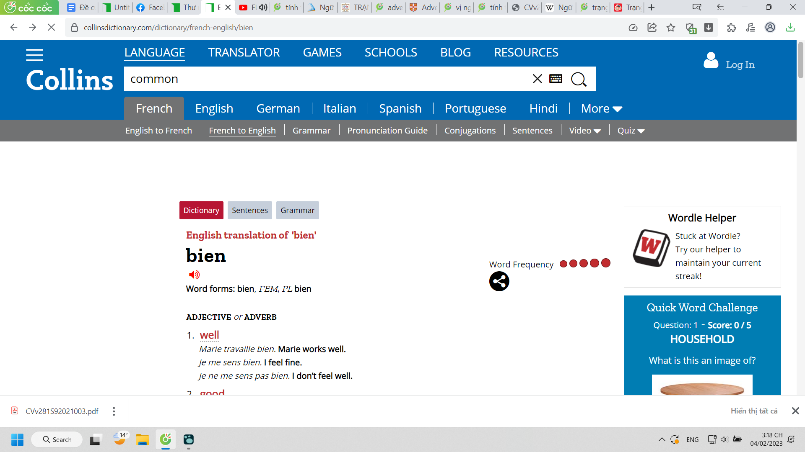

- Quanh đi quẩn lại, học tiếng Pháp cần tốt Việt ngữ và ngược lại học tốt tiếng Pháp thì hiểu Việt ngữ hơn vì có hình dung
	- Đang tra từ bien
		- đa dụng phết, noun, adv và cả adj. Ở dưới tuy có giải thích nhưng ở đây tôi bị lú, không phân biệt được, ở tiếng Việt hay tiếng Anh còn dễ
			- vì tiếng Anh có đuôi ly
			- tiếng Việt thì mình nhớ là bổ nghĩa cho danh từ hoặc động từ, mới đầu còn lú là danh phải đi tra, tính từ bổ ngữ cho động,... ơ nhưng mà...
				- thực ra tiếng việt ít kiểu vừa là tính vừa đổi sang là trạng được đúng không nhỉ?
				- haiz lỗ hổng việt ngữ nè và cũng chẳng biết lấy câu nào làm mẫu mà xác định xem đâu là trạng từ kiểu tính từ đuôi ly. tiếng Việt không có đuôi, nhưng chức năng từ có thể thay đổi theo vị trí
					- cách dùng từ, giải thích vẫn chưa ổn lắm, mày tư duy được nhưng chưa đến mức độ giao tiếp hay khai phá, maybe thậm chí sáng tạo kiến thức mới được đâu nha
						- hôm trước thử nghĩ xem nếu mình giải thích cho chị Nhat âm tiết âm vị âm tố thì sẽ nói như nào
							- hình dung và phân tích chỉ ra được thì oke nma cách diễn đạt còn ấp úng, chưa chuẩn, chẳng biết dùng từ nào
	- 
	- và hành trình tìm, nhận ra thứ mới
	- 
	- mới đầu không phải không tin nhưng mà không hiểu tại sao hiện thực khác trong trí nhớ thế, khó tin, mà quả thực thế, người ta lấy ví dụ kìa, một đống đầu mục
	- 
	- 
	- cam không giải thích
	- check lại và nhận được đáp án, hóa ra cái mình lú là khi tính từ đứng vào vị trí kiểu sau tobe, trả lời câu hỏi là gì
		- 
	- 
	- so sánh tiếng Pháp với tiếng Việt cũng được
	- 
	- 
	- 
	- 
	- và quả thực đâu cũng thế thôi
	- 
	- 
	- ừ vì nó cùng tên thì chẳng lẽ khác chức năng
	- bí ẩn vẫn nằm đó, tính từ chỉ hạn định và ít giá trị thế thôi ư, lúc nằm ở vị ngữ, mà không, nó hoàn toàn có thể như bổ ngữ, bổ nghĩa cho danh từ: cái thằng đẹp trai ấy hay chơi đá bóng chẳng hạn
		- nhưng khoan nó có phải bổ ngữ không
	- đấy, muốn học nốt, đào nốt và biết chắc sẽ có 1 phần hoặc được gợi mở ra tất cả đáp án ở phần Việt ngữ còn lại
	- nhưng không vì thế được bỏ ôn Pháp đâu, bỏ đó ôn tiếp đi, sắp thi rồi mày ôn mãi không xong kìa.
-
- 
- 
-