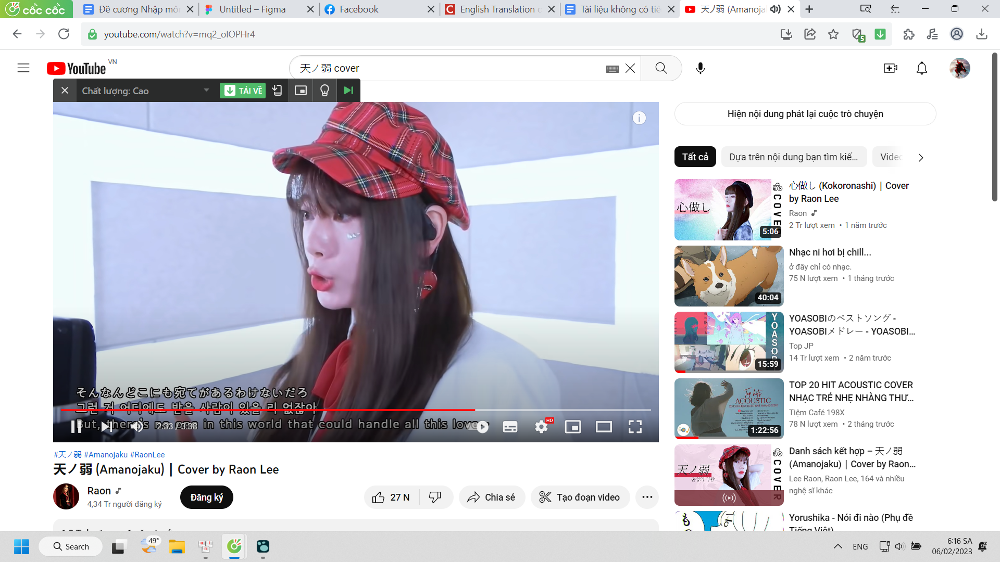
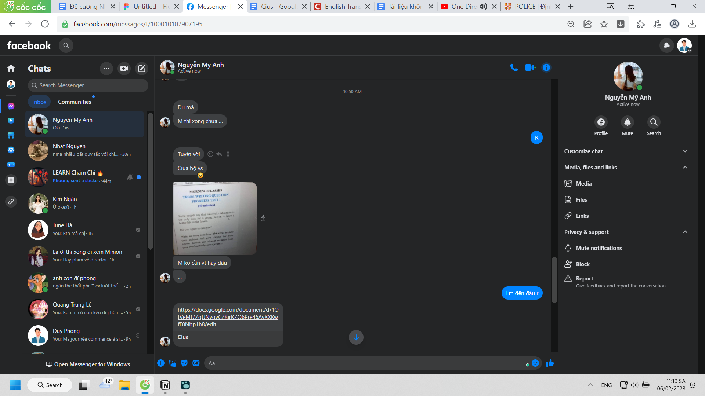
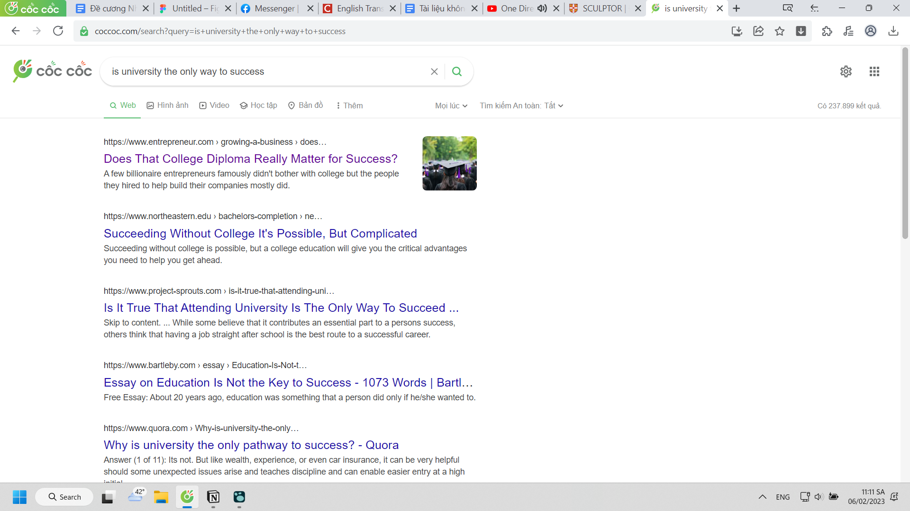
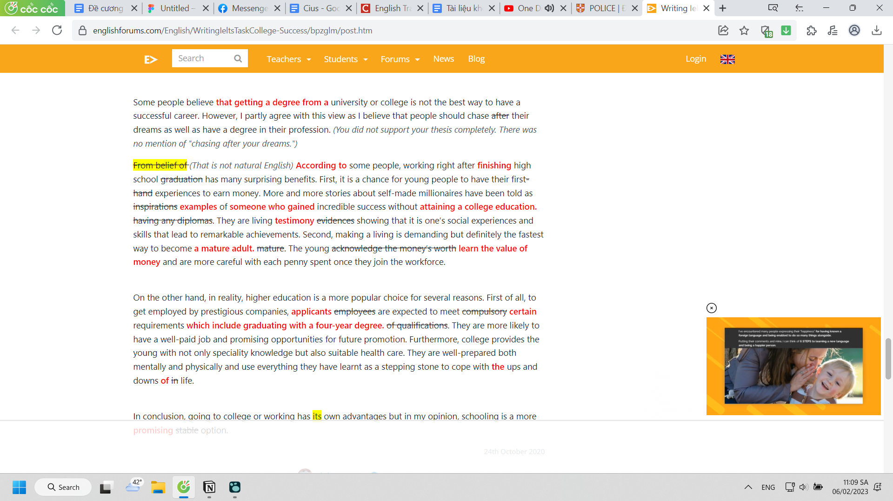
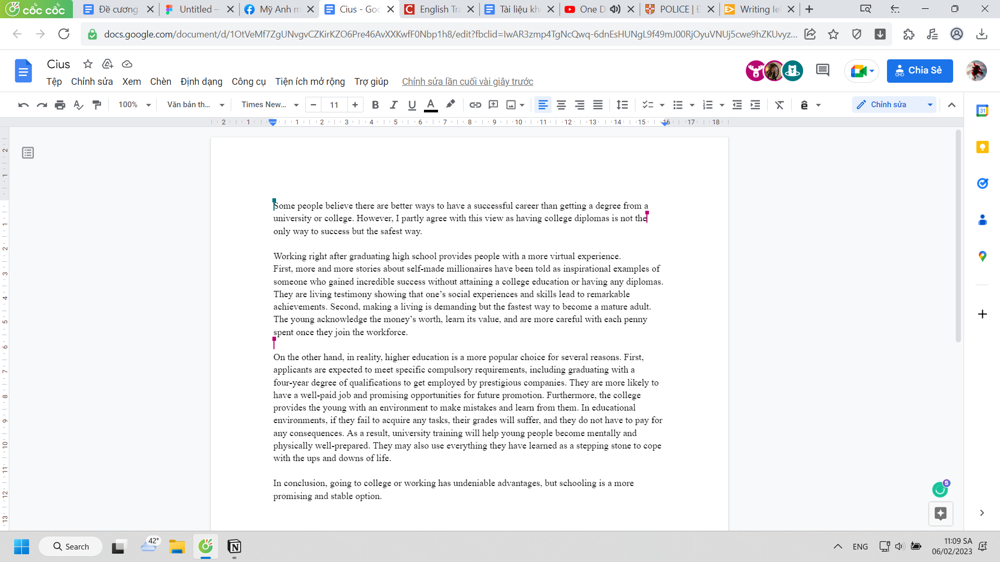
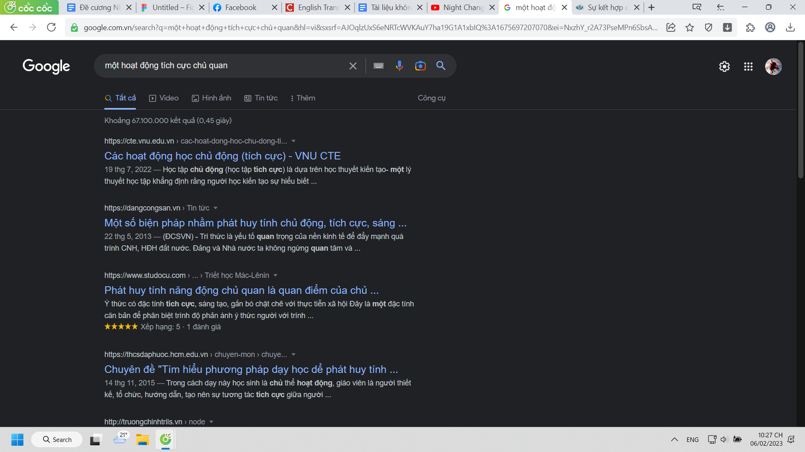

- 
- ở một khía cạnh khác, mấy bài hát nghe rất sâu lắng của Nhật đều có thể rock hóa, bên đó không phải cội nguồn rock nma học sinh chơi rock cũng nhiều, sang đó học thì sao?
- 11:09
- 
- mệt ghê đang ăn, may mà không phải nghĩ ý và từ mà chỉ cân đối, bổ sung và sửa đổi
	- nhìn đề phát biết ngay tra được
- 
	- kéo xuống trang 6, kĩ năng để không bị người khác vô tình tìm được giống
		- vì mình cũng lười không dùng quilbot mà chỉ kết hợp kĩ năng của mình học được + grammarly (cho nó mang tính người chứ máy tốt hoàn toàn làm được, học và làm cũng toàn dựa trên kĩ năng - thuật toán, phương pháp thôi mà)
- 
- 
-
- 
-