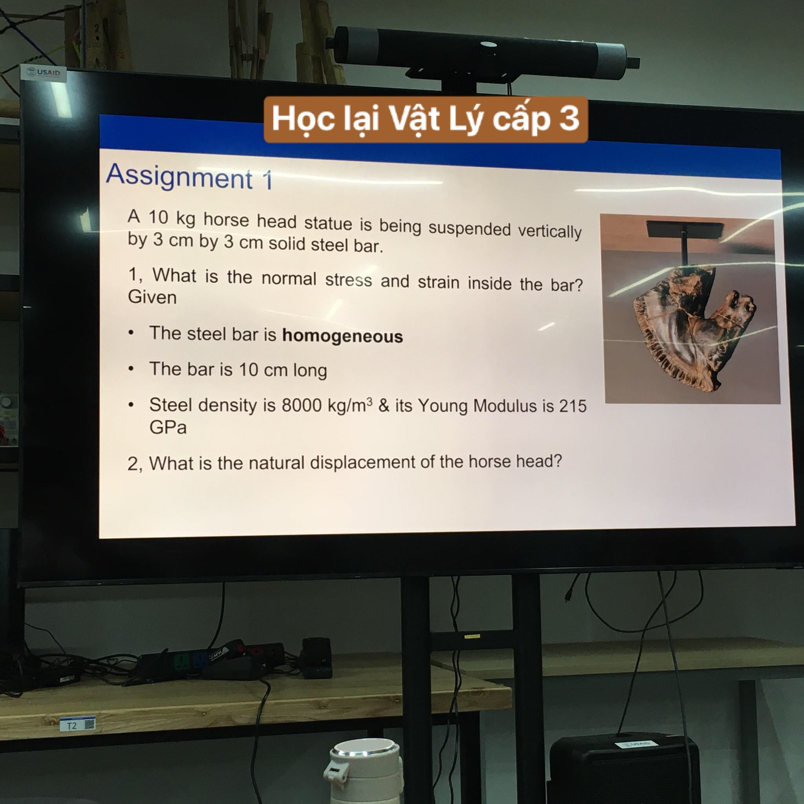

- 
	- Anh Long
- 
	- Tan Le
-
- 23:59 hệ thống search chưa tối ưu lắm
	- mình tìm chức năng khu biệt không ra mà nó search theo cụm...
		- thế phải thiết kế theo hệ thống search à, chứ không thì phải tra từng từ: khu biệt chứ đừng ghi cả cụm
		- tương tự phụ âm đầu tiếng Việt, phải biết cái từ phụ âm mình đã ghi là của tiếng nào thì mới vào và tìm được, hoặc trong mảng phụ âm có đề cập các thứ tiếng khác (nếu không nhớ phụ âm mà tra trúng, tra theo tên miêu tả thì khó) thì chắc sẽ phải viết bằng ngôn ngữ đó luôn chứ không thì toang, loạn. Hoặc thêm tag, ừ hoặc có cách nào tổng hợp toàn bộ, bách khoa toàn thư về khái niệm này kia, vào đó mò dễ hơn là mò trong một trang diễn giải sách - có rất nhiều đề mục