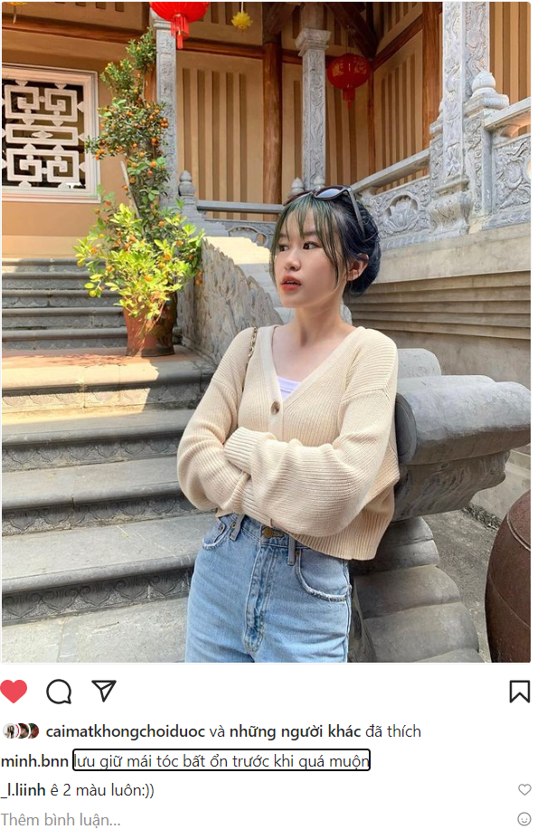

- 
- nhìn hai gái RMIT cười đùa với nhau và thoải mái cười đùa (dù có lẽ k đc rep có thể gây cgiac gì đó hoặc chỉ như ngày xưa vui thì nhắn thôi, rồi một cảm giác như ngày nay hoặc tiếp diễn tới ngày nay: quên ngay, đến khi đc rep lại mới nhớ đến lượt mình)
	- cảm giác vui như thể nhìn lũ trẻ con của mình chơi với nhau như chị em và trưởng thành lên vậy (lớn dần lên theo thời gian thì đúng hơn còn thân thiết với nhau thì liên quan gì trưởng thành và lớn lên, cùng nhau? hay qua tương tác thì mỗi ngày ta một lớn)