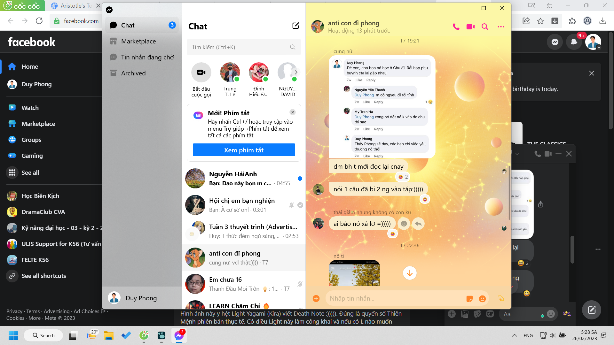
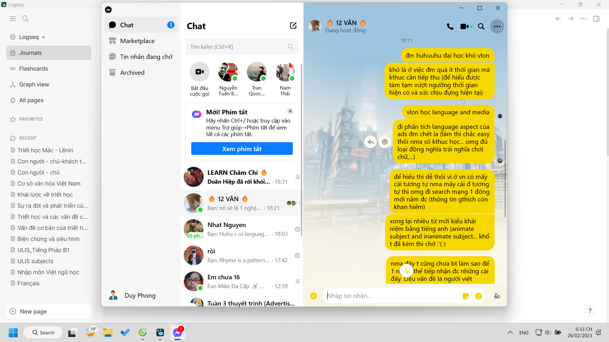
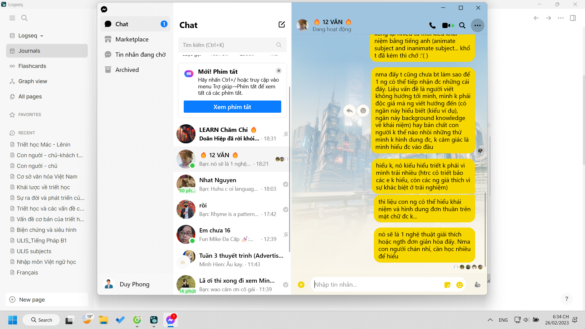
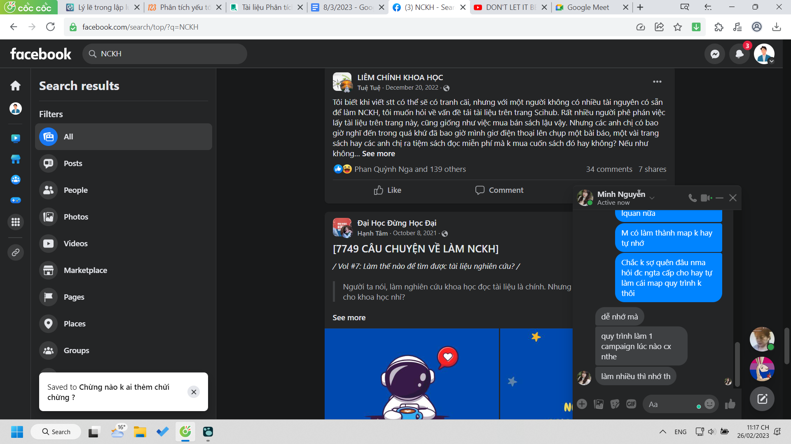

- dậy lúc 02:25 xong ngồi dọn file tới giờ, vừa làm xong 1 ván game
- 04:28 nghỉ tay tí vậy, đọc truyện thôi
	- đầu tóc mặt mũi khó chịu quá
- vẫn còn căng thẳng lắm còn việt ngữ và deadline hẹn với nhóm media
- cũng đói nữa
- 05:11 Xong tạm
  collapsed:: true
	- tại bị cuốn vào cái hiện tượng dập khuôn ngôn ngữ chap 25 truyện ethics class quá
	- chứ không cứ nằm đó à
		- mày chờ cái gì
		- hỏi vậy phải nghĩ tức không có câu hỏi đâu
	- vì ngoài cái hiện tượng dập khuôn kia - dùng những từ trend không chỉ vì nghe nó hay sang hoặc tạo cảm giác trendy, nó mang ý nghĩa cảm xúc rất lớn
	- nó gắn liền với một sự vô thức của con người rất nhiều
	- thay vì nghĩ điều mình muốn, cảm thấy điều mình muốn cảm thấy, gọi tên được cảm xúc
	- thì do ngôn ngữ hạn chế mà ta nói thẳng ra một điều chẳng liên quan lắm, nó hóa thành công kích cá nhân: phiền quá, địt mẹ, vui... (dạo này tôi cũng vị ít vốn từ, lớp tôi cũng chẳng dùng nhiều vốn từ - lớp văn giống như môi trường đại học ngoại ngữ không nói quá nhiều tiếng Anh một cách chủ động) - (những lúc cần vui, cần thể hiện sự hạnh phúc biết ơn như lúc bọn nó tổ chức sự kiện cho thì không có, hoặc đơn thuần biết ơn lắm vì mày cố tìm cảm xúc nào đó mạnh mẽ hơn để nói, hoặc bình thường có chút vui, đơn giản việc cảm thấy và chú ý đến cảm xúc mình như vậy đã hay rồi, cũng do mình không quen cảm thấy hạnh phúc ở đời thường? ít nhất thì đó là giới hạn cảm xúc có thể nói được, còn thành nhạc văn thơ nó sẽ hơi khác)
		- wtf? chửi cái gì
		- giống bố chựt cái gì
		- thà nói ra yêu cầu hoặc đưa ra bàn luận về nên cảm thấy gì, ai nên làm gì còn hơn
	- tôi thì không bị lắm
	- nhưng tôi nhiều lúc cũng rất bản năng, hoang dã và vô thức
	- móc tay bằng tay trái, rau dính lại tay từ môi miệng thì mình mút lại ăn, dính răng thì móc ra và vo lại, tung đại đâu đó
	- thoáng chốc đang tư duy cái kia, mình nghĩ sang cái việc chú ý lại đến bản thân nhiều hơn cứ để cảm xúc trôi vào hoặc trôi qua trong người, mình thấy mình như đang không điều khiển cơ thể này
		- không phải nó chỉ vô thức ở cấp hành động đâu mà cả chi tiết hành động như những cái vo, tay trái hay tay phải móc, tay phải thường gãi đầu, gãi mặt,...
		- và vứt thường ra chỗ nào chẳng hạn
	- chú ý những cái nhỏ thế cũng hay, dù chưa biết để làm gì
		- như thể có nhiều cảm xúc lúc mày lướt reel phết nếu mày chú ý, để không bị chai sạn và vô bổ đi thì nên chú ý nó nữa
			- xem xong tin của Minh Thảo đăng về những ngày chơi tôi lại hơi ghen tị, lướt sang phải mà thấy công trình nào cá nhân làm thì mình cũng sẽ đồng tình, nghĩ ngay đến việc thay vì chơi bố mày sẽ học, và làm những thứ tầm cỡ, dù đ làm được nổi giống cái người ta khoe (về quy mô và độ hoàn hảo đâu)
	- còn hoạt động kia không ngày một ngày hai có ích cho mấy đứa con gái ẩm ương khó nói ra cảm xúc mình hoặc do thiếu từ như Mai hồi trước, chẳng biết giờ như nào, thì cái tính bọn nó càng khó khiến bọn nó nghe, mà mình cứ mê có chuyện gì đó với mấy đứa xinh xinh kiểu vậy
	- ừ đây chỉ miêu tả ý lớn, miêu tả ý nhỏ là mày ngồi như nào, đánh máy như nào, tay đang cứng đờ vì lạnh như nào nữa,...
	- nghĩ lại một lần nữa xem viết đã đủ hiểu chưa:
		- chai sạn cảm xúc vì cứ bị mấy cái từ dễ nhớ, ngắn gọn kia ảnh hưởng mà nó biến cảm xúc mình méo mó hạn hẹp theo
		- nhất là khi mấy từ đó không còn ý nghĩa về mặt nghĩa mà chỉ có ý về mặt cảm xúc như từ cảm thán
		- lúc đấy mình vô tri như một đứa trẻ
			- cứ hỏi tại sao con khóc, có lẽ nó chẳng biết tại sao, chỉ là như này sẽ khóc, chưa chắc đó đã là khó chịu sẽ khóc, hoặc khó chịu đâu đó sẽ khóc
			- ngôn ngữ giúp tư duy và từ tư duy mới ý thức được?
		- đó cũng là cách để nói câu yêu không sáo rỗng
			- chứ không nói yêu mà chỉ cảm thấy từ việc nói yêu mình yêu hơn đơn thuần thì
			- 100 cảm xúc yêu và của câu yêu như 1
	- hơi giống cách cười dựa trên hiện tượng và cách nói của My (chưa hẳn đến mức có vấn đề nảy sinh)
		- 
		- người như tôi sẽ không hiểu rốt cuộc mình sai ở đâu
		- dù tôi cũng đùa câu đó
	- 1 thế giới nơi có quá nhiều thứ nói hộ cảm xúc quá cũng khổ, mình mất khả năng dùng ngôn từ bản thân
		- và đó là những câu nay bạn cảm thấy gì, hôm nay bạn cảm thấy gì
		- tuy vague nhưng mình không muốn trả lời vague, thì cũng khó để trả lời, đặc biệt bằng tiếng anh\
- 06:38 giác ngộ ra rằng chúng ta không chỉ đọc để nghe giảng thì nhớ lâu hơn, để kiểm tra vì cũng đ nhớ cụ thể gì với một giáo trình toàn chữ và chia theo mục (khác với kiểu sách giáo khoa)
  collapsed:: true
	- thì đm đọc triết dần không hiểu do thiếu kiến thức
	- mình nên hỏi
	- ừ nó sẽ hay và thật sự giá trị hơn trong việc đọc nhiều hơn là quan niệm mình phải đọc hiểu hết đống này để làm bài, hiểu là một cách nhớ
	- nhưng có hiểu đ đâ, chẳng hạn cái là thế giới quan, chẳng rõ cái nào mình không hiểu không đồng tình mà đã bỏ quan nữa phải xem lại, đọc thật nhanh lại cả cơ sở ngôn ngữ để hỏi
		- hiểu mình cói là trả lời được câu hỏi thế nào- bằng tự giải thích hoặc tưởng tượng hình dung
			- còn các câu hỏi khác và câu hỏi kiểu xã hội học của anh VHL là từ bao giờ nó thành thì để sau
	- tiếc một cái là địt mẹ, mấy câu mình nghĩ là mình hiểu thì không thể kiểm chứng lại được vì làn gì có ai để kiểm chứng
		- chỉ có thể trao đổi với cô
		- hiểu sai cái thôi là dễ làm sai lệch thế giới đi lắm
		- bài test cũng là một cách, ừ là một cách nhìn test và tham làm test nhưng test ở trường như buồi ý, đéo có tí nào đòi tư duy (dù dùng tư duy để giải cũng được nhưng bản chất là nhớ chứ không phải hỏi câu này nghĩa là gì. nếu nhiều học sinh sai - ở nhiều thời đại thì có lẽ lỗi của người viết trong việc sử dụng từ)
- 09:16 lại ngồi vào đọc language & media cho đỡ stress sau khi deadline cận kề
- vừa đọc xong, chơi xong và đọc được một đoạn đầu giáo trình
	- dù cái cách viết hơi khó hiểu tí, chắc do người Việt viết đều bị thế, cứ rối đéo hiểu họ muốn nói gì, hệ thống như nào với từng thông tin nhỏ lẻ thế
- 10:46 tìm định nghĩa khác của việc chơi chữ ULIS đ ra, đọc một số bài viết chiêm nghiệm của các bạn buồn ngủ quá. Của sunny thì hay, quả không ngoa đôi mắt này toàn nhìn đúng người. Buồn ngủ thì đổi việc, đọc được 3 trang và xem ads rồi.
- 13:32 đi ngủ thôi, xem ads đã thật, tại toàn được xem ads hay chứ :))) cơ mà phân tích ads hay cũng khổ, hi vọng học xong phân tích được cả cái dở, và mình cũng nghĩ về ads mình nhiều lắm
- 17:00 dậy học
- 18:33
  collapsed:: true
	- 
	- 
	- phải tìm cách truyền tải rồi
	- maybe làm nhiều bài rồi đa dạng, để xem khả năng thích ứng và tiếp thu của con người như nào
	- liệu không chỉ với đọc, mà về sự khó, bao nhiêu khó là vừa để tiếp thu và lâu dài được, nhưng đây khó mấy Phong vẫn kiên trì cắm đầu, cũng nhờ khó, mệt mới không buồn ngủ
	- nhưng thật sự đấy thay vì đấy nên có một cách tiếp cận lịch đại tại sao người ta làm thế và làm thế từ bao giờ, trước đây thì sao (nhưng phải có logic giữa các thời - nhiều thứ viết lịch sử không mạch lạc lắm mà chỉ nói được sự khác biệt) hơn là nhảy bổ vào một thời điểm kiến thức nhất định mà không có những giải thích liên ngành (để dễ nhớ: ấn tượng ngôn ngữ đến từ tâm lý chẳng hạn)
	- và tất nhiên siêu máy tính trả lời bài, bảo nó giải thích và lí giải chữa lỗi tư duy mình cũng oke
	- một cách tiếp cận hệ thống, cái này bồi đắp đối chiếu để hiểu cái kia cũng rất hay
	- càng học khó mình càng trông chờ buổi học tiếp theo xem cô giảng như nào
	- và người đọc cũng phải rất hiểu mình, vận dụng hết các vốn liếng đối chiếu nữa. tạm thời thế
	- nó là cách tiếp cận hơi triết học rồi, hi vọng tìm ra quy luật, chứ thực tế cứ nhìn con người mò mẫn, cũng khó thấy quy luật... như tại sao gradable adjective outnumber non gradabel. Mày nhìn và xem một số cách giải thích thì đã muộn rồi, mày sẽ tin thứ mày thấy lần đầu hơn hoặc nếu mày tự tìm được lỗ hổng hoặc lí lẽ, đối chiếu trải nghiệm rằng mày thích này thích kia hơn thì ok; không thì phải test viết sai sự thật để thử việc tri nhận thứ mới của con người - liệu họ có đủ sức đào về cội nguồn để check, họ có thấy điều đó khả thi, liệu họ có nghi ngờ hay thậm chí tiếp nhận được đến mức để có thời gian và sức suy nghĩ mà nghi ngờ (wao nghi ngờ là một bước nâng cao hơn trong tiếp nhận kiến thức)
	- cái bài viết này vẫn còn sơ khai lắm, cảm giác nó thiếu một ý rất lớn (chưa được đề cập) và một hệ thống liên kết, các keo dính tốt (yêu cầu hiểu chính xác từng từ và nếu có thể cả những nhánh của khái niệm được liên kết thành ý nữa)
		- cách đọc sẽ dừng khi thấy khó chứ không quá là đọc hết đã rồi tính - để trí não mình tự do và tôn trọng, trân quý từng từ và ý - không cái nào thừa để bị xem nhẹ hay lướt, dù thế thì nó quá to lớn nặng nề và cồng kềnh
			- sau cùng sau khi đọc xong hết sẽ chẳng nhớ gì vì mình dành não không phải tìm cách nhớ, nghĩ bổ sung (à người ta cũng chẳng viết để mình từ đó tiếp nối nó như nào mà làm nó chắc nịch để người đọc chẳng đào vào đâu, bám rễ vào đâu và chiếm cứ làm địa bàn mình và từ từ xâm lấn người ta - kích thích tư duy và maybe thế dễ chịu hoặc học sinh có cách tiếp cận từ việc người ta chỉ ra chưa biết tiếp cận như nào - cảm giác bởi một yếu tố gì đó khác và cách làm này đúng hơn là có thể từ việc chỉ ra đó họ cũng ngầm nói cách họ nghiên cứu. Người ta lao cả tòa thành kiến thức vào mặt mình)
		- nhưng cảm giác tự tìm ra và tự tìm đúng - dù sau này được giải thích sẽ nhớ lâu hơn là đọc ok dễ hiểu quá lướt. quên mất cả sự khó hiểu và những vướng mắc ban đầu (cái việc quên vướng mắc này càng dễ hơn khi ta đang vướng mắc, ta trốn chạy bằng việc hoàn thành cái khác và khi nhìn lại, có lẽ não không bị overwhelmed nữa nên mình cũng đỡ thấy rối rắm phức tạp - vì bản chất không phức tạp, hoặc đơn giản mình quên nhìn vào đâu, theo hướng nào từ cái chỗ nhìn đó)
		- và bản thân mày nhân cơ hội học và hỏi quá nhiều thứ nên nó mới phức tạp: dịch, phát âm, tâm lý, từ vựng, âm học, văn học,...
- vẫn cảm giác mình đọc kĩ từng từ và cố hình dung từng ý nhiều hơn, liệu điều đó là cách mình tự làm khó mình còn nhiều đứa hiểu mặt nghĩa tạm hoặc nhận biết các mục hoặc hiểu một phần, một ví dụ là đủ?
- mà đấy là còn chưa có nhiều ví dụ về các loại hình kết hợp những điều này và xét tính hiệu quả
- đến lúc làm thì kệ sinh viên và chấm nhẹ, thế thì bao giờ mới tự vượt khung giới hạn được.
- 19:11 ăn, mới đọc được tầm 6 trang chậm quá còn 25 trang nữa cho tới 11h30 và chưa tìm được ads nào song song
  collapsed:: true
	- ừ nên kiếm ads + khái niệm luôn ý... nhưng đó là lí tưởng, đọc nhuần nhuyễn + thu thập đủ kiến thức để cho mớ kiến thức đang xây và xếp chồng dính, không bị đổ - hơi nhiều thời gian nhưng thực sự
	- đọc truyện đi cho não nghỉ ngơi, dù mới hai tiếng tăng gia tư duy
	- ừ mà sao đọc truyện lại dễ hiểu, do không có gì lạ, không có lỗ hổng đòi lập đầy hay yếu tố gì đó của truyện tranh kiểu Overgeared? nó cũng không ra thử thách đố để người đọc hiểu thứ gì xảy ra trong truyện (hoặc cách yếu tố đã quá quen với mày, với một đứa con gái có lẽ cả hành động bvaf từ sẽ phức tạp) nữa (hoặc bán ngoài-trong truyện: nghệ thuật) hoặc khái niệm từ thế giới này: ngoài truyện
- ăn xong tầm 20:00, xem chương trình quay ở Chu và nhắn với lớp rồi tiếp tục học
- 23:17 sắp đến giờ học rồi, mà wao nhiều cái hay
  collapsed:: true
	- 
-
-
-