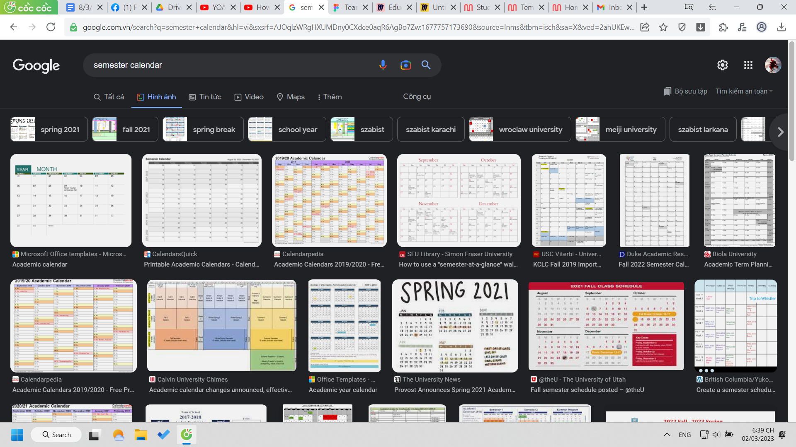
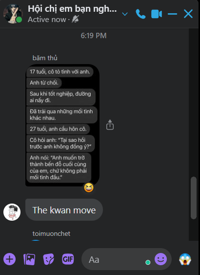

- Dậy lúc 6:15 ôn bài
- 07:26 nghỉ ăn cơm
- 18:39 đang nghiên cứu và chọn ứng dụng để làm semester calender, đăng ký mural
  collapsed:: true
	- làm week với day thì dễ hơn
	- chưa thống nhất được một mạch sử dụng giữa các ứng dụng
		- mà sau này có thống nhất thì vẫn phải có một hệ thống không thể chỉnh sửa, ứng dụng chỉ là cái hiện thân, hình dáng của tư tưởng, tư tưởng cấu trúc phải tốt từ đầu: kho ở đâu, search engine các thứ ở đâu, view kiểu này chính ở đâu,...
		- sau đó mới tính dùng app và modify theo app
	- 
	- cap lại cho biết mẫu calender chán như nào, phải đọc tạm sách để làm cái calender đối phó tí
	- có ý tưởng là thay vì kiểu làm một lần và nộp sản phẩm coi như xong thì nên có update theo tuần, nó như kiểu khóa học ứng dụng thực sự
	- và chọn ứng dụng nào để dùng thật sự tốt nhất cho việc này, và quá trình làm ngắn gọn nhất ra sao chứ không lân la tận hưởng được quá vì sau này sẽ còn nhiều calender thì làm thế nào đây ta,
		- chỉ biết tạm là calender hay portfolio nó nên dễ access và có thể modify thay đổi được chứ không dùng một lần như tùy loại CV trước đây hoặc cả sản phẩm của mình.
		- ừ nếu mình gổi thậm chí có thể làm những phiên bản thấp hơn cho mọi người bạn bè, nó cũng có thể là một phần quan trọng nếu làm nhóm
			- như câu hỏi tại sao mọi app nước ngoài giờ đều có workspace
		- tạm mới nghĩ miro hoặc kiểu figma (calender lớn + theo dõi được vì dễ nhìn tổng quan) và notion (portfo)
			- hoặc một số ứng dụng đơn giản chỉ cập nhật thông tin hơn? nhắc nhở mình deadlines nhiều hơn dù mình vẫn thích dùng một phần sức chứa của não để nhớ nhiệm vụ ngày
			- 
			- đọc được cái này :))
			- mình đang tưởng tượng ừ có khi sau này quay lại với mthao chứ không buồn như một video nào đó có người được phỏng vấn bảo bọn em chỉ lướt story nhau đến cuối đời thôi
			  collapsed:: true
				- wtf sao nói chắc nịch thế, như triết gia thế, bao tuổi mà biết được thế, để một cảm giác hoặc một chuỗi cảm giác chi phối đời mình à
				- hay người đời nào dạy? sao con người nghĩ được viễn cảnh đấy
					- tôi nghĩ được đéo đâu
			- nhưng lúc đó, hoặc trước khi đi ra nước ngoài hope hoàn thành được tất cả sự chuẩn bị
			- haiz cứ có những cái môn kiểu kỹ năng này thì chuẩn bị ngắn hạn nhảm nhí vl
				- phí thời gian công sức và đứt, ngắn mạch nghĩ
				- dài cũng có sao đâu miễn mày còn sống, không thì sau làm cho con mày
			- nhưng chỉ sợ lúc mình build xong calendar cho mình rồi mình bị ì trệ, như tạo được một cuộc đời, phong cách, lối sống hoàn hảo, cảm giác dễ mất hứng làm calender là phương pháp cho cả thế giới này lắm
- nhưng nghĩ khó việc mình implement nó vào đời được lắm, dù đời, hoặc sau này có học những khóa gì kiểu thiết kế đời thế này thì nên là sự tiếp nối bằng của nhau, thế cho học sinh đã làm được gì thì làm tiếp, dù hoàn toàn có thể thế mà, tại mày chưa làm mà giờ vẫn chưa hợp lối sống đó nên phải làm qua loa thôi
	- ừ qua loa lại thành học thiết kế ở khóa này chứ chẳng áp dụng được gì thực sự
	- còn cái khó thì là cái gì xâm lấn vào đời ta được chứ, một routin chính xác thì khó có thể... cái đó phải chủ động thế nào thì chúng ta mới không quên hoặc lười chán đây
		- chắc AI may ra mới giúp được chứ tự ta ngày nào cũng vào check, cũng nghĩ về một cái plan, thường plan xong cứ túc tắc thôi chứ ít nghĩ lắm