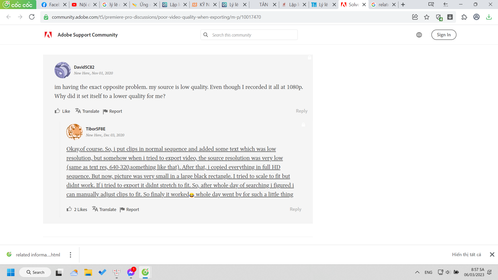

- 01:52 xong nhiệm vụ 8-3
	- cùng kích cỡ, thế mà chất lượng khác nhau đáng kể vl. Vậy thực ra chất lượng và gb và cái gì tạo nên gb, kb ở video?
- phân tích video cái để làm tư liệu sau này nếu cần nộp cho trường điện ảnh
- tại sao mình chọn video tỏ tình kia
	- tại nó hợp vào mấy dịp bày tỏ tình cảm (định dùng luôn 14-2 nhưng muộn rồi, may là sắp tới cũng có dịp)
	- nó mang hiệu ứng kiểu parody gây hấp dẫn thích thú (intertext)
		- chính cái parody cũng nổi vì nó có yếu tố gây hấp dẫn loài người (không biết, cảm thấy thế nên không phân tích rõ được)
	- và lời thoại hợp để kể câu chuyện của mình nữa
	- sến đùa lại vui
	- mình tưởng tượng cảnh ra thì nó kiểu như mình làm nên cũng khá đẹp, tiếc là không đứng chỗ trước cửa thư viện được hoặc quay "after credit" ở trước miếu Cô Son vì không có nhiều thời gian, không chuẩn bị nhiều, cũng chẳng đi khảo sát thực địa, may sao được một ngày trời đẹp
		- lúc đó còn không thuộc và ngại, khả năng học thuộc về mo mẹ rồi
	- mình vẫn muốn lồng bài kí ức trong tôi vì hồi đó đam mê, lúc đầu định lồng làm nhạc nền nhưng thế có lẽ không hợp lắm, giai điệu, lời, cả cũng không cần thiết
		- nên là để chạy phía sau, như cái bọn lớp mình làm tặng mình
		- thế thì phải lấy ảnh, lấy ảnh cũ cũng được, bọn nó chẳng chán đâu nhưng mình chán, mình không muốn làm những thứ chỉ lặp lại
		- thế chợt nhận ra mẹ cũng có nhiều ảnh, thực ra không nhiều đến thế
		- mà kiểu chụp của mẹ đôi khi nó lại có góc nhìn khác bọn nó, có cái họ thấy đẹp bọn nó không thấy, như kiểu các bà cô chụp, nên bọn nó cười, mình muốn lợi dụng yếu tố này
	- và ừ ảnh của mẹ là ảnh người thế hệ cũ nhìn, bài ca và video này cũng khá cũ. mình sẽ cho nó cái sự cũ, được về Chu quay cũng là một cái gì đó cũ.
	- Mình có viết script và nghĩ tới đoạn nhờ mai và muốn tỏ lòng mấy cái suy ngẫm chiêm nghiệm về tình cảm, về sự thay đổi quan niệm trong mình, nên may quá mình xen vào được lúc giữa nhạc. Ban đầu định để cuối khi chẳng còn lời hát nào nữa cơ.
	- Xong trước khi quay edit thử trước, thế là khá lí tưởng, như tôi biết có bao nhiêu giây quay để áng chừng và cắt bớt đoạn nói đi, thì chính nó mới trọn vẹn được chứ cắt bớt video nói đi nó sẽ chưa chắc hợp đoạn nhạc đấy nữa chẳng hạn
		- lí tưởng trong điều kiện chất liệu sáng tạo của bạn bị giới hạn, không cho bạn bung lụa hết khả năng tưởng tượng
			- lúc đó nó sẽ đến khả năng tư duy kĩ thuật khoa học: vận dụng và luồn lách giữa những quy luật lề lối sẵn có, ứng dụng sử dụng nó
	- nhưng cho video vào kiểu gì, nhìn thời gian mẹ đề ở thư mục, rồi có cả ảnh Chu của bác Toàn, mình mới muốn làm như thước phim tua ngược vì mình chèn ảnh cũng tức nhìn về quá khứ so với hiện tại rồi mà, thời cấp ba là quá khứ rồi. Thế thì hãy nhìn quá khứ xa hơn nữa đi. Và đấy là mình làm biên niên sử tua ngược, thước phim tua ngược 12 văn. Lấy cả mấy ảnh dạo gần đây chụp sau khi ra trường nữa. Cũng muốn dùng nó lắm
	- nhưng ít ảnh lớp 11, 10 hơn mình tưởng, xin bọn nó cũng được nhưng không thích
	- mấy cái ý tưởng hay nhất vẫn là nghĩ liên tục ngay từ cái hôm xem xong video từ ULIS TV gợi đến video tỏ tình hài sến kinh điển kia để mình càng ngày càng lắp được thêm sự trùng lặp vào và dùng nó cho mình
	- Mình thấy cải mấy video chất lượng thấp mẹ chôm qua ai đó nữa, có lẽ từ cô Hợp. Cho vào luôn. Ngon, dù chất lượng hơi thấp nhưng không sao cổ cổ tí
	- Xưa video chất lượng thấp mình vẫn thấy ok mà
		- nhưng đừng làm nhan sắc bọn nó vỡ nát xấu đi như lần suất video sai lầm đầu là được
		- mình đã đăng story về điều này
	- hỏi thơ, tuy thơ không giúp được nhưng một lần nữa mình thử mánh cuối nà khi render, vì tra render trực tiếp và render trực tiếp xong vẫn lỗi vẫn éo hiểu kiểu gì
		- mình thử render và nó vẫn xấu tệ hại, tìm cách xem hoặc chỉnh thông số kiểu gì thì chỉ xem được thông số khung hình chính, xong thử lí giải mình đã edit gì, có hợp lí không
			- 
			- và tra mạng chỉ được thế này, không liên quan lắm nhưng nó là một lỗi thật sự rất cơ bản và cách xử lí cũng thế
			- thế là gần như hi sinh một buổi chiều để nhận ra và sửa lỗi riêng của mình
			- mày tìm thấy lỗi rồi mà cứ sửa sửa ở đâu đâu :))), tại không hiểu mấy cái khác ít nhiều liên quan gì không, dù lỗi bé cỏn con, phần phức tạp lúc nào cũng tinh vi và chuẩn xác hơn sẵn rồi? nên chỉnh hay không chỉnh sẽ không thay đổi được cái lỗi cơ bản nền tảng kia đâu
	- mình xem phân giải và thấy nó vẫn cao, thôi thì thử một cách là change source, thứ mà mình đã không làm dù giữa chừng nhìn source thấp thế mình cũng nghĩ tới. Và mình cứ cố sửa đuôi (exporting )dù nó sai đầu (low quality), gần đầu (sequence setting chẳng hạn thế)
	- mình vẫn kèm một đoạn nói gì đó cho cảm giác nó đỡ trống. Cảm giác về mặt cảm xúc. và nó echo lại việc nhân vật babylon ngồi khóc sau khi thấy thước phim lịch sử và cuộc đời mình đã từng thuộc về gì đó lớn lao hơn
		- mình vẫn muốn khai thác, đi theo ý này dù thầy Hiếu cho mình ý khác buồn hơn và có vẻ đúng hơn
		- ê lại nghĩ đến thầy và những video nhật anh gửi mãi chưa mở ra xem, cùng lắm đi quân sự ngồi chill rảnh nghe liền tù tì... ừ cũng là một ý tưởng
	- và cũng nhận ra có lẽ mấy cái chuyển cảnh liên tục nhiều màu lúc cuối không hẳn là hiệu ứng tạo cảm giác mà có lẽ đó là thời tiền sử của điện ảnh: chỉ là test màu xanh đỏ vàng? tiền sử của K112 Văn là một CVA không có K112 Văn, mình không có ảnh chụp trường sơ khai thế và nằm ngoài tác động, góc nhìn mình nên dùng mấy ảnh bác Toàn không vướng người đang chụp kỉ yếu
	- dù nó vẫn chưa cao trào kịch tính như mong đợi: từ hài -> khóc -> sâu lắng bâng khuâng về hiện tại. có lẽ do nhạc không phải sinh ra cho ý tưởng này nên nó thế
	- à quên, đấy dễ bổ qua nhanh từng khâu thế, sắp xếp thời gian là do cảm tính thôi vì ảnh mẹ không có ghi tiêu đề bằng thời gian (nó được tải về) và ngày tải một số bức là cùng lúc
	- còn một số video, ảnh mình chọn nó phải có tính gợi và nét đặc trưng
		- đó có thể không phải bức ảnh cười đẹp nhất, nhưng mình nhìn mình thấy bọn nó nhất, qua phong cách, hành xử, nét mặt, biểu cảo
		- màu đẹp cũng có thể là một yếu tố
		- nhưng tất nhiên vẫn chú ý đến cái đẹp bình thường không dìm hàng quá
		- dù dìm mình mới thấy vui kiểu ác độc, thân thương gần gũi
- Về lúc 18:00, 18:30 ngủ đến 19:30
- 20:00 vào tọa đàm cân bằng cảm xúc, thử record bằng loom nhưng phải xóa vì loom chỉ ghi âm mình chứ không ghi tiếng của người nói
	- tiếc nhưng kệ, coi những thông tin họ không dám đăng, không công khai là những thứ họ không kiểm chứng được tốt
		- dù sao nó cũng chỉ là một chuyên đề giảng qua qua chứ chẳng phải học thực
		- gợi mình vài suy nghĩ như đối lập cảm xúc mình với người khác, khiến người ta bối rối trong cách phản hồi và mở đầu một cái gì đó như nào
		- rồi mình vẫn tin là nên đi đến tận cùng cảm xúc xem thế nào chứ buồn thì xem gì đó để vui lên, hài nào làm quên lãng đi được bi kịch?
	- có một vài mô hình kiến thức hay đấy nhưng thôi cái đấy tra mạng và nghiên cứu có khi ra một đống, dù sao ở đây cũng không phải bài giảng nên nó không cung cấp cái mạch học dựa lịch sử
	- và nghe, làm theo mấy cái trò đoán cảm xúc, thực hành,... từ người thứ hai đôi khi không hay đâu, hiếm ai là source thứ cấp mà hơn nguyên cấp
	- ngay cả giáo trình triết cũng thế, đọc chính gốc chắc chắn khổ nhưng dễ hiểu hơn, lúc đấy phân tích người ta chỉ là một góc nhìn không có mấy giá trị
	- còn giảng viên giảng thì là trò đùa vui thôi chứ không có mấy giá trị kiến thức lý thuyết, mấy cái ví dụ để cho gần gũi, hiếm lắm gợi một vấn đề hay gì đó hay từ thực tiễn khác lí thuyết thôi.
- 22:41 đang đọc triết