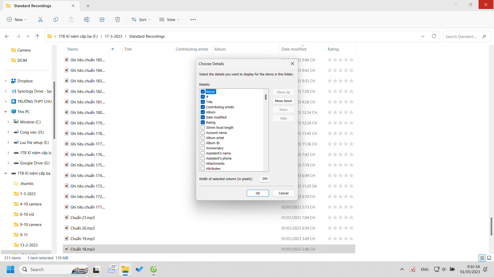
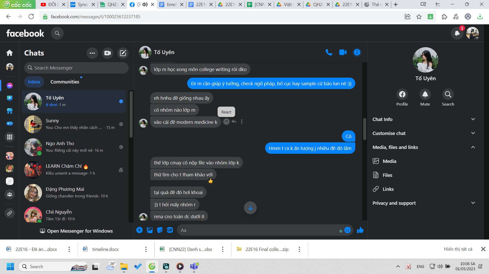
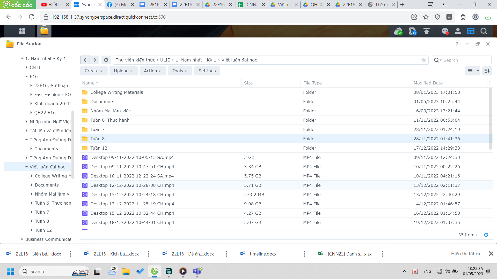
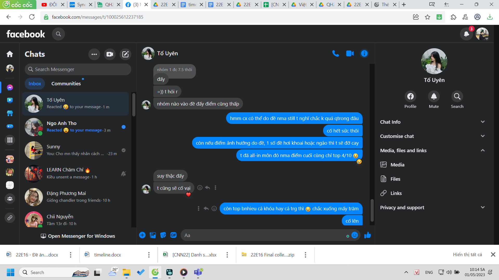
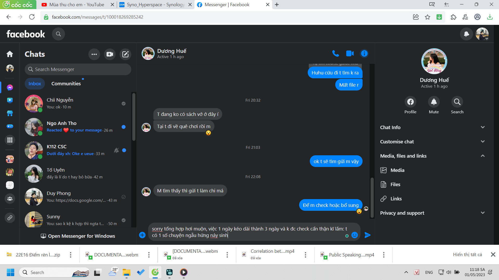
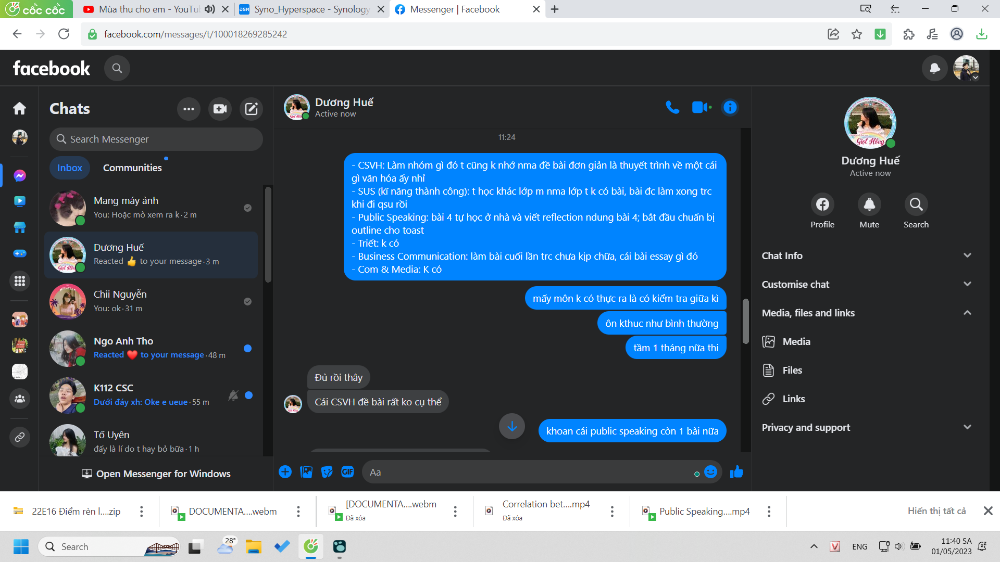
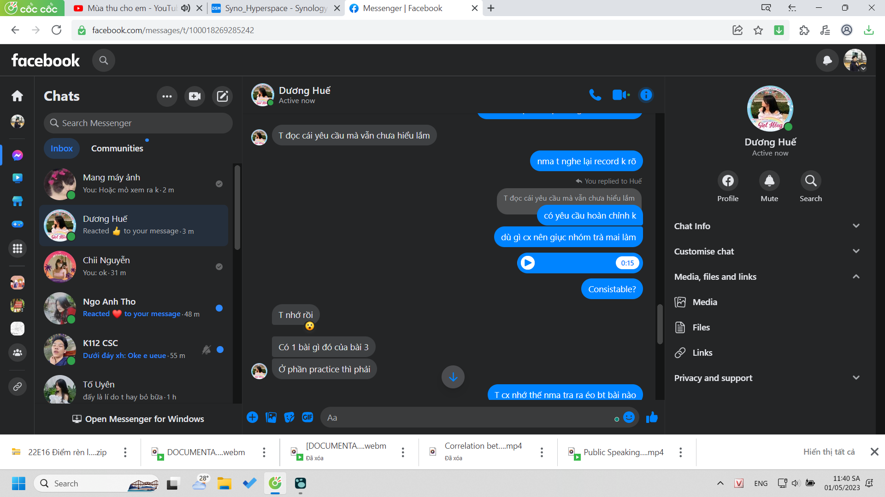
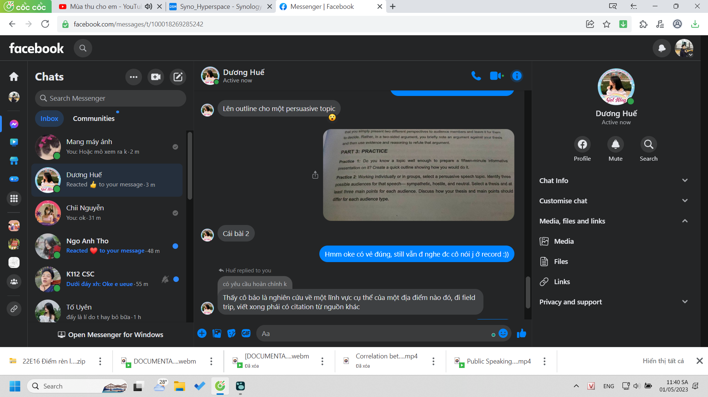

- wao hay
	- 
	- đây là lí do nên nghiên cứu kĩ các tính năng, phân tích các khả thể
		- sắp xếp tủ quần áo cũng thế, nay vẫn chưa tối ưu lắm
	- nhưng quan trọng phải biết cơ bản cần những gì để chọn lựa và sắp xếp dựa trên cái nền đó
- Uyên nhắc mới mở lại file và để ý mình chưa sao lưu toàn bộ...
	- 
		- à không mình làm rồi chỉ là lưu ở E16... lúc đầu file đó là tổng hợp tất cả những thứ lục được ở group lớp
		- mình trước tư duy là tách E16 ra riêng, còn lại để mỗi record ở file môn học, hầu như là thế. Nhưng nay với thực tiễn cách mình nghĩ và tìm và đằng nào thì cái file đó cũng toàn E16 vì mình có cơ hội học lớp khác đâu.
			- 
			- có nên nhét tài liệu theo từng tuần không... hừm thực ra xem vid lâu hơn, mà đã xem xong thì quay ra mò file cũng dễ vì file ít. mà phải mò vì mình muốn giữ đúng chất cách viết, đặt tên tiêu đề của bọn sinh viên
	- cayyy
		- 
	- nhưng mà như bây giờ mình cũng có aim top đâu, mình aim chất riêng và cố hết sức lợi cho mình về kiến thức các thứ hơn, thế mà cuối cùng khi thấy điểm lại muốn top
		- hãy nhớ mày từng kém tiếng Anh... 1 vài tháng không thay đổi được thực lực, quan trọng là sau khi học xong còn giữ được điểm đó không nữa
			- không tự tin ha
		-
- 
- thực ra còn sắp xếp deadlines... tí đi học với chi nguyễn chắc là sẽ ngồi nghiên cứu lẽ thường. sẽ hơi ì lúc đầu để khởi động lại máy, nhưng cũng nên thử đi nghiên cứu ở nơi xa.
	- 
	- 
	- 
	-