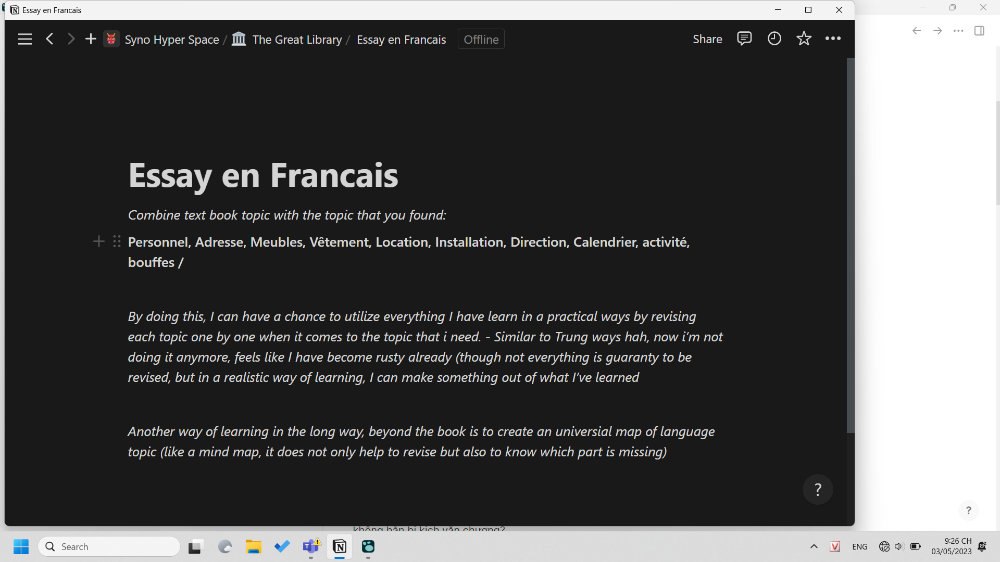

- 09:29
  collapsed:: true
	- 
- 
- chà, facebook vẫn là nơi để chia sẻ suy nghĩ mà không phải lo nghĩ quá nhiều như xưa, nơi ta được thật, bình thường, không hoàn hảo hoặc màu sắc quá độ như nay.
- 21:13
  collapsed:: true
	- lúc mình vào, cào cửa như mèo cào, để trêu xem Phúc sẽ nghĩ đó là Phong hay mèo, bạn ấy có cười khúc khíc, giọng như chị Hà ý. Hồi xưa còn làm việc ở Mở mình còn quan tâm và gặp nhiều vấn đề trong làm việc chung kiểu gì ấy, giờ thì mình thấy mơ hồ, chẳng biết đã học được gì, phát triển tư duy hay khả năng phát hiện vấn đề, làm việc trong mối quan hệ nhóm hay có giải pháp và nó đã ngấm vào người chưa
	  Record này có đề cập và có tính khai mở về ý nghĩa của chức danh leader (làm nhiệm vụ), còn gì nữa không, và hệ thống không leader, role leader với những việc hiện tại thực tế không cần quá nhiều leading skill như dictator hay một khả năng chuyên biệt như nhìn tổng quan hoặc maybe cả xây dựng hình thức làm việc? thực ra cái đấy ai chẳng có khả năng nghĩ và nghĩ cùng, không cần giao trực tiếp cho một người, tính kỉ luật dù gì vẫn tốt hơn và dù nó chỉ cần một người check deadlines, chủ động thay phiên nhau làm vẫn tạo một môi trường làm việc như không phải làm việc? nhưng vẫn nên master để bật lại và thành viên và giá trị của một nhóm (cứu nhau)
	- để nó giải thích, mình chỉ giải thích những gì mình biết
	  collapsed:: true
		- hmm không tốt lắm cho học và có thể không tốt lắm cho điểm
			- ví dụ nhỡ nó làm sai và với học thì người ta đã làm ra yêu cầu, tự ta có thể đánh giá nó hữu ích hay không nhưng cũng nên
		- nghe code thú vị ghê, nó là tập lệnh và ta dùng đúng lệnh đúng chỗ để đạt đúng mục đích
		  collapsed:: true
			- còn sâu xa hơn của code là cách tư duy nói chung - nhưng vẫn dựa gì đó, dựa thực tế: ví dụ nhập sai ngày sinh - ví dụ Phúc bảo thì nó tự nhập lại, check sai kiểu gì các thứ; cách tư duy dựa theo loại code, mô hình code và thậm chí cơ chế của mỗi
			- rồi với môn code thì có nên code chung như cách tôi từng ngồi viết essay chung cùng (cái đấy cũng chưa biết hình thức môn như nào để chốt hình thức làm việc với nhau)
				- anh Tùng cũng từng viết blog song song với ai đó, chúng tôi cũng từng thiết kế bot với nhau như vậy
				- kiểu viết chung thế này khá thú vị, nhất là khi những thành viên khác mạnh điểm gì đó và mỗi người làm một kiểu chung
				- bọn nó tính đến dùng AI - nó huy động và lắp ghép kiến thức hộ hay các phần mềm check kiểu grammarly, à mà code tự có khả năng check mà, khả năng tối ưu thì không
		- nếu thế này thì ta sẽ tự làm một mình, chấp nhận hardcore. Ồ, những viễn cảnh và yêu cầu nhìn trước chứ không chỉ là chọn phương án tốt nhất với hình thức môn, mà cả hoàn cảnh sắp tới và thậm chí các viễn cảnh, hệ thống khác nhau theo sự gấp rút hay tình trạng làm việc nhóm
- 21:26 viết tiếng Pháp, phần đầu, mình mới nhận thấy vốn từ chủ đề topic của mình vẫn còn hạn chế. Cơ sở vật chất, Thời gian biểu, Món ăn, mình đã biết đâu
	- 
- wao giá cũng rẻ mà cũng thú vị
	- 
- 23:33 lên list những hướng triển khai mở bài: để catch attention có những gì, để đầy đủ an toàn có những gì, và để làm gì khác có những gì
	- rồi đưa example vào phân tích các hướng phát triển của mỗi ex: như phân tích cái chỉ số năng lực theo cái hình đa giác

- 205k lẩu Phan
- 55k nước với Chi Nguyễn
- 150k dooki
- 60k nước
- 100k tiền kara 30p
-