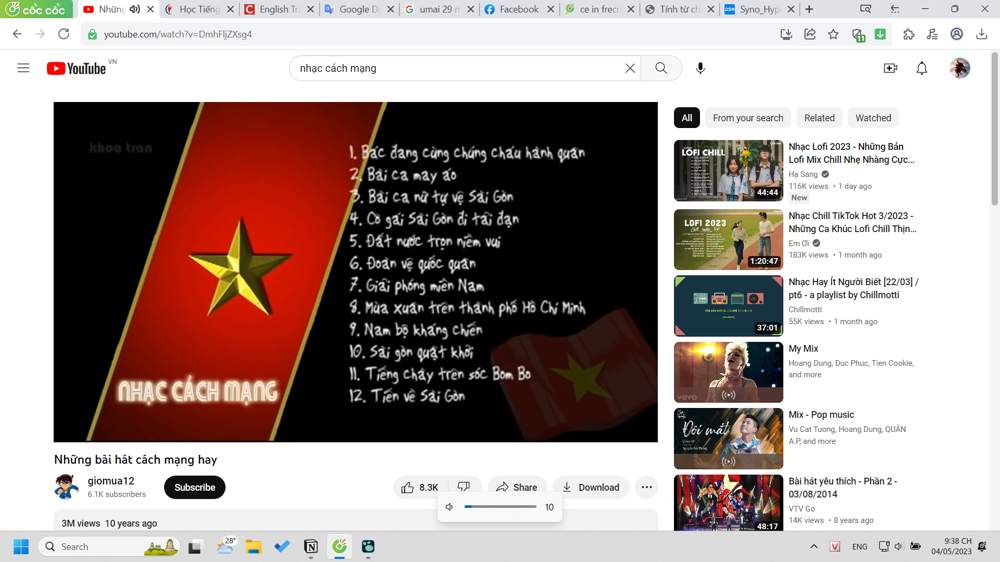

- 01:43 call với Lã
	- dù sao h mình thấy ngta dùng từ lạ, cao siêu hoặc chuẩn, mình check lại xem đúng k thôi chứ k check với tâm thế cay cú soi mói hơn thua nữa
	- sau này từ cái việc đc hướng dẫn cụ thể hơn chúng tôi và cx vì thế cao cấp hơn dl chúng tôi vì chỉ dẫn ngta ở mức khá học thuật chứ k chấp nhận hên xui vừa học thuật, vừa thường miễn sao hay như ulis đc (trừ những môn nó tính là nghiên cứu), bọn nó mà từ đó học đc cách áp dụng cho riêng mình như tôi đang cố thì sẽ đỉnh hoặc ít nhất biết cách làm việc ở những doanh nghiệp yêu cầu chuyên nghiệp đây, cứ theo form mà làm là quen. tôi chưa bao giờ nắm đc hoàn toàn quy trình quá trình tự tìm hiểu và đề giao ra sao mà chỉ biết cách bọn nó làm
- 21:38 ý nghĩa mấy ngày 30/4 ngoài được nghỉ thì là nếu làm việc thì nghe đống bài này cũng hay
	- 
	- với mấy đứa như mình ít cơ hội để nghe và cũng chẳng nhớ mà tìm nghe