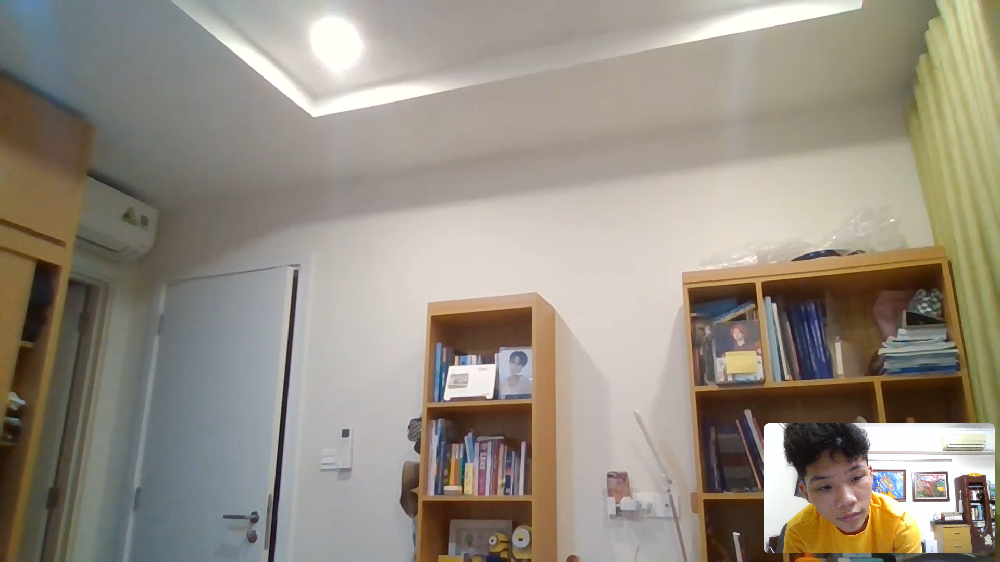

- 01:23 tôi xóa The Sim4 khỏi máy hoàn toàn, vì down lại cũng dễ nếu ở nhà
  collapsed:: true
	- và thế là niềm tin rằng một ngày Chi Nguyễn gọi tôi chỉ vì muốn chơi The Sims không còn? Tôi cũng không quá tin nhưng cũng cứ bám víu, kể cả hỏi nó thì nó quyết định thôi chứ cũng chẳng trả lời được tương lai
	- sự tốt bụng của tôi đến đây là hết? không phải tôi thành người xấu chỉ là tôi không thấy cần thiết nữa khi căn cái tốt bụng vào việc tốt với niềm tin mỏng manh của 1 người quá...? cố chấp là tốt bụng? cố chấp với bản thân
- 01:40 tình trạng 1 số lúc khi học xong
  collapsed:: true
	- có lẽ ngủ chơi lướt fb
		- 
		- 
	- mình cứ lo, muốn tìm cách gọi nó dậy tắt máy đi ngủ cho đoàng hoàng nhưng nghĩ lại thì, để máy nhau 1 cách tự do như này cũng là cái hay, như ngày xưa ở MỞ thì máy tính không chỉ là công cụ, nó là cái cửa sổ kết nối hai thế giới. Bạn khó có thể cảm nhận rõ thế giới bên kia ra sao, bạn chỉ cảm nhận được đối phương thế nào, nhưng cảm nhận được hoạt động đối phương tương tác ở thế giới đó, nó tạo mình cảm giác cũng chân thực không kém gì như đang nhìn qua, được vươn qua ô cửa sổ máy tính
	- để toàn màn hình thì đích thực nó như hình nền, là cửa sổ luôn, kệ lã đi, mình không muốn cảm giác dậy đã thấy người kia cúp máy tự bao giờ không biết, nhưng nó cúp trước thì mình oke, còn không thì sáng mai bất ngờ và ngỡ ngàng rung động vl, mình được thấy buổi sáng lã thế nào, chỉ sợ phiền nhà nó chứ phòng tôi thì không ai vào đâu nên không sợ gây phiền ai bị thấy vào
		- 
- 10:51 thay vì phí thời gian vào những việc không đâu, năng suất ngày càng giảm cũng như tần suất học, số đầu việc làm được, chất lượng kém đi thì hãy kiếm thứ năng lượng mới hiệu quả hơn: không game hay truyện để có động lực cảm hứng, một là chết với nó, hai là thử lại sống với phim, với học nhiều môn nhiều thứ
	- rồi dùng sự sống đó cho làm bài, chạy dl
		- 
- 22:05 tối nay định viết reflections xong thì đọc triết với cơ sở văn hóa, nhưng mình đã chơi 30 phút soulknight, tốc độ thôi nào
	- 16:00 chiều nay mới ngủ, 19:00 dậy nấu lại đồ ăn cùng bố, gấp quần áo và tưới cây, sắp xếp dữ liệu, nghĩ rằng giờ xếp luôn thì có cái không tiện là mình rồi sẽ phải up hết lên Notion cái tên để nắm được tất cả theo một tiến trình lịch sử
-