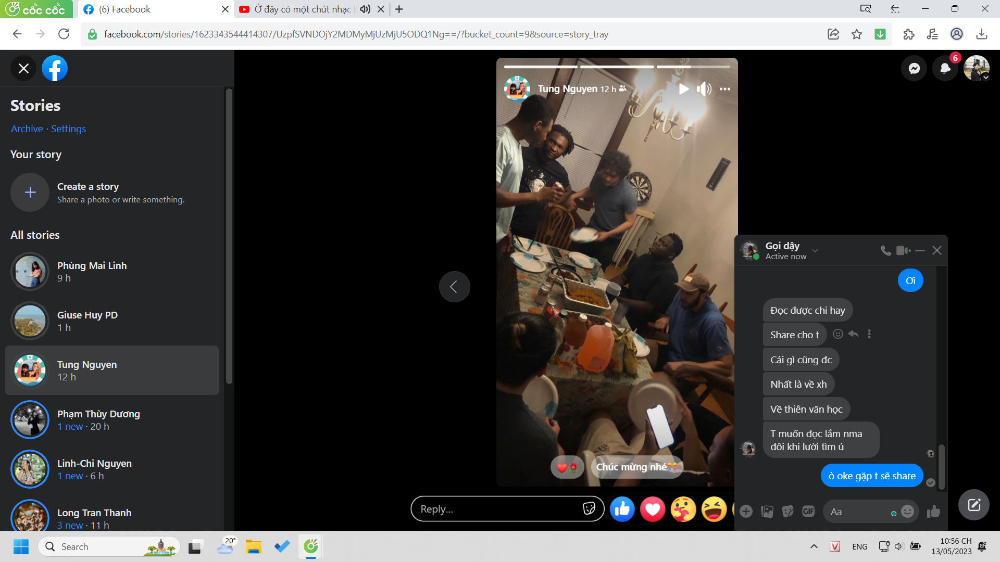
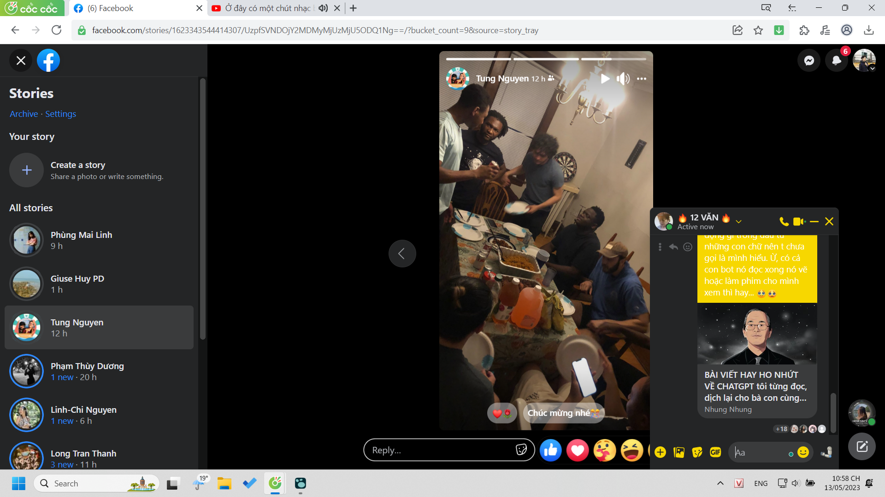

- 00:52
  collapsed:: true
	- Họ và tên: Lê Vân Thy
	  Anh 02 – Kinh doanh số – K61 – Trường Đại học Ngoại thương
	  BÀI DỰ THI “CUỘC THI REVIEW SÁCH: MIRRORS”
	  TÁC PHẨM: “NỖI BUỒN CHIẾN TRANH”
	  TÁC GIẢ: BẢO NINH
	  Tôi muốn viết bài dự thi này như một lời tri ân đến ông nội tôi – người chiến sĩ giải phóng miền Nam đã dành nửa cuộc đời mình cho sự nghiệp giải phóng đất nước. Ông đã mất vì căn bệnh ung thư từ khi tôi lên 6 nhưng những tấm huân chương, những dòng nhật kí đầy xúc động của ông sẽ mãi là niềm tự hào trong tôi.
	- “Nỗi buồn chiến tranh” không phải một tác phẩm dành cho số đông.
	  Từ những trang sách đầu tiên, tôi đã biết rõ điều đó.
	  Phải nói rằng số tác phẩm về chiến tranh (cả trong và ngoài nước) mà tôi đọc quả thực không ít nhưng, “Nỗi buồn chiến tranh” vẫn là một điều gì đó rất khác. Hiếm có một tác phẩm nào có thể miêu tả chiến tranh (cụ thể là chiến tranh Việt Nam) đến mức trung thực và tàn nhẫn như thế. Ở đó không có ánh hào quang chiến trận. Không có lớp màng sử thi. Càng không có câu hát, niềm vui, hạnh phúc. Mà nếu chăng có thì cũng sẽ bị chiến tranh nghiền nát…Ở đó, duy chỉ có một sự thật trần trụi về một thời chiến tranh tang tóc đến kinh dị, gớm guốc; một thời hậu chiến nghiệt ngã đến nao lòng.
	  “Trên đầu trực thăng rà rạp các ngọn cây và gần như thúc họng đại liên vào gáy từng người mà bắn. Máu tung xối, chảy tóe, ồng ộc, nhoe nhoét. Trên cái trảng hình thoi ở giữa truông, cái trảng mà nghe nói đến ngày nay cây cỏ vẫn chưa lại hồn để mọc lên nổi hồi đó la liệt xác người bị đốn, thân thể dập vỡ, tanh banh, phùn phụt phì hơi nóng”
	  “Nỗi buồn chiến tranh” không có một bối cảnh cụ thể, cũng không có một dòng thời gian cụ thể, càng không có một cốt truyện cụ thể. Khi là những hình ảnh chiến tranh tàn khốc với mưa bom bão đạn, có khi lại là một Hà Nội êm ả và mộng mơ, khi lại là căn phòng u tối trong những đêm mưa,…Thiên tiểu thuyết ấy chỉ có một điểm dính kết duy nhất đó là Kiên – hay chính xác hơn là tâm trạng, cảm xúc của Kiên – người lính đã may mắn sống sót qua khỏi lửa chiến tranh. Xuyên suốt cuốn truyện, Bảo Ninh đã đưa người đọc đi đến tận cùng thế giới tâm hồn của một người lính, từ thuở còn là một chàng trai Hà thành giàu mộng mơ, nhiệt huyết đến khi là một người lính lạnh lùng, tàn nhẫn và rồi là con người vất vưởng, lạc lõng khi bước qua chiến tranh. Mưa bom bão đạn đã không giết chết được anh nhưng những ám ảnh khôn nguôi về quãng thời gian đau thương và nghiệt ngã ấy lại là liều thuốc độc từ từ gặm nhấm thể xác và tâm hồn Kiên. Để rồi, người lính ấy dường như bơ vơ, lạc lõng và “trôi dạt” ngay trong chính “hòa bình” mà anh và các đồng đội đã không tiếc hi sinh xương máu để đổi lấy. Anh đã sống sót nhưng tâm hồn anh, tình yêu và hạnh phúc của anh đã bị vùi lấp trong “nấm mồ” mang tên chiến tranh.
	  “Nỗi buồn chiến tranh” - “Thân phận tình yêu”
	  Nhan đề cũ của “Nỗi buồn chiến tranh” là “Thân phận tình yêu” và không phải ngẫu nhiên mà Bảo Ninh chọn cho đứa con tinh thần ấy của mình cái tên như vậy…
	  Khi nhắc về “Nỗi buồn chiến tranh”, người ta nghĩ nhiều về nhân tính, nhân dạng – những giá trị được coi là món hàng “xa xỉ” trong chiến tranh, những giá trị căn bản của con người đã bị chiến tranh vùi dập, tước đoạt. Nhưng đối với tôi, điều khiến “Nỗi buồn chiến tranh” trở thành tác phẩm nghiệt ngã nhất trong số những tác phẩm văn học phản chiến mà tôi đã đọc là tình yêu của Phương và Kiên.
	  Trong truyện ngắn “Cỏ lau”, Nguyễn Minh Châu đã nhận ra một sự thực rất đắng cay về cuộc đời người lính bước ra từ chiến trận: “Cuộc chiến mà anh đã không tiếc dốc hết tuổi trẻ mà cống hiến cho nó giờ đây lại như nhát dao phạt ngang hai nửa cuộc đời anh bị chặt lìa khó lòng mà hàn gắn lại”. Với tôi, tình yêu của Phương và Kiên dường như cũng giống như vậy, bị chặt lìa, rỉ máu. Chiến tranh đã giằng Phương ra khỏi tay Kiên kể từ ngày quyết định bước vào trận tuyến. Và ngay cả khi trở về sau chiến tranh, Kiên gặp lại Phương. Một bức tường vô hình đã được dựng lên giữa họ tự bao giờ. Phương không còn là cô học trò trinh trắng ngày xưa nữa mà đã là một người đàn bà buông thả. Trò đùa của chiến tranh buồn đến tê lòng!
	  Người ta vẫn thương nói nhiều về khả năng cứu rỗi và chữa lành của tình yêu. Không sai! Bởi, trong những cơn hồng ma mộng mị, trong những đêm đen hoan lạc, đêm đen của chiến tranh và phi nhân, điều níu giữ được chút nhân tính cuối cùng trong Kiên là Phương, là cái đẹp người trinh nữ, là những vu vơ, ngây ngô của một thời tuổi trẻ và tình yêu. Thế nhưng bước ra từ chiến tranh hết thảy những cái đẹp ấy đều trở thành sứt mẻ và giờ đây, chính thứ ánh sáng đã từng cứu lấy Kiên lại là thứ “giết chết” và thậm chí trở thành thứ thuốc độc gặm nhấm tâm hồn Kiên.
	  “Dù đã dầm mình trong rượu, dù đã hàng trăm lần tự cầu xin lòng mình hãy yên lặng đi cho, thì trong tâm trí anh vẫn không ngừng nhói đau những hồi tưởng tan nát về thời gian sống cùng nhau sau chiến tranh của anh và Phương. Mảnh đời còn lại sau mười năm bị lửa đạn của chiến tranh vằm xé lại bị móng vuốt của tình yêu xé nát”.
	  Và trong những đau thương cùng cực, Kiên chợt nhận ra dường như chính anh đã đánh mất khả năng yêu của chính mình. Tình yêu của anh, bị móng vuốt chiến tranh cào xé tan nát như chính hình hài của những con người dưới đống đổ nát của lịch sử. Và đây, tình yêu ấy, cái đẹp bị chiến tranh làm cho què quặt, rách nát ấy đã biến thành một thứ độc dược, quay ngược trở lại dìm anh xuống vực sâu của tuyệt vọng.
	  Và không chỉ với Phương và Kiên, còn bao nhiêu mối tình, bao nhiêu tình yêu trong sáng đã bị chặt lìa, bị hủy hoại trong chiến tranh? Còn bao nhiêu số phận con người đã bị tàn lụi, hủy diệt trong mưa bom bão đạn? Chiến tranh, đúng như Nguyễn Minh Châu đã từng nói: “...chẳng phải trò đùa”.
	  Qua mỗi trang viết, cuốn tiểu thuyết lại mang đến trong lòng người đọc những ám ảnh, giằng xé bởi chính những ngôn từ sống động, mâu thuẫn, tranh luận với nhau; bởi một thế giới bị đập vụn, tan tác, méo lệch nương theo dòng suy tưởng của tâm hồn, đáy sâu trái tim âm u, tan nát. Để từ đó, người đọc không thể nguôi đau xót về những cái giá phải trả cho hòa bình, không thể nhìn chiến tranh với tấm màng sử thi hào hùng đơn thuần như trước bởi chiến tranh dù là chính nghĩa hay phi nghĩa thì đều là phi nhân.
	  Nhưng nếu nói như vậy, thì liệu “Nỗi buồn chiến tranh” có đang muốn phủ nhận và lên án hết thảy hơn ba mươi năm chiến tranh giành độc lập của dân tộc?
	  Tôi cho rằng, không!
	  Với tôi, “Nỗi buồn chiến tranh” không phải nơi cất tiếng cho những mất mát chiến tranh để rồi phủ định một thời huy hoàng và dũng cảm của cha ông, để phủ nhận cuộc sống tốt đẹp hay hòa bình của ngày hôm nay. Với tôi, “Nỗi buồn chiến tranh” cao cả hơn thế.
	  Như cách bà tôi vẫn thường kể cho tôi những câu chuyện về ông, về những cơn sốt rét, về những vết hằn không thể xóa bỏ mà chiến tranh đã để lại trên người ông, như cách bà tôi vẫn giữ mãi từng bức thư của ông trong thời chiến trận, giữ mãi từng tấm màn đơn, từng bình nước uống. Họ chưa từng giấu diếm tôi nỗi gian khổ về chiến tranh, càng chưa từng cố làm cho nó bớt tang tóc hay đau thương. Họ khiến tôi nhận ra chiến tranh không xa lạ đến thế, nỗi tang thương vẫn song hành cùng niềm vui chiến thắng, con người đã khuất nhưng câu chuyện vẫn sẽ còn ở lại. Một cách rất tự nhiên, họ khiến tôi không quên đi, không thờ ơ, không xa lạ với những đau thương mất mát, khiến tôi hiểu được hòa bình đáng trân trọng đến nhường nào.
	  “Nỗi buồn chiến tranh” cũng thế. Nó cho con người nhìn nhận lại chiến tranh, nhìn nhận lại một thời quá khứ đau thương nhưng hào hùng, kiên cường bởi quả thực có những cuộc chiến cần thiết để đấu tranh vì lợi ích sinh tồn của con người hơn những cuộc chiến khác, ví như chiến tranh giải phóng dân tộc. Ở đó, những mất mát có thể bù đắp, những vết thương sẽ lành, đau khổ sẽ hóa thạch nhưng nỗi buồn về một cuộc chiến tranh sẽ mãi còn đó, và nên còn đó - “một nỗi buồn mênh mang, cao hơn hạnh phúc và vượt trên đau khổ”. Nó buộc mỗi chúng ta phải thôi thờ ơ, phải biết buồn, biết thương cho những mất mát khó có thể bù đắp; từ đó, nó khiến con người có thêm dũng khí, thêm tình người để sống sao cho xứng với những máu thịt của cha ông, không thể thờ ơ trước những đau thương mà chiến tranh để lại, thậm chí đang hiện hữu.
	  Đó mới thực là điều làm nên sự vĩ đại của tác phẩm ấy.
	  Nguồn ảnh: Pinterest
	- [#reflexion](https://www.facebook.com/hashtag/reflexion?__eep__=6&__tn__=*NK*F)
	  [#fblcreview2023](https://www.facebook.com/hashtag/fblcreview2023?__eep__=6&__tn__=*NK*F)
	  [#mirrors](https://www.facebook.com/hashtag/mirrors?__eep__=6&__tn__=*NK*F)
	- See less
- 22:56 bước đầu tạo newsletter, feed customized cho bạn bè, cần nền tảng nữa thui. Chắc tag ? nhưng lướt thấy thì thích hơn. Thế share cho một nhóm người nhất định trên fb? vì họ hay lướt ở đó, hoặc ins (ins chắc tiện hơn nữa vì fb noti nó hơi phèn)
	- 
	- bắt đầu từ cái này
		- 
	- bình thường tôi đọc gì tôi chỉ like nhưng thế chắc chưa đủ nhỉ. chỉ để Thái Lai đến bàn luận thôi.
-