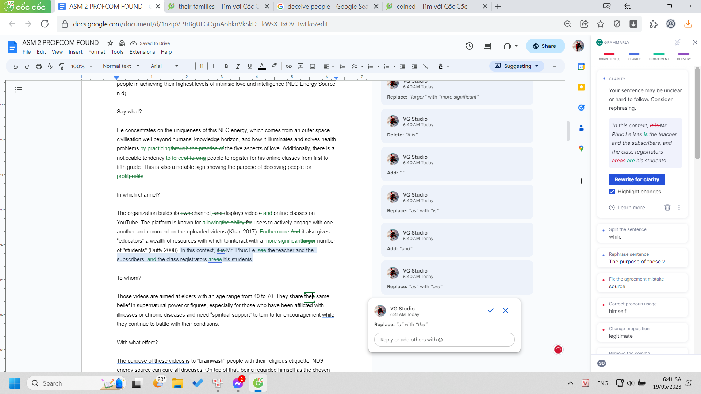
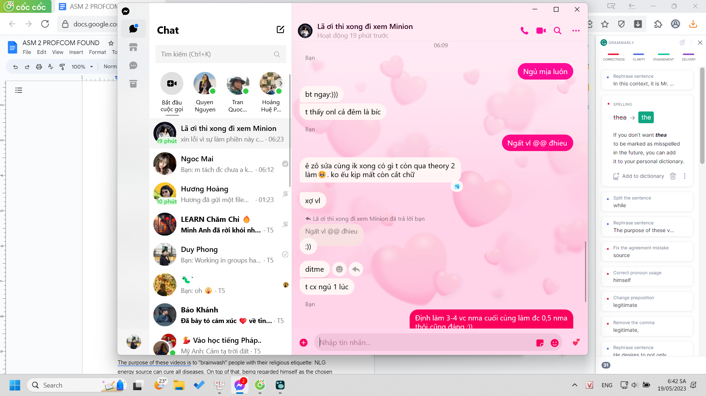
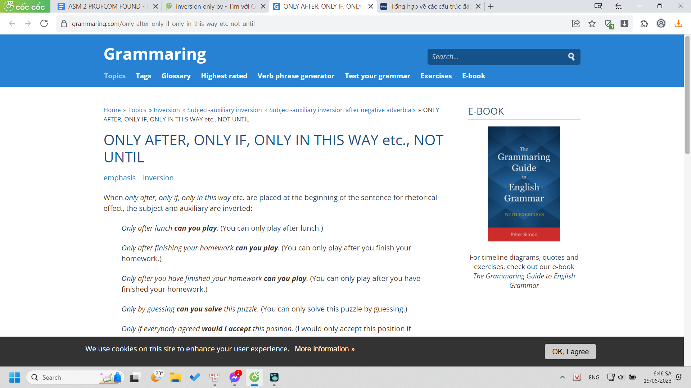
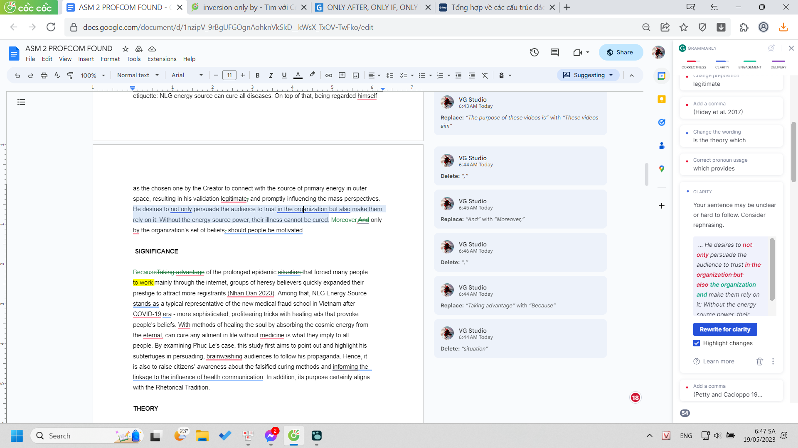

- 06:41
  collapsed:: true
	- chưa học tiếng Pháp, tí học nhanh chia động từ và làm btvn vậy
	- 
	- làm trước cái này ở đây vì điện thoại không có, trưa lại về trường ăn và làm việc ở đó?
	- 
	- trưa mình sẽ check cấu trúc bài, đoạn, câu vì grammarly không check được (cả word choice nữa)
	- mình cũng phải check lỗi sửa của grammarly (mà thường nó sửa cơ bản như lỗi ngữ pháp thôi)
	- mình học lại một số lỗi và đọc comment về ngữ pháp cũng khá hay
		- 
		- 
		-
- 17:56
	- ở record học với Lã mình nói lí do và cảm hứng mà mình muốn làm gì đó
		- nó sẽ thành một tư liệu cung cấp vào một bể tư liệu cách người ta làm một việc, rộng hơn là sáng tạo một thứ gì đó
	- mình nên có một cái format cho việc ghi chú thông tin kiểu này để sau xem lại còn dùng được: ngoài what có thêm why và dùng như nào
- 18:19 cách hoạt động của một số từ
- 18:25 những gì tôi nói ở khoảng tầm lúc này đều rất hay và gợi và rất giá trị (mấy trăn trở về việc có những phương án nào sẽ là tư liệu giúp mình xây dựng nên một hệ thống hoàn chỉnh của cái gì đó: trước tiên là đầy đủ về mặt phạm trù, tập hợp, 2 là check lại xem mối quan hệ giữa chúng ra sao, đúng là cover phần đối của nhau, có giao nhau hay gì như góc nhìn tập hợp toán, 3 hướng đi tùy trường hợp (giữa 1 bể tất cả các chữ ta đi từ A->Z chẳng hạn, nhưng đây k được đánh tên thế thì ta đi từ đâu thì sẽ theo mục đích ta muốn là gì))