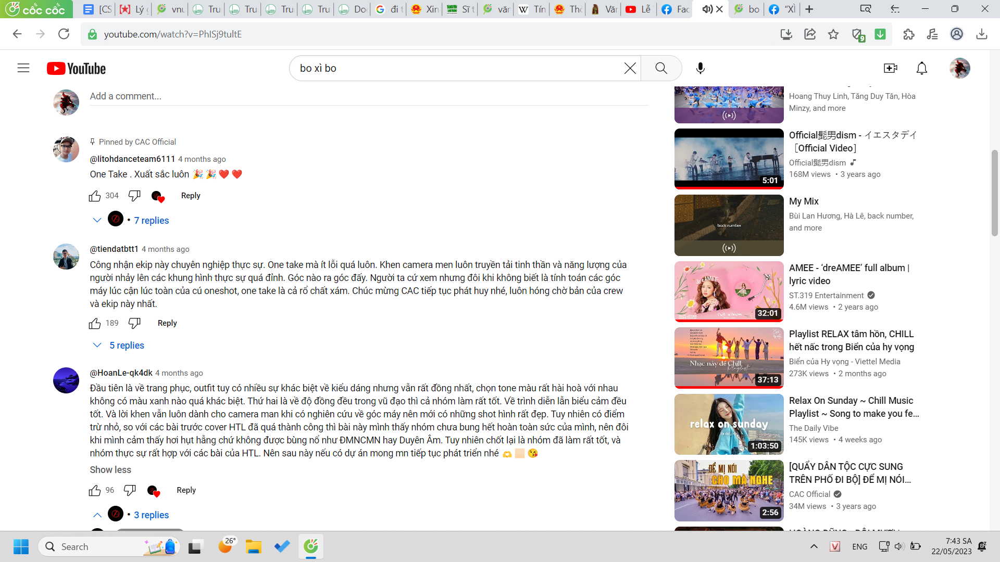
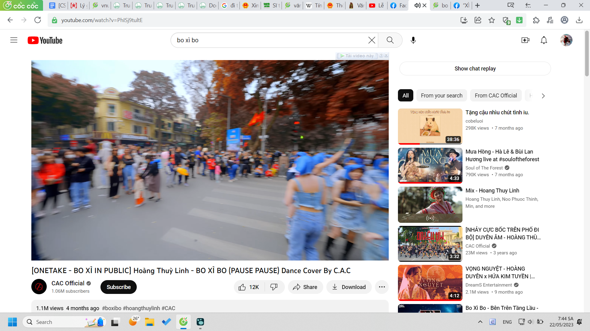
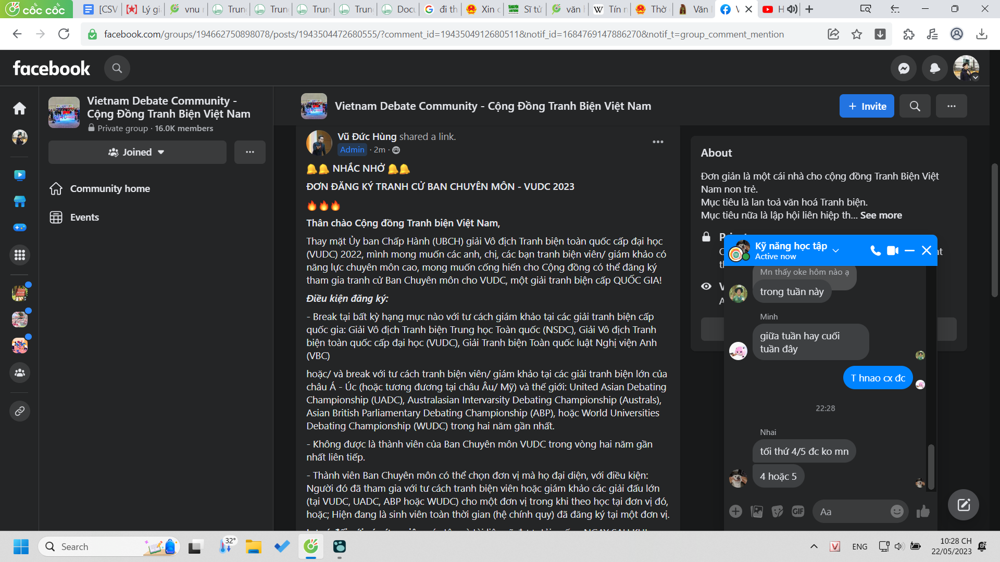
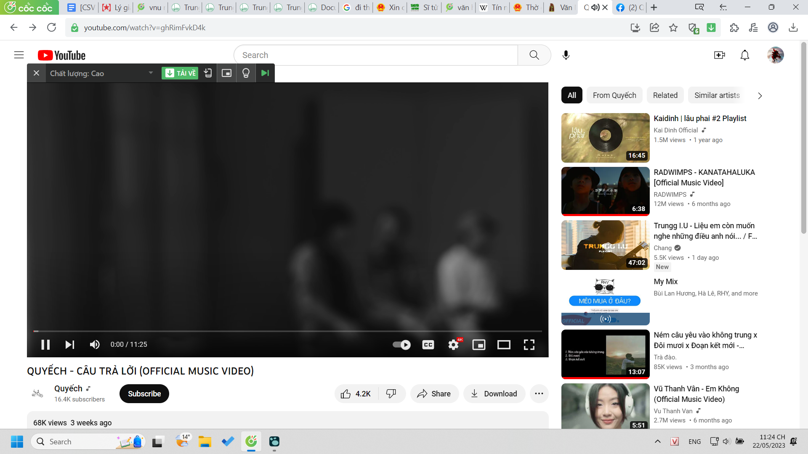
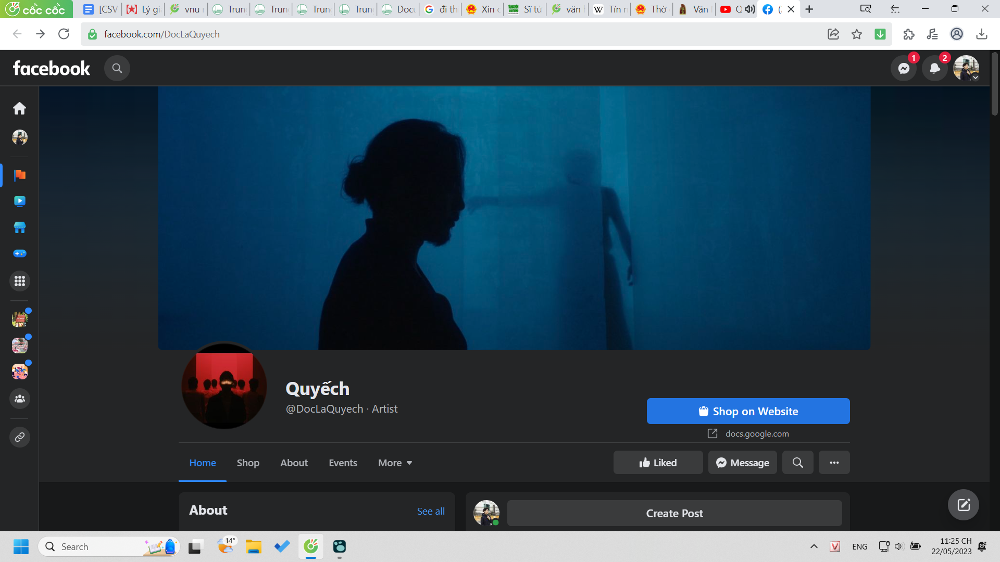
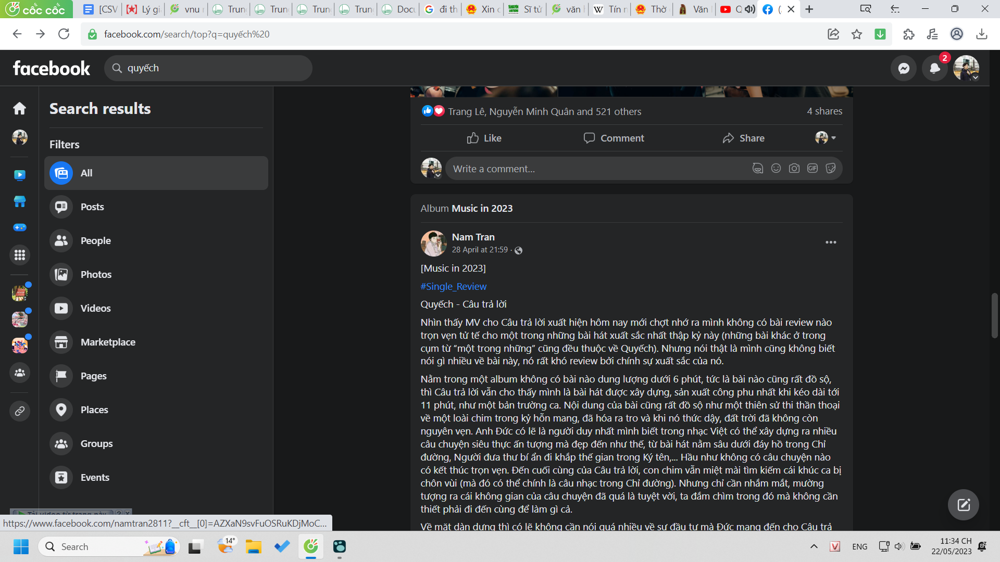
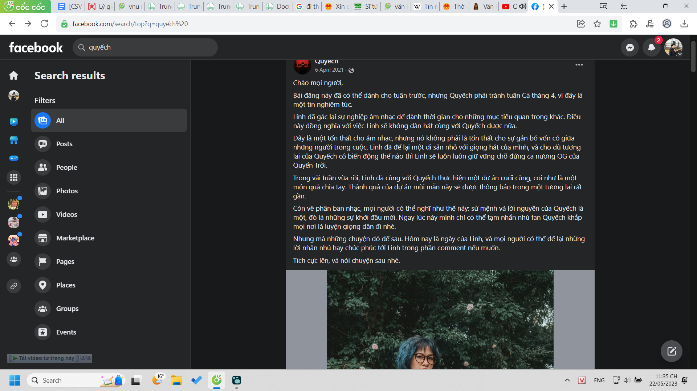
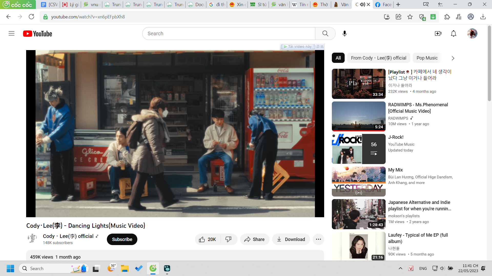
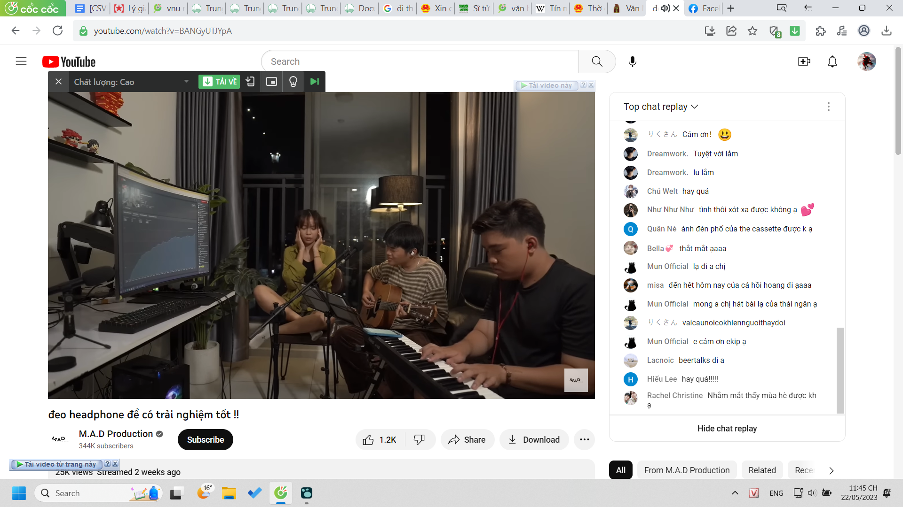

- 
- 
- 1 cách nhìn đánh giá phân tích
-
- Mình phải tìm rất nhiều loại data, nhưng mà data tìm được không như mong muốn thì khó xử lí lắm.
- Phải học cách người ta dàn cảnh, chuyển thể, để chuyển mấy đoạn tư liệu, hình ảnh mình tìm thành phimb trước tiên là góc quay cơ bản và viết cơ bản? Để bản thân có thể hình dung?
-
- 22:28 trên đời này còn rất nhiều người đỉnh
  collapsed:: true
	- 
	- còn nhiều đỉnh cao mình chưa với được
	- còn nhiều đất nước chưa đi
	- tất nhiên so vậy là khập khiễng và đôi khi đừng bị hình thức che mờ rằng mày với chưa chạm
	- nhưng mình vẫn kính phục con đường:
		- anh VHL xưa học chuyên lý, theo xã hội, từ xưa đã biết chụp ảnh và dần dần chụp ảnh phim ánh sáng bố cục tốt hơn đại chúng ai ai cũng cầm máy lên chụp phim
			- vì phim dễ chụp hơn (không cần kĩ thuật quá vẫn đủ đẹp và thực sự cũng không yêu cầu)
			- nó như Canva vs Photoshop
		- nhưng mình vẫn chưa động tới máy ảnh mới
		- vẽ vời thì hơn được ai kể cả có làm nó suốt
		- văn mày viết định làm nhà văn á, có làm được không? được chưa?
		- các anh trong CSC tuy không nổi, viết nhiều sách thì cũng kiếm tiền ghê mà
	- Trần Tiến cũng ghê
	- quan trọng tất cả đều là học sinh Chu, con người Việt Nam hừm
	- mày còn cái mộng Chu thì ừ cũng được, mày trông khá lí tưởng và đi những hướng tân tiến như anh BHL hay đi. Vì vậy cảm giác nông hơn, chỉ như một tân vương, chứ không gánh hết được mọi nội vụ mà sẽ cần những người như thầy Hiếu,... thầy Trung cũng rất rất đỉnh nữa
	- rồi Quả Cầu cũng hướng tới xây thế giới mới rất rõ
	- rồi anh gì ứng cử quốc hội mà nổi với LGBT không biết giờ ra sao, cụ thể lúc này đang làm gì? họ là những người biết đi đâu, không thì cũng biết mình đang ở đâu và từng là ai
- có bao giờ họ thấy đường đang đi không thể làm gì không
  collapsed:: true
	- anh Long còn làm được phim dù tôi chưa rõ như nào nhưng cũng hiện đại hơn các bộ đã có về Chu
	- những người quay chụp đẹp đều ở Humans... well đừng xem họ là gì quá ghê, chỉ là đam mê với nhau cả mà
- cảm giác ULIS cũng không tệ nhưng đường này khó đến Pháp làm đạo diễn, mà còn đường nào tốt hơn sao?
-
- 23:25 chà new ghê
- con người này có personality thú vị, còn cả con người ngoài đời thực thì chưa chắc
  collapsed:: true
	- dự là mình sẽ ảo hơn
	- 
	- 
- xem người ta lôi kéo mọi người và build team cũng hay, người ta có vẻ khá cởi mở khoe, nó không kiểu chuyên nghiệp che dấu tất
-
- 
- hmm qua đây mở được nhiều hiểu biết và mối quan hệ ghê
- vì nghĩa vụ nắm được mọi khả năng của con người, ít nhất là những người nổi bật ở Việt Nam (người quen chị Bebe)
- 
	- tò mò ghê dù người thường có lẽ không?
	- hoặc có
	- nhưng mình tự hỏi lí do gì họ gác cả một thứ nghệ thuật lại thế nhỉ?
		- cưới, ra nước ngoài, làm mẫu, chắc vẫn hát thôi nhưng dùng từ sự nghiệp âm nhạc nghe lớn quá
		- 
- có thể có nhiều người có gu nghe nhạc Ngọt, thích mấy bài Quyếch nhưng được mấy ai coi họ chỉ là người, bọn kia chỉ âm thầm ủng hộ, tôi không có nên chê khinh
	- tôi toàn bạn bè ủng hộ thôi chứ làm gì có fan mà thu tiền :)))
	- và tôi thích thế
	- tôi cũng sẽ thoải mái khám phá nhờ cậy sức họ
	- không có bất kì ai thì cũng là một thiếu sót lớn
		- mà cố nhồi cũng khổ, không nhồi được cũng thế :'( tính rộng quá thì có lúc mày phải quỳ gối xin nhân lực
- thực ra tôi ấn tượng bởi hình ảnh hơn dù nhạc cũng rất đỉnh nhưng tôi không có gu? và điện ảnh có lẽ là thứ mới vẫn thấy thống trị được chứ không phải chỉ khác đi
- văn thì chà, đấu với cổ điển cũng khó
- mày mà mở rộng network-tầm nhìn sang cả các nước khác thì sẽ đỉnh vãi, mày ghi chép cho cả thời đại luôn
- thế giới này rộng lắm, đôi khi phải đi thực tế, mạng không đủ kết nối
	- đây chẳng hạn? nhìn có gì đó khác và mình nên nhìn người ta thế, như một đối tượng của thời đại, mình là người phê bình lịch sử, chứ không tôn thờ họ, dù không thực sự thế, như fan, nhưng tại cảm xúc bọn nó chỉ có thế nên đẩy lên cũng không có sao? hay gần gũi như bạn bè
	- ừ, dù mình là bạn cả khóa, nhưng cũng chỉ muốn làm việc cùng
	- 
- nhưng mình học được ở Quyếch cách nhẹ nhàng đau đáu đi tìm người ủng hộ chứ không phải thấy ai rất tài rất giỏi nên bằng mọi giá giữ họ, không chỉ giữ, tham vọng còn lớn đến xây điều kiện cho họ làm nếu họ vẫn còn muốn bằng cách nào đó
- nhưng đã muốn rời đi rồi thì chịu? cũng khó hiểu lòng người... vì mày đã bao giờ chịu bỏ cái gì đâu? hay cái nào bỏ rồi như cầu lông bây giờ ai bảo quay lại cũng mất lửa đam mê... mọi thứ tương tự với Ch:ấm với một số đứa?
- nhưng xu hướng thời đại là mới lạ và mở và có sự gần gũi hơn
	- 
	- tự tin mà cũng bớt chói, rời xa được ánh hào quang tự ướm lên mình rồi đó, tôi thấy khá bình thường như đời thường rồi, hoặc tôi thay đổi?
	- cũng không có gì tỏ bình thường mà vẫn trông rõ thượng đẳng để so (còn nhớ được)
		- như văn mình viết?
		- à mấy đứa KOL đấy, tiếp cận bằng sự bình thường nhưng có bao giờ chấp nhận mình bình thường :)))
		- tôi cũng không nhìn bọn nó bình thường nổi
	- có lẽ vẫn hát cho công chúng nên nó vẫn thế
	- nếu như một hội nghệ sĩ với nhau thì sẽ khác
	- hoặc đỉnh cao sẽ là ai cũng thân thiện đón chào mừng bất kì ai
	- không sợ người tham gia kém mình họ phá hoại, cũng không bất ngờ họ quá giỏi mà mình e dè
		- hoang dã và tự do như vibe con Hà Thanh trông có hơi quê ấy :)))
		- yeah nhưng chỉ nét trông thế thôi chứ thực ra cũng không quê quá, nhưng cũng không phải quá sang
		- haiz ta chỉ sang với kẻ thù thôi chứ
	- thời đó bao giờ đến? hoặc ai cũng phải dễ nhìn hoặc mắt ai cũng phải lọt người khác
	- hoặc nhìn nhau bằng con mắt tri âm, thế thì ai mình cũng không chê
- mà tất cả đều được list lên là indie, kiểu nhà tự làm, xưa cũng có một số nhóm thế nhưng đầu tư không được bằng bây giờ, và họ cũng đủ tài để biểu diễn và muốn biểu diễn
- thế khác gì các công ty lớn nhỉ, cảm giác bọn kia đáng ngờ, như mấy thằng già kiểm soát chứ chẳng phải ai trẻ lắm, kiểu có thằng già đứng sau rót tiền còn bọn khác dựng lên bằng danh nghĩa công ty tư bản nào đó
-
- 23:59 tiếp nè, quảng cáo mà, cho thông tin mới thì lúc nào chẳng thấy thế giới phát triển
	- còn phần bình luận của ai đó phản tư cho rằng đang đi xuống
	- hay xây chưa tối ưu lắm, bình luận từ 50 năm sau cũng được, ta có thể nhìn ra pattern sự thiển cận dễ mắc, hoặc tự suy được luôn, công trình đó có được như mong muốn hình dung kiến trúc sư xây hiện giờ chưa
	- đừng chỉ dắt mũi bằng mấy thông tin đơn giản "mới" (đơn giản có nghĩa là đơn giản và cũng có nghĩa chỉ là)