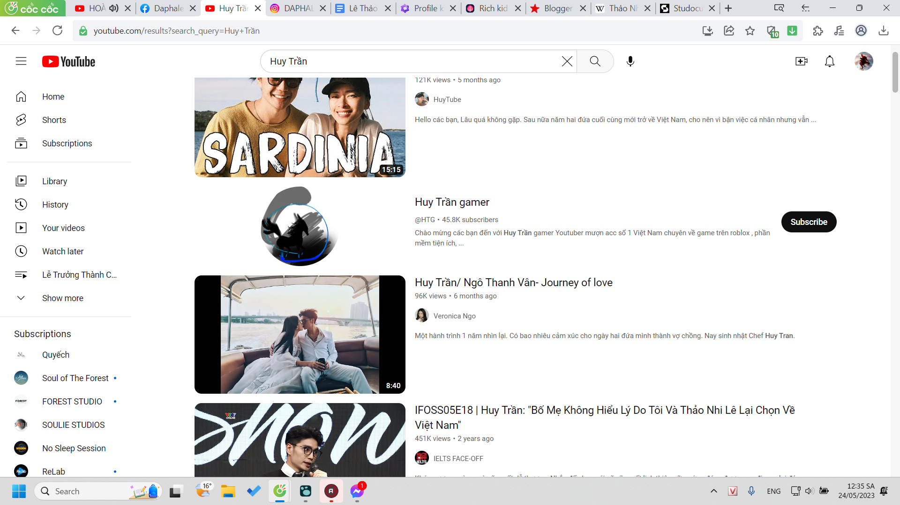

- 00:32 Diệp nói vậy nhưng thật ra tôi chẳng hứng thú lắm
  collapsed:: true
	- 
- Chẳng hiểu mình được giá trị gì nhưng cứ giúp nó vậy
  collapsed:: true
	- nó dùng SWOT, biết vậy
	- như Lã thì cũng chẳng giúp lắm nma đề tài có vẻ challenging
- Đây thì có lẽ cơ hội tôi tìm hiểu về cái nó bảo thôi
  collapsed:: true
	- 
	- cũng chỉ là tìm thông tin, chưa phân tích hay để làm theo định hướng gì
	- wao nhiều ttin về loại người đặc biệt
		- 
- 19:27 vừa mới nhặt rửa rau xong, cũng tắm rửa và cày game mới là iron marines rồi
	- vẫn thấy trống tâm hồn, muốn xem gì đó
	- đấy, đây là bẫy động lực, dù cũng là điều mình muốn
		- không muốn phải tự ép mình bằng cách nhận kín việc
		- mà muốn có gì liên tục thúc đẩy mình, cảm xúc đẩy mình đi, lí do dẫn mình lối, thực trạng khiến mình đi từng bước vội
	- thôi thay vì xem phim để lấp thì ta cứ đọc dần triết, cơ sở văn hóa, public speaking, rồi mai cả sus nữa
		- ghi ra để mày biết nhiều và còn nhiều việc như lẽ thường tự dưng mày mất hứng và mất động lực làm rồi ư, nó như một cái gì không phải của mình, chưa trở về mình cho đến khi mình xong đống kia
- ú ù quên mất sưu tầm mấy cái này khá khó, chịu khó đặt đọc thôi, cũng không quá đắt.
- đặt sớm bỏ tiền sớm thì được lâu nhiều, nhưng phải trích sẵn 1 khoản cho nhiều số phết
-
- 21:22 ghi tạm vào đây note họp Triết, vì chưa biết tạo file đặt tên gì để ở đâu
  collapsed:: true
	- bạn ơi khó hiểu không phải cứ giải thích là hiểu đâu mà phải cho người ta biết người ta đang ở đâu trên trái đất chứ không thể cứ miêu tả địa lí xung quanh nơi người ta đang ở được (như tôi này)
	- giọng quê thế
	- ừ có tài liệu hết rồi đọc hiểu giải thích cho mọi người hiểu ừ và làm sao nó hay
- sorry quên mất vẫn chưa tìm đc
- j thêm
- nma thấy HDung mới đăng cái này
- cũng ghê
- [https://youtu.be/5ESESVMoVMg](https://youtu.be/5ESESVMoVMg?fbclid=IwAR2k_9VGe7tkjK98YjJAQupHQPFxWuSDHQXOHWpjk7EeDCNtM-hMGCeMTgI)
- k biết trình làm show top bnhieu thế giới r
- khi t bắt đầu để ý đến những thứ đó thì ngta đã đi đc 1 hành trình rất xa
- h thì rầm rộ
- ai cx làm đc
- haiz tiếc k ai tổng hợp lại nó
- để t biết những show trc tư duy các thứ ra sao
- chứ đi xem show đương đại nhiều, tự ta cũng biết cách để làm khác đi, để vượt hơn
- nma sẽ k lường trc đc mọi đỉnh cao đã tồn tại
- cx như k vượt trên đc lịch sử nhân loại
- chứ vượt trên thời đại mình thì cx bth
- t k có những ng bạn để làm những điều như nhóm Quyeesch làm
- t luôn buồn tiếc
- dù t có ng giúp, cưu mang dạy bảo các thứ rất nhiều
- nma ít ra t có m
- cta sẽ conquer this world