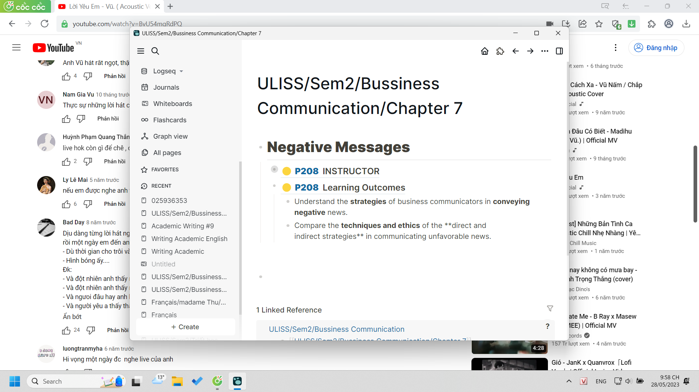
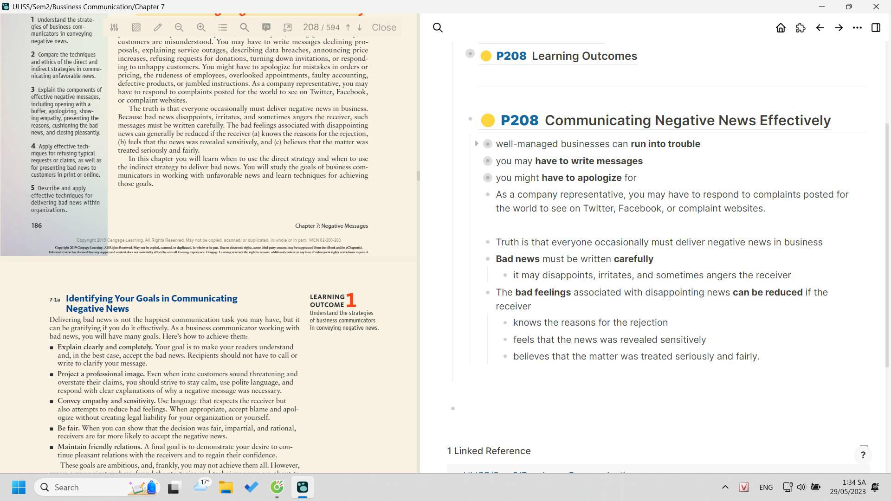

- Mình không biết đăng cái kinh nghiệm và thành quả của mình có giúp gì người ta, ngoài một ví dụ về cách áp dụng, còn áp dụng để làm gì có khi người ta không cần nếu người ta khác mình
	- 
	- nhưng ở đây là chỉ cần nhìn in đậm thì muốn đọc nhanh ta đọc được ý chính, còn muốn đọc đủ và có data để máy tra, sử dụng thì cũng có
- giá như dạy được người ta logic bằng tư tưởng, nghĩ ra giải pháp hay ở những hành động mình làm... phải cần đến mình trực tiếp giúp người ta sao... thực ra ta có thể vẽ map ra, nhu cầu là gì, ta có hình thức gì để đáp ứng nhu cầu ứng dụng đó và ta có thể dùng nó như thế nào, để cho ai sử dụng, mỗi tính năng sẽ phù hợp với đối tượng riêng như highlight để người đọc, dữ liệu tách ra để máy tra (nó same same với nội dung cần được hình thức hóa)
	- làm mỗi câu hai cái cho đủ một cụm chủ vị => tròn ý từng câu
	- Tất nhiên cái nào quan trọng nữa thì sẽ có cách highlight riêng
	- nhưng các ý nhỏ ở dưới thì nên và phải đọc, còn ý chính để lướt nhìn tìm thôi, mình cũng có não tự nghĩ mà, ý dưới để check
		- 