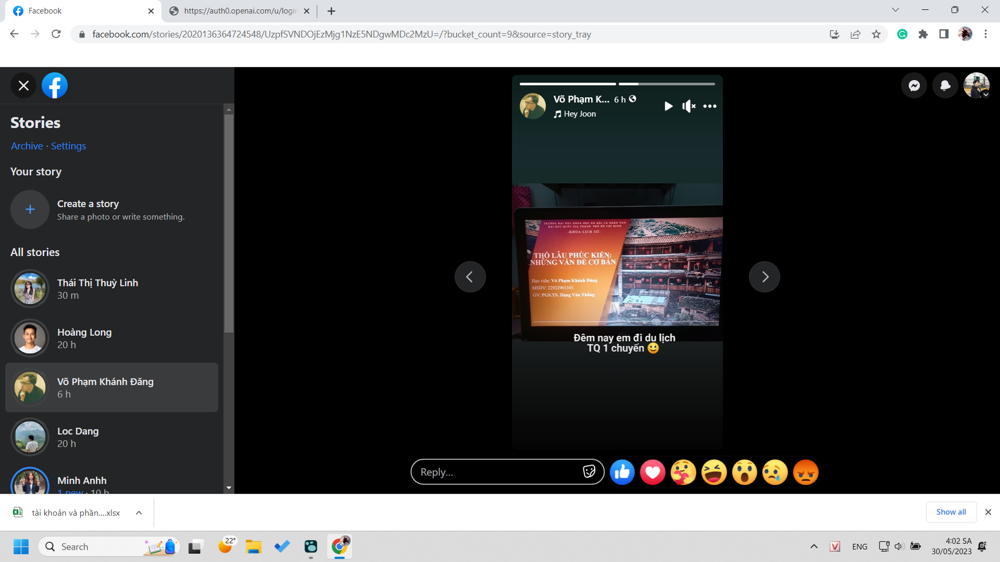
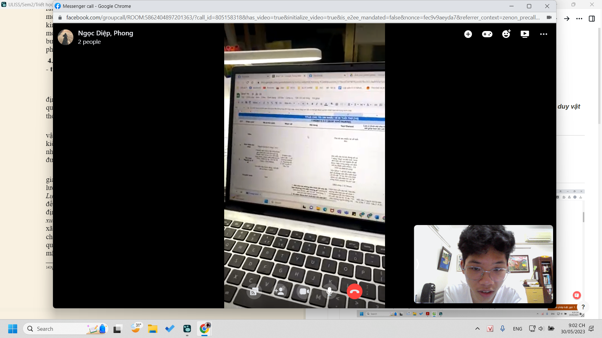

- Thử thách 1 haha = học thì nhàm quá vì lúc nào đó ta sẽ tự học xong thôi, nó thường quá, ta nên kiểu 1 haha =  1 thành quả học, 1 haha bằng 1 thành quả chất lượng hơn bao lần hoặc học hiệu quả hơn bao lần (0,1 chẳng hạn) và ta sẽ phải tìm cách phải chất vấn xem học là gì, rồi có lẽ học để làm gì mà phải năng suất
- 
- 
-