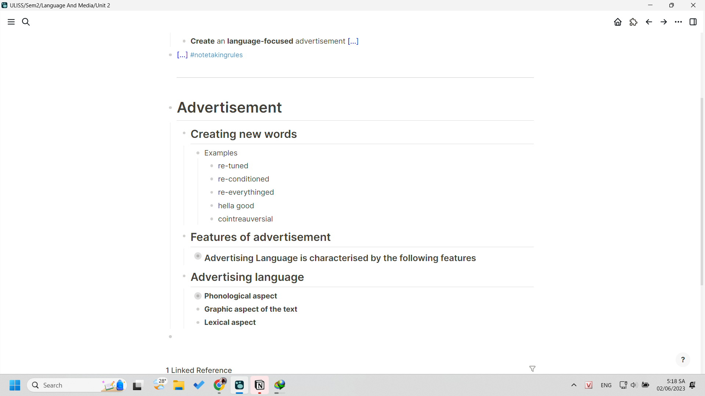
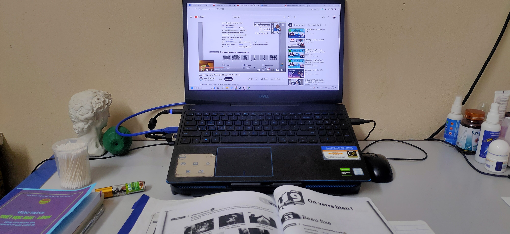

- 05:17 đang chạy ôn tiếng Pháp và Language and Media
	- 
- 4 giờ dậy cầm máy lên đọc truyện tí tỉnh ngủ, thấy Dung chia sẻ video phòng 107 của câu lạc bộ nó, nghe hay thật, nhìn cảm xúc thật. Do nhạc phần nhiều và xếp cảnh đúng nhạc (lại nhớ đến video của mình, có lẽ có thể thử xem lại) nhưng mà hóa ra nhạc do video gốc đã khá ổn rồi, còn lại thì edit một tí nó hơi kiểu tiktok tí cũng được. somehow nhạc tiktok được người ta chỉnh khá nhiều, mà bịt âm thì kĩ thuật đó là giảm thanh đi, tôi vẫn chưa biết cách làm cơ bản, tra mạng được, nhưng nhiều cách làm và có thể làm đến đâu như nào (chẳng hạn đưa một người chuyên nghiệp họ tự mò, tham khảo phát triển thì còn đỉnh hơn, cảm giác bản exclusive ý :)) )
- Cái sự hoài niệm về một thứ gì đó ra đi với cả MV cứ gợi mình về All little things CVA vì mình nhớ mãi cái cảnh ấm cúng. Và ừ đúng là ấm cúng thật, cái sự kết hợp áo trường, cảnh Chu và mọi loại áo giữ nhiệt nữa. Và mình xem, và mình muốn làm điều trước giờ mình chốt khi xử lí đống dữ liệu siêu lớn với mình mà chưa có phần mềm quản lí hay kiểu gì trợ giúp: mỗi ngày nhập một tí, 5000 files cũng sẽ xong. Khi nào có hứng thì làm. #cvatrongtoi
- Well và giờ mình không hát bài đó với tâm thế bản thân, đặt nó vào hoàn cảnh bản thân nữa mà nó pha ít nhất cuộc chia tay dark trong MV và mình, nếu mình hát mình sẽ nghĩ đến Thảo và của cả Dung
-
- 
- 07:15 dẫu vừa mới làm vlog về việc sáng dậy sớm làm việc thích thế nào thì ngược lại, làm việc để ôn, chạy nước rút, thật sự chạy deadlines sát ngày mà đó còn là học chứ không phải làm thì thật khiến mình thấy ngập úng trong người, phát ói, cơ không có lực và dễ gục ngã ra mà nằm chơi game đọc truyện hoặc làm việc gì đó khác không có hạn định mà kệ đời
	- học và làm thì vui miễn là nó không vì thi cử sắp tới sát nút (cũng không phải mình đổi cách học tủ đâu, chỉ là cảm giác mệt mỏi khi bị ép chứ không phải tự do thản nhiên học rồi khi nào thi thì thi, thi bất chợt, thi cũng chẳng quá quan trọng, thi để kiểm tra sau này làm tốt hơn)
	- mà có lẽ do phải rush chứ không chill bình thường và ngồi ì ra được
	- chạy nhanh, bứt tốc liên tục 1 môn thì không sao chứ môn nào cũng thế thì cũng mệt
- thôi dừng sau 20 phút ngồi chép và ôn lại bài Language and Media. Học tiếng Pháp mình học đến 6h30 nghỉ. Tí 8 giờ ôn tiếp vở bài hôm trước chứ không ôn một lượt từ trước giờ hay randomly được, đến sách bài tập còn toàn chép cho đỡ mất thời gian tư duy và tranh thủ học ghi nhớ cách dùng, cách đọc mà.
-
- Nhìn hợp ghê
	- 